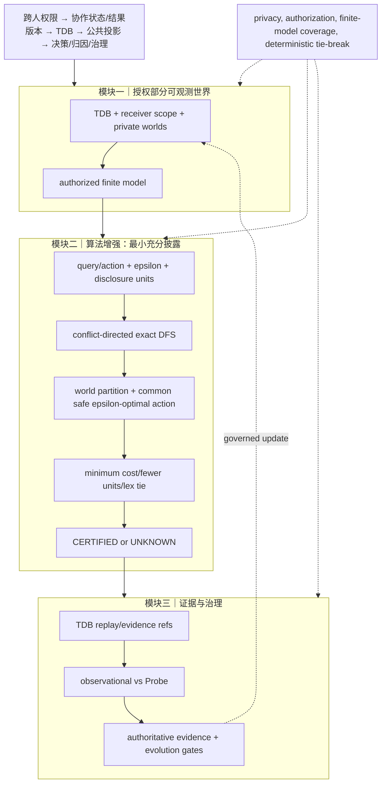

# uBuddy 算法增强 V1：冲突导向的最小充分披露搜索

本轮只选择一个高价值计算瓶颈：模块二的最小披露求解。模块一 TDB、模块三证据/治理门控保持不变。

## 为什么选这个瓶颈

原实现对最多 16 个披露单元做全子集枚举，并在每个子集上重新划分世界。它的语义方向是正确的，但有两个论文和实现问题：搜索没有利用“当前不可行世界组必须被拆分”的结构信息；而且 baseline 对安全动作的 regret 定义需要与决策充分性检查器保持一致。本轮没有修改已经正确的有限世界 minimax-regret checker，而是把搜索改为 conflict-directed exact DFS。

## 算法定义

给定私有世界集合 (W)、披露单元 (U)、动作集合 (A) 和容忍度 (epsilon)，对已选披露集合 (S\subseteq U) 定义等价类：

\[
  [w]_S=\{w'\in W: values(w',S)=values(w,S)\}.
\]

世界 (w) 的安全最优值为：

\[
  V^*(w)=\max_{a\in A:\,safe(w,a)} utility(w,a).
\]

一个等价类 (C) 可决策，当且仅当存在共同动作 (a)：

\[
  \forall w\in C,\ safe(w,a)=true \land V^*(w)-utility(w,a)\leq\epsilon.
\]

目标是：

\[
 S^*=\arg\min_S \left(\sum_{u\in S} cost(u), |S|, lex(S)\right)
\]

约束是所有 ([w]_S) 都可决策；若不存在则返回 `UNKNOWN`。

## 求解步骤

1. 校验 world/unit/action、授权、有限 primitive observable values、数值 utility 和布尔 safety。
2. 以 ((selectedMask, undecidedMask)) 做 DFS 状态记忆。
3. 评估当前 selectedMask 的世界分区和共同 epsilon-safe 动作。
4. 若某个分区不可行，选择能产生最多不同观测值的未决单元作为冲突分裂变量，递归“选择/不选择”。
5. 使用当前最优成本做安全剪枝；以成本、单元数、字典序确定性 tie-break。

该分支策略仍然是 exact：任何不可行分区若最终变为可行，至少需要选择一个能区分其中世界的剩余单元；否则该分区在所有后继节点保持不变。

## 复杂度与假设

- 最坏情况：(O(2^{|U|}\cdot |W|\cdot |A|\cdot |U|))，与原问题的指数性质相同；额外有状态记忆、冲突变量选择和成本剪枝。
- 空间：(O(2^{|U|}+|W|)) 级别，受当前 ( |U|\leq16, |W|\leq128, |A|\leq32 ) 上限约束。
- 假设：world catalog 是显式且有限的；observable values 是 JSON 可表达的 primitive；utility/safety 是调用时给定的静态模型。
- 该算法不声称学习策略、近似最优或解决未知世界；模型不完整时仍 `UNKNOWN`。

## 三模块技术链路



## 三位独立顶会审稿评分

| 维度 | 评分 | 基于证据的判断 |
|---|---:|---|
| 新颖性 | **7.2/10** | 冲突导向精确披露搜索与 TDB/query 主线结合清楚，但 conflict-directed branch-and-bound 本身是成熟思想，不能单独宣称算法新颖。 |
| 技术深度/可验证性 | **8.1/10** | 明确目标函数、共同安全动作约束、严格 primitive 校验、诊断计数；15 个披露/决策测试含 80 组 oracle 差分。仍缺更大规模复杂度实测。 |
| 实现一致性 | **8.4/10** | 生产函数已实现 DFS、记忆、冲突变量、成本剪枝和确定性 tie-break；现有主线接口未改变。当前仍为显式有限模型求解器。 |
| 综合论文价值 | **7.8/10** | 适合作为方法中的一个扎实算法组件；需要与 TDB 绑定投影的实测收益共同构成论文贡献。 |

## 三位审稿人保留意见

**新颖性审稿人**：算法搜索本身不够新，真正可写的贡献是“权限受限的 TDB 语义单元如何改变世界分区，并由共同安全动作定义停止披露”。需要消融：全枚举、普通 branch-and-bound、冲突导向 DFS。

**技术深度审稿人**：当前实现只在有限显式模型上提供 exact guarantee；需要证明冲突变量选择不影响完备性，并报告最坏/平均节点数与 pruning ratio。

**实现一致性审稿人**：已有 decision checker 保持 O(|W||A|) 且通过 oracle 差分；disclosure solver 与其安全 regret 语义已对齐。仍需检查生产调用是否会传入非 primitive observable 或隐藏字段。

## 本轮验证

```text
node --check src/shared/contracts/uBuddyDisclosureFrontier.js
15/15 算法正确性、反例与 oracle 差分测试通过
```

## 未完成能力

尚未实现学习型 disclosure policy、未知世界的概率后验、连续动作/连续观测、跨任务联合优化或性能实验；这些不属于本轮渐进修改。
