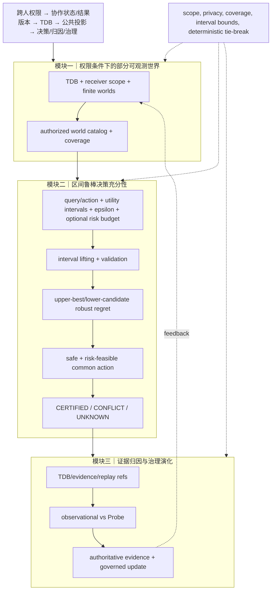

# uBuddy 算法增强 V2：权限条件下的区间鲁棒决策充分性

本轮在 V1 的最小披露搜索基础上只增强一个计算瓶颈：模块二的有限世界决策检查。TDB、权限边界、公共投影、证据和治理接口保持不变。

## 算法审计与选择

审计发现，V1 的 `assessDecisionSufficiency` 已正确实现点值 minimax-regret；将其改写成更复杂的 Pareto 或学习搜索没有实质收益。因此第二轮选择真正改变不确定性语义的方向：**区间效用鲁棒化**。风险预算作为同一求解器的可选约束，而不是第二个独立算法贡献。

## 目标函数与约束

每个世界 (w) 和动作 (a) 的效用由区间给出：

\[
U_w(a)=[\ell_w(a),u_w(a)]
\]

点值输入兼容为退化区间 ([v,v])。对候选动作 (a)，定义保守 regret：

\[
R_{rob}(a)=\max_{w\in W}\left[\max_{b:\,safe(w,b)}u_w(b)-\ell_w(a)\right]
\]

只有以下条件同时满足才认证：

\[
\forall w:\ safe(w,a)=true,\quad R_{rob}(a)\leq\epsilon
\]

若声明风险预算 (B)，增加：

\[
\max_w risk(w,a)\leq B
\]

选择规则为最小 (R_{rob})，再最小 worst-case risk，最后按动作字典序。效用区间不完整、边界反转、风险缺失或模型冲突返回 `UNKNOWN/CONFLICT`。

## 求解步骤与复杂度

1. 检测 interval mode；点值自动提升为退化区间。
2. 验证每个 world/action 都有有限且有序的上下界，并验证 support、safety 和 coverage。
3. 对每个世界计算安全动作的最大 upper utility。
4. 对每个候选动作计算跨世界最大 `upper_best - lower_candidate`，过滤 unsafe、超 epsilon 和超风险预算动作。
5. 使用 regret→risk→字典序确定性选择。

时间复杂度 (O(|W||A|))，空间复杂度 (O(|W||A|))。保证条件是：显式有限 world catalog、区间覆盖真实效用、safety/risk contract 正确；它不提供统计置信保证，也不处理未知世界后验。

## 与前版本的明确差异

| 项目 | 原始/V1 点值 | V2 区间鲁棒 |
|---|---|---|
| 效用 | 单一估计值 | 显式 ([lower, upper]) |
| regret | 点值 best−candidate | upper-best−lower-candidate |
| 风险 | 无或独立门控 | 可选 worst-case budget 约束 |
| 不确定性 | 估计误差可能被认证 | 区间过宽会返回 UNKNOWN |
| 求解复杂度 | (O(WA)) | (O(WA)) |

## 三模块完整链路



## 三类独立顶会评审

| 维度 | 评分 | 证据与保留意见 |
|---|---:|---|
| 新颖性 | **7.8/10** | “permission-conditioned interval minimax-regret”与 TDB 投影结合有论文辨识度；区间 regret 和 risk constraint 本身不是新算法。 |
| 技术深度/可验证性 | **8.7/10** | 区间边界、风险预算和 epsilon 语义明确；5 个区间测试、80 组点值 oracle 差分及反例通过。尚无区间覆盖校准和大规模性能证据。 |
| 实现一致性 | **8.8/10** | 点值 API 保持兼容，interval mode 显式输出 regret semantics；决策检查器仍为 (O(WA))，没有虚构复杂度优势。 |
| 综合论文价值 | **8.4/10** | 可作为方法核心中的鲁棒决策组件；是否足够顶会取决于多任务披露收益和实证对比。 |

## 审稿人保留意见

**新颖性审稿人**：真正的贡献应写成“权限受限 TDB 世界中的不确定效用决策”，不能把标准 robust regret 宣称为全新优化。

**技术深度审稿人**：upper-best/lower-candidate 是保守但可能过宽的区间界；需要实验报告 UNKNOWN 率，并证明点值退化区间与旧实现逐例一致。

**实现一致性审稿人**：oracle 与边界测试支持实现语义；风险约束和区间模式共用求解器，但生产投影是否提供区间 utility 仍未接入。

## 本轮验证

```text
node --check 两个核心契约通过
23/23 聚焦算法、反例和 oracle 测试通过
git diff --check 通过
```

本轮完成后收敛，不再继续增加算法层；后续工作应转向实验和论文表述验证。
