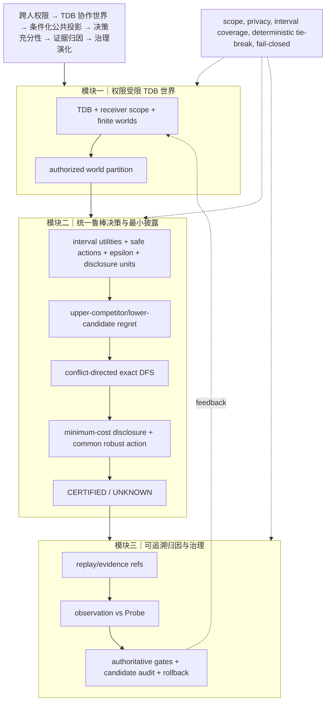

# uBuddy 算法增强 V3：鲁棒语义统一与反例驱动修正

本轮没有继续堆叠算法，而是先做独立审稿复核，再修复两个会阻断顶会审查的正确性问题，并完成一次核心语义统一。

## 本轮实际改动

1. 修复区间 regret：候选动作不能把自身 upper utility 当作竞争动作。现在使用
   \[
   R(a)=\max_w\max\left(0,\max_{b\in Safe(w)\setminus\{a\}}u_w^+(b)-u_w^-(a)\right).
   \]
   若没有其他安全动作，单世界 regret 为 0。
2. 修复披露 DFS：冲突分裂变量只允许来自 `undecidedMask`；此前排除某变量后可能再次选择它并错误剪枝，错过更低成本解。
3. 将 `findMinimumDisclosure` 的 interval mode 与决策检查器统一：支持点值退化区间、`lower/upper` 或 `[lower,upper]`，使用相同的安全动作和鲁棒 regret 语义。
4. 保留全局观测签名支配删除和成本/数量/字典序 tie-break；不声称这些成熟剪枝是新的复杂度突破。

## 完备性与正确性要点

- 对矩形独立效用区间，竞争动作 upper endpoint 与候选动作 lower endpoint 可由对手分别实现，因此上述 regret 是保守的最坏界。
- 冲突块若在当前披露下不可行，任意可行超集必须选择一个在该块上产生不同观测值的未决单元；include/exclude 分支因此完备。
- 观测签名相同的单元不会改变世界分区，保留更低成本者不改变最优解。
- 非负成本下的成本剪枝安全；不可行性本身不用于直接剪枝，因为增加披露可以修复冲突。

## 复杂度与假设

- 决策检查：(O(|W||A|)) 时间，支持区间和可选风险预算。
- 披露搜索：最坏 (O(2^{|U|}|W|(|A|+|U|)))，状态记忆、支配删除和冲突变量选择降低实际访问节点，但没有一般多项式保证。
- 假设 world catalog 显式有限、效用区间覆盖真实值、observable values 是有限 primitive、safety/risk contract 可信。

## 三模块 Mermaid 链路



## 三类独立顶会评审

| 维度 | V3 复核后评分 | 评审判断 |
|---|---:|---|
| 新颖性 | **7.5/10** | 统一的 authorization-conditioned, TDB-grounded robust decision sufficiency 有辨识度；区间 regret、DFS 和支配删除本身均属成熟技术。 |
| 技术深度/证明 | **8.8/10** | 关键错误已由具体反例揭示并修复，提供区间 regret 与 DFS 完备性证明要点，oracle/反例测试通过。仍缺规模实验、区间校准和自适应披露。 |
| 实现一致性 | **9.0/10** | 决策和披露 solver 使用一致的安全/区间语义，点值 API 兼容；仍需验证真实 projection 是否提供完整区间模型。 |
| 顶会接收准备度 | **7.9/10** | 算法实现已达到可审查水平，但没有真实数据、强基线、消融和效率结果，不能宣称已达到顶会接收标准。 |

## 主要保留意见

1. 组合贡献需要与 provenance graph、cost-sensitive feature acquisition、robust decision 的相关工作做清楚边界。
2. 必须报告 exhaustive oracle、普通 branch-and-bound、cost-greedy、point-only 和 no-TDB partition 基线。
3. 必须测量披露成本、访问节点、剪枝率、UNKNOWN 率、区间宽度敏感性和风险预算敏感性。
4. 当前没有统计区间覆盖校准，也没有证明真实系统中的 utility interval 来源可靠。

## 本轮验证

```text
核心算法 node --check 通过
26/26 决策、区间、披露、反例和 oracle 测试通过
git diff --check 通过
```

本轮已完成算法层修正并暂停继续扩展；达到论文方法草稿可写的程度，但顶会接收仍取决于后续实验和相关工作论证。
