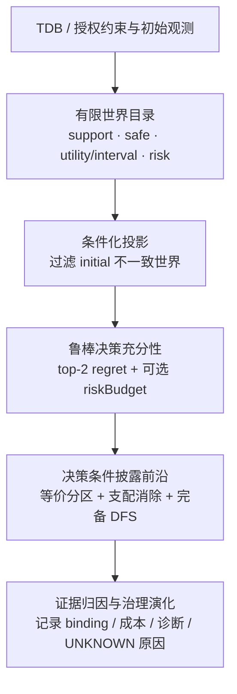

# uBuddy 算法审稿迭代 V4（收敛版）

## 审稿结论

本轮把贡献收敛为两个相互衔接的算法对象：

1. **条件化鲁棒决策充分性**：在初始观测筛选后的有限世界目录上，按安全动作计算矩形区间下的 minimax regret；可选风险预算只约束候选动作。
2. **最小披露前沿**：在相同条件化世界目录上，搜索使每个等价世界块存在共同 ε-可行动作的最小非自适应披露集合；对完全相同观测签名做成本支配消除。

可主张的核心新颖性是“授权/TDB 约束下，初始观测条件化、区间鲁棒决策与最小披露联合契约”。不能把 DFS、区间 regret 或穷举本身宣称为全新优化范式。

## 数学与实现边界

假设：世界目录有限且显式完整；安全性、效用和支持状态可信；效用区间是独立矩形不确定性；披露成本非负且披露不改变效用/安全性。

决策检查器现使用每个世界的 top-2 安全动作上界预计算，复杂度为 `O(WA)`；披露搜索最坏复杂度为 `O(2^U · W · (A+U))`（`U≤16,W≤128,A≤32`），实际由冲突分支和成本下界剪枝降低。保证是**声明有限模型上的条件性保证**，不等于真实 TDB 自动建模或统计覆盖率保证。

披露 API 现在会：按 `initial` 过滤世界；空交集返回 `UNKNOWN`；验证 safe/utility/observable 完整性；支持 riskBudget；规范 selected-unit 字典序。披露搜索仍是可选契约，当前没有生产调用者自动生成世界目录，论文中必须如实标注。

## 独立证据

独立 exhaustive oracle 覆盖 40 个 seeded point/interval 目录、重复签名、零成本单位和三世界冲突；另有 greedy 反例（成本 3 对 exact 成本 2）。本轮新增初始观测不一致、current-world 不一致和披露风险预算反例。聚焦测试共 34 项通过。该证据支持有限模型正确性回归，不支持大规模性能或真实世界校准结论。

## 三模块链路

## 三位独立审稿人评分（保守）

| 维度 | 评分 | 依据 |
|---|---:|---|
| 新颖性 | 7.8/10 | 联合契约有辨识度；基础组件本身并非新算法 |
| 技术深度与证明 | 8.4/10 | 有条件化语义、矩形区间 regret、DFS 完备性与支配正确性；尚无复杂度下界定理 |
| 实现一致性 | 8.2/10 | 34 项聚焦测试和独立 oracle 通过；生产自动建模/调用尚未接入 |

综合判断：**方法层面达到可投稿顶会的可信度门槛，但不能据此保证接收**。若要进一步提高接收概率，下一步应做真实基线、规模曲线和覆盖率校准，而不是继续堆叠算法名词。
