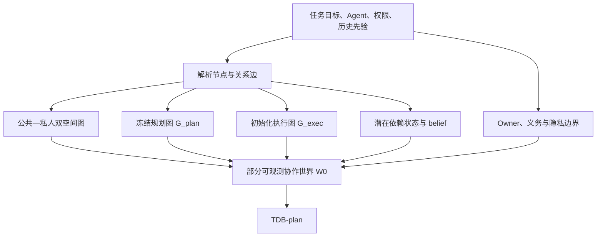

# uBuddy 技术模块一：部分可观测协作世界建模

> 研究设计稿。本文定义模块一的数学对象、状态空间、初始化算法和输出接口；不等同于当前 Janus 已经完全实现的能力。

## 1. 模块目标

模块一回答：

> 当前任务中有哪些节点和关系？哪些状态是公共可见的，哪些状态属于私人空间？每条关系边有哪些潜在依赖、Owner、权限和任务义务？

模块一的输出不是一个简单的任务 DAG，而是一个带有公共投影、私人隐藏状态、潜在依赖和信念分布的部分可观测协作世界。

## 2. 统一任务对象

设当前任务为：

\[
\tau=(G, A, O, P, H, Y)
\]

其中：

- \(G=(V,E)\)：任务节点和关系边；
- \(A\)：参与 Agent、用户和组织；
- \(O\)：任务义务、验收条件和硬约束；
- \(P\)：权限、隐私和可见性策略；
- \(H\)：历史依赖集束先验；
- \(Y\)：当前可观测事件和结果。

每条关系边绑定为：

\[
e=(\tau,eid,u,v,a_u,a_v,r,ver)
\]

其中 \(u,v\) 是源节点和目标节点，\(a_u,a_v\) 是两端 Agent，\(r\) 是关系类型，\(ver\) 是该关系的版本。

## 3. 协作世界状态

在时刻 \(t\)，协作世界定义为：

\[
W_t=(G_t^{pub},G_t^{priv},G_t^{plan},G_t^{exec},Z_t,B_t,O,P)
\]

- \(G_t^{pub}\)：面向当前接收者可见的公共图；
- \(G_t^{priv}\)：包含 Prompt、完整 Memory、文件、凭据和内部工具状态的私人图；
- \(G_t^{plan}\)：执行前冻结的规划图；
- \(G_t^{exec}\)：按照真实事件追加构造的执行图；
- \(Z_t\)：所有关系边的潜在依赖状态；
- \(B_t\)：对隐藏状态的信念分布。

公共图由可见性投影产生：

\[
G_t^{pub,r}=\Pi_r(G_t^{full};P_r)
\]

其中 \(r\) 是接收者，\(P_r\) 是其权限和隐私边界。不同接收者可以拥有不同公共投影，但必须满足任务语义一致性。

## 4. 公共—私人双空间图

每个节点表示为：

\[
v_i=(v_i^{pub},v_i^{priv})
\]

公共空间至少包含：

```text
nodeId, taskRole, status, progress,
publicSummary, resultVersion, allowedEvidenceRefs
```

私人空间可以包含：

```text
privatePrompt, privateMemory, rawFiles,
credentials, internalToolState, privateCapability
```

模块一只负责定义边界，不负责决定最终披露层级；最终披露由模块二的条件化语义投影决定。

## 5. 规划图与执行图

规划图：

\[
G^{plan}_0=(V^{plan},E^{plan},C^{plan})
\]

执行图：

\[
G^{exec}_t=(V^{exec}_t,E^{exec}_t,X_t)
\]

规划图在执行前冻结：

\[
G^{plan}_{t+1}=G^{plan}_t
\]

执行图通过事件追加更新：

\[
G^{exec}_{t+1}=G^{exec}_t\oplus event_t
\]

其中 \(\oplus\) 代表追加而非覆盖，因此可以恢复“偏差何时产生、如何传播”。

规划节点至少包含：

\[
p_i=(goal_i,agent_i,input_i,output_i,dep_i,accept_i)
\]

执行节点至少包含：

\[
x_i(t)=(status_i,progress_i,output_i,version_i,retry_i,handoff_i,failure_i)
\]

## 6. 潜在依赖场

每条边 \(e\) 有一个潜在依赖状态：

\[
z_e=(z_e^{data},z_e^{logic},z_e^{quality},z_e^{freshness},z_e^{capability},z_e^{resource},z_e^{risk})
\]

由于私人状态不可见，系统不直接把 \(z_e\) 当作确定事实，而维护：

\[
B_t(z_e)=P(z_e\mid O_{0:t},H_e)
\]

其中 \(O_{0:t}\) 是公共观察，\(H_e\) 是该关系类型的历史依赖集束先验。

新事件到达后的贝叶斯更新为：

\[
B_{t+1}(z_e)\propto P(o_{t+1}\mid z_e)B_t(z_e)
\]

如果无法计算精确似然，可以使用校准的状态估计器：

\[
\hat z_{e,t+1}=F_\theta(\hat z_{e,t},event_{t+1},result_{t+1},review_{t+1})
\]

但必须同时保留置信度和不确定性：

\[
U_{e,t}=1-Confidence(\hat z_{e,t})
\]

## 7. Owner、义务与边界

任务义务集合：

\[
O=\{o_1,\ldots,o_m\}
\]

每个义务包含：

\[
o_i=(owner_i,pre_i,post_i,authority_i,visibility_i,hard_i)
\]

权限和隐私边界定义为：

\[
P=(readScope,writeScope,shareScope,inferenceBoundary)
\]

公共投影必须满足：

\[
\Pi_r(W_t)\models P_r
\]

任何后续进化不得削弱硬义务：

\[
Evolution(\Delta)\models O_{hard}
\]

## 8. 初始化算法

### Algorithm 1：Initialize-Partial-Observable-World

```text
Input:
  task specification τ
  participating agents A
  historical prior HDBP
  permissions and obligations (P, O)
  initial public evidence O0

1. Parse task τ into nodes V and typed relation edges E.
2. Assign source/target node, source/target Agent and relationType to each edge.
3. Split each node into public state and private state.
4. Freeze the initial planning graph G_plan.
5. Create empty execution graph G_exec, seeded from G_plan.
6. Load matching HDBP as a prior, without copying it as current truth.
7. Initialize belief B0(z_e) for every relation edge.
8. Register Owner, authority, acceptance obligations and privacy boundaries.
9. Emit W0 and TDB-plan for every edge.
```

初始化关系集束：

\[
TDB^{plan}_{\tau,e}=InitBundle(e,B_0,HDBP,O,P)
\]

## 9. 模块一输出

\[
O_1=(W_0,G^{plan}_0,G^{exec}_0,B_0,TDB^{plan},O,P)
\]

其中 `TDB-plan` 只是当前任务的计划依赖状态，不是历史经验的直接复制。

## 10. 正确性与边界

模块一应满足：

1. 节点、关系和 Owner 均有唯一标识；
2. 规划图和执行图语义分离；
3. 私人状态不会因为建模自动进入公共图；
4. 历史先验不会直接替代当前任务事实；
5. 缺少足够证据时保留不确定性，而不是强行给出确定状态。

模块一不负责：

- 决定最终公开多少信息；
- 直接判断任务是否完成；
- 自动修改 Agent 能力或组织结构；
- 用单一总分替代多维依赖状态。

## 11. 技术链路图



