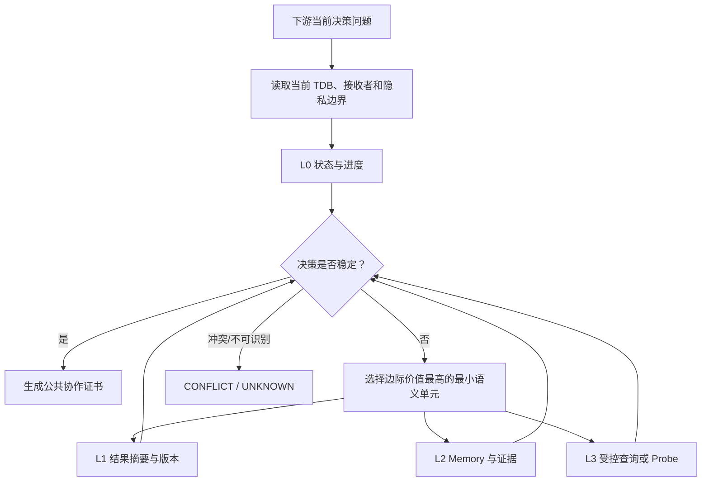

# uBuddy 技术模块二：决策充分的条件化公共语义投影

> 研究设计稿。本文定义如何根据任务依赖集束、下游决策、接收者和隐私边界，生成最小但足够稳定的公共协作语义。

## 1. 模块目标

模块二回答：

> 当前下游为了做出一个具体决策，需要看到多少节点状态、结果、Memory 和证据？什么时候应该停止披露？什么时候必须输出 UNKNOWN 或请求 Probe？

核心原则：

\[
披露量\neq g(单一依赖分数)
\]

而是：

\[
披露策略=f(TDB,query,receiver,trust,privacy,risk,uncertainty)
\]

## 2. 输入输出

输入上下文：

\[
C_t=(TDB_t,q_t,r_t,trust_t,privacy_t,risk_t,u_t)
\]

输出公共语义证书：

\[
C^{pub}_t=(G^{plan}_{pub},G^{exec}_{pub},claims,evidence,confidence,unknowns,nextAction)
\]

其中 \(q_t\) 是当前下游决策问题，\(r_t\) 是接收者。

## 3. 语义投影函数

对完整协作世界 \(W_t\)，接收者 \(r\) 的投影为：

\[
C^{pub}_{r,t}=\Pi_{\theta}(W_t;TDB_t,q_t,r,privacy_t)
\]

\(\theta\) 是投影策略参数，可以由规则、上下文 bandit 或离线策略学习得到。

投影必须满足非越权：

\[
VisibleFields(\Pi_\theta)\subseteq AllowedScope(r)
\]

## 4. 披露层级

定义有序披露层级：

\[
L_0\prec L_1\prec L_2\prec L_3
\]

- \(L_0\)：节点状态和工作进度；
- \(L_1\)：结果摘要、版本、适用范围；
- \(L_2\)：必要 Work Memory、局部证据和依赖维度；
- \(L_3\)：受控查询、补充证明或 Probe。

层级不是把完整私人状态逐级公开，而是逐级增加“与当前决策相关的最小语义”。

## 5. 决策充分性

设下游决策空间为：

\[
\mathcal A=\{accept,wait,request,retry,reassign,replan,terminate\}
\]

给定投影层级 \(L\)，定义决策后验：

\[
P(a\mid C_L,q_t,r_t)
\]

决策充分性约束：

\[
\max_{a\in\mathcal A}P(a\mid C_L,q_t,r_t)\geq \tau_d
\]

更严格地，可以要求决策在所有与当前公共观察一致的世界中保持一致：

\[
\left|\{a^*(w):w\in M(C_L)\}\right|=1
\]

其中 \(M(C_L)\) 是与当前公共投影一致的模型世界集合。

## 6. 最小披露优化

披露成本：

\[
Cost(L)=\lambda_p PrivacyLeak(L)+\lambda_c Communication(L)+\lambda_m CognitiveLoad(L)
\]

最小充分披露层级：

\[
L^*=\arg\min_{L\in\{L_0,L_1,L_2,L_3\}}Cost(L)
\]

满足：

\[
DecisionSufficient(L)\land PrivacySafe(L)\land EvidenceValid(L)
\]

如果不存在满足条件的层级，则不能强行提升披露：

\[
L^*=UNKNOWN/Probe
\]

## 7. 条件化策略

策略输入：

\[
s_t=[x_e(t),q_t,receiver_t,trust_t,privacy_t,risk_t,u_e]
\]

策略输出：

\[
\pi_\theta(s_t)\rightarrow(L_t,fields_t,nextAction_t)
\]

可以使用约束上下文 bandit：

\[
\theta^*=\arg\max_\theta E[DecisionUtility]-\beta E[PrivacyLeak]
\]

约束：

\[
E[PrivacyLeak]\leq\epsilon_p
\]

学习目标不是“尽可能少公开”，而是“以最低披露代价达到当前决策稳定”。

## 8. 渐进式语义展开算法

### Algorithm 1：Progressive-Decision-Sufficient-Projection

```text
Input: TDB, query q, receiver r, trust/privacy/risk context
1. Start at L0 and construct a candidate public projection.
2. Evaluate decision posterior and evidence validity.
3. If one decision is stable and authorized, stop.
4. Otherwise identify the smallest missing semantic unit.
5. Expand to L1, L2 or issue a controlled query.
6. Re-evaluate decision stability after each expansion.
7. If evidence conflicts, emit CONFLICT.
8. If evidence remains insufficient or non-identifiable, emit UNKNOWN.
9. Record disclosed fields, reason, version and evidence references.
```

## 9. 缺失语义单元选择

将候选信息单元记为 \(m\)，定义其边际价值：

\[
MV(m)=H(A\mid C_L)-H(A\mid C_L,m)
\]

其中 \(H(A\mid\cdot)\) 是决策不确定性。

选择单位：

\[
m^*=\arg\max_m\frac{MV(m)}{DisclosureCost(m)+\epsilon}
\]

同时要求：

\[
m\in AllowedScope(r)\quad\land\quad Risk(m)\leq RiskBudget
\]

## 10. 公共规划图与执行图

规划图公共投影：

\[
G^{plan}_{pub,r}=\Pi_r(G^{plan},TDB^{plan})
\]

执行图公共投影：

\[
G^{exec}_{pub,r}=\Pi_r(G^{exec},TDB^{active})
\]

默认展示：

```text
节点状态、工作进度、结果摘要、版本、简单关系边、必要证据引用
```

默认隐藏：

```text
完整私人 Memory、Prompt、文件、凭据、内部推理、未授权能力信息
```

## 11. 冲突与 UNKNOWN

如果公共观察对应多个世界，且这些世界要求不同决策：

\[
\exists w_1,w_2\in M(C_L),\quad a^*(w_1)\neq a^*(w_2)
\]

则当前投影不具备决策充分性。

处理规则：

```text
证据充分且决策稳定 → 输出 CERTIFIED
证据互相矛盾 → 输出 CONFLICT
证据不足但可通过低风险查询补足 → 请求 Probe
无法识别或超出权限 → 输出 UNKNOWN
```

## 12. 公共协作证书

\[
Cert^{pub}=(claims,scope,version,evidenceRefs,confidence,unknowns,nextAction)
\]

证书不包含完整私人状态，只证明：

1. 在当前作用域内观察到哪些事实；
2. 哪些任务义务仍未满足；
3. 当前结论适用到哪个版本和接收者；
4. 哪些信息被主动隐藏；
5. 下一步需要等待、请求还是 Probe。

## 13. 正确性目标

投影算法的目标性质：

### 语义充分性

\[
DecisionStable(C^{pub})\Rightarrow CorrectDecision(C^{pub})
\]

### 非越权

\[
Disclosure(C^{pub})\subseteq AllowedScope(receiver)
\]

### 单调展开

\[
L_i\prec L_j\Rightarrow Information(L_i)\subseteq Information(L_j)
\]

### 安全拒答

\[
NotIdentifiable(C^{pub})\Rightarrow Verdict=UNKNOWN
\]

## 14. 技术链路图



