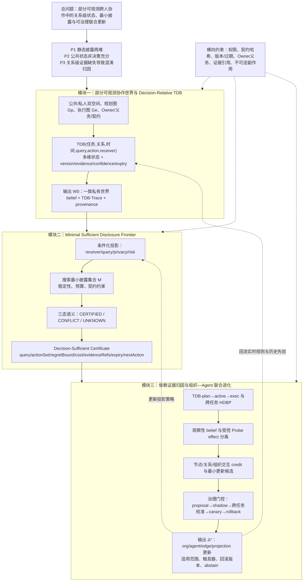

# uBuddy 痛点与创新点 V1：关系级决策充分状态

本版本在现有主航线基础上做一次小幅收紧，不改变三模块结构，也不改代码。三位独立审稿人分别从新颖性、理论深度、系统闭环评审。

## 1. V1 总问题

在私人状态不可见的跨人、跨组织 Agent 协作中，如何维护绑定到具体任务关系的多维依赖状态，并根据接收者的决策查询生成最小必要公共语义，从而为协作决策和后续组织—Agent 更新提供可追溯证据？

核心对象仍是 TDB，但 V1 将其明确为：

> **任务—关系—时间绑定、相对于查询和候选动作的状态摘要，而不是字段集合或通用图记忆。**

同一个 TDB 同时服务于两件事：决定应披露哪些语义，以及解释后续结果应归因于节点、关系还是组织。

## 2. 三个痛点（渐进式修订）

### P1：静态披露无法同时满足隐私与决策需求

静态全量共享会增加隐私泄露、越权推断和通信成本；静态最小共享又可能缺少支持下游动作所需的版本、新鲜度、质量或义务信息。因此披露范围必须由具体关系、接收者和决策查询共同决定。

### P2：权限过滤后的公共状态仍可能不是决策充分状态

同一公共投影可能对应多个私有协作世界。节点状态、进度和简单连线不足以判断某个结果是否适用于当前动作。系统需要判断：在所有与当前公共历史一致的私有世界中，允许动作是否保持稳定；无法稳定时必须返回 `CONFLICT` 或 `UNKNOWN`。

### P3：关系级证据缺失导致组织、依赖边和 Agent 混淆归因

任务成败不能直接说明问题来自 Agent 能力、交接关系、版本选择、资源状态还是组织拆分。若将结果直接写入 Skill、Memory 或组织策略，容易产生跨任务负迁移。观察性轨迹只形成证据加权归因；受控 Probe 或 replay 才能升级为干预支持的归因。

## 3. 三项主创新

### 创新一：Decision-Relative TDB

定义 `TDB(τ,e,t;q,A,r)`，其中 `τ` 为任务、`e` 为关系边、`t` 为时间、`q` 为接收者查询、`A` 为允许动作集合、`r` 为接收者。对象保留现有 data、logic、quality、freshness、review、capability、resource、risk、impact、uncertainty 等维度，并为每一维附带版本、证据引用、可信度、过期时间、owner 和义务状态。

它区别于普通图记忆的关键是：状态摘要随具体决策查询和授权动作变化，且同时成为公共投影和后续归因的共同证据底座。

### 创新二：Minimal Sufficient Disclosure Frontier

M2 不再只描述 L0–L3 的工程展开，而定义语义单元集合 `M` 的前沿搜索：在固定隐私/通信预算和不可修改公共契约下，寻找成本最小的披露集合，使指定查询下的允许动作保持 `ε` 稳定。

对当前公共历史 `h`，令 `W(h,M)` 表示与投影一致且满足权限和契约的私有世界集合。若存在授权动作在所有 `w∈W(h,M)` 中的 regret 不超过 `ε`，输出 `CERTIFIED`；若不同世界支持互斥动作，输出 `CONFLICT`；若支持不足、超出权限或预算耗尽仍无法判定，输出 `UNKNOWN`。`CERTIFIED` 只表示对指定 query 的决策充分，不表示识别了真实私有世界。

### 创新三：Dependency-Grounded Counterfactual Credit and Governed Joint Evolution

M3 将节点、关系边和组织结构作为不同的干预组件。观察性轨迹得到 `b_c=P(c|Trace)`；只有 `replaceAgent`、`changeEdge`、`refreshVersion`、`addReview` 等受控 Probe/replay 产生增量效果时，才报告 intervention-supported attribution。对必须联合修复的依赖边，记录交互项而非假设单边贡献可加。

归因证据进入组织策略、Agent 能力、依赖估计和投影策略四类更新，但必须经过适用范围、跨任务校准、置信下界、版本栅栏和 rollback 条件门控；历史 HDBP 只能初始化先验，不能覆盖当前实时证据。

## 4. V1 三模块完整链路图

## 5. 三维独立审稿评分

| 评审维度 | V0 当前方案 | V1 方案 | 主要理由 |
|---|---:|---:|---|
| 新颖性 | 7.4/10 | **8.1/10** | TDB 被提升为 query/action/receiver-relative 状态；同一对象同时驱动披露与归因 |
| 技术深度 | 7.0/10 | **7.9/10** | 引入决策充分性、最小披露前沿、三态拒答和观察/干预归因区分 |
| 系统闭环与边界 | 7.8/10 | **8.3/10** | 证书字段、过期/版本/Owner 约束和更新门控更明确 |
| 综合顶会接受潜力 | 7.5/10 | **8.0/10** | 主线保持稳定，核心对象和不可替代性更清晰 |

## 6. 本轮新增的新颖性锚点

> **同一个任务级、关系级、时间绑定的 TDB，同时决定应披露什么、如何解释结果、以及哪些组织或 Agent 更新可以被保留。**

这句话是 V1 相对于图记忆、选择性披露和单 Agent credit assignment 的主要区别。单独的图、摘要或归因算法都不能提供这种共享语义。

## 7. 尚未解决、留到下一轮的问题

1. 需要进一步区分 minimum-cost disclosure 与 minimum-cost evolution update。
2. `CERTIFIED` 的 regret/safety 计算还需要选择稳健世界语义或分布语义，不能混用。
3. 受控 Probe 的支持条件和可回放等级需要形式化。
4. HDBP 的跨任务校准目前是设计要求，尚不是已验证结论。

本版本只完成方案迭代，没有修改代码。
