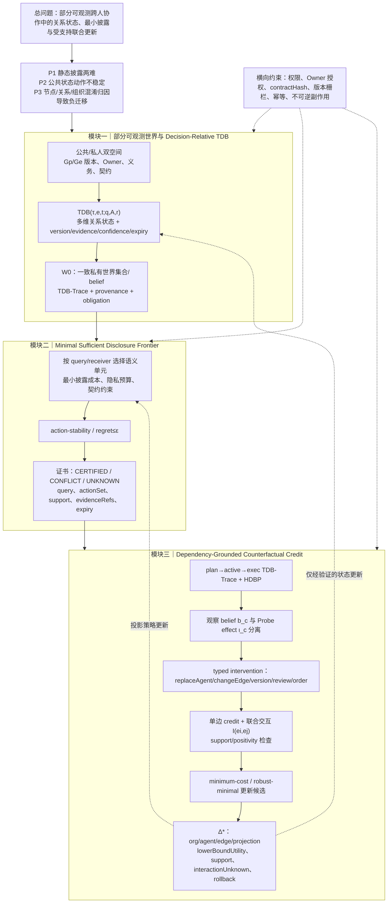

# uBuddy 痛点与创新点 V2：支持感知的关系干预与最小联合更新

V2 在 V1 基础上继续微调，保留 M1→TDB→M2→M3 主航线。本轮只解决一个问题：M3 如何从“证据加权归因”进一步成为有支持边界的关系级干预与联合更新，而不把观察性概率冒充因果结论。

## 1. V2 新增技术语义

### 1.1 三种归因证据必须分开

- `b_c=P(c|TDB-Trace)`：观察性责任信念，只表示轨迹证据支持度。
- `ι_c=E[Y|do(I_c=1)]−E[Y|do(I_c=0)]`：受控 Probe/replay 支持的干预增量。
- `support(I_c)`：该干预在当前权限、版本、执行环境和候选世界中的支持程度。

只有 `support(I_c)>0` 且满足版本/权限/契约条件时，才允许将 `ι_c` 标记为 intervention-supported；否则只保留 `b_c` 或返回 `interactionUnknown`。

### 1.2 关系交互而非单点 credit

对于关系边 `e_i,e_j`，定义联合干预交互：

`I(e_i,e_j)=ΔY(e_i,e_j)−ΔY(e_i)−ΔY(e_j)`。

这表达“单边修复无效、联合修复有效”的跨层依赖。M3 的更新候选因此可以是 `node + edge + organization + projection` 的 typed 集合，而不是单个 Agent 分数排名。

### 1.3 最小性分层

- `inclusion-minimal`：删除任一更新动作后不再满足目标；
- `minimum-cost`：总更新成本最小；
- `robust-minimal`：对所有与当前公共历史一致且有支持的候选世界成立。

论文主张默认使用 `minimum-cost`，若求解器只能保证前两者之一，必须显式标注。

## 2. V2 更新后的三模块链路图

## 3. 三维独立审稿评分

| 维度 | V1 | V2 | 审稿判断 |
|---|---:|---:|---|
| 新颖性 | 8.1 | **8.3/10** | 关系边级 typed intervention 和联合交互 credit 提高了区别度 |
| 技术深度 | 7.9 | **8.3/10** | support/positivity、effect 与 belief 分离、三类最小性使问题可形式化 |
| 系统闭环与边界 | 8.3 | **8.4/10** | 受控 Probe、版本/权限/幂等约束进入归因语义 |
| 综合顶会接受潜力 | 8.0 | **8.2/10** | M3 不再只是 self-evolution 叙事，但仍需治理门控收尾 |

## 4. 本轮仍不应过度声称

1. `ι_c` 只有在真实 Probe/replay 支持下才是干预效果。
2. `minimum-cost` 不是自动可得的，需要说明 solver 或近似边界。
3. 交互项未知时应报告 `interactionUnknown`，不能按单边贡献相加。
4. HDBP 仍是带适用范围的历史先验，不能覆盖当前 TDB。

本版本只修改方案文档，没有修改代码。
