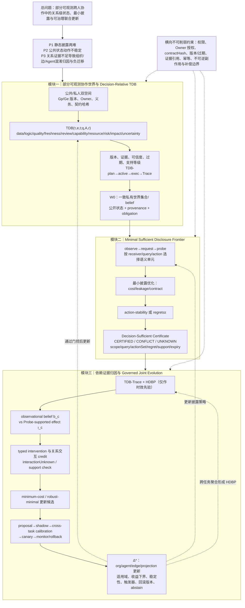

# uBuddy 痛点与创新点 V3：可治理的跨任务联合进化闭环

> **研究主张已切换（2026-09-10）。** 当前规范入口是 [V4 主张冻结](ubuddy-pain-points-innovations-v4-claim-freeze.zh-CN.md) 与 [V4 自进化收束稿](ubuddy-pain-points-innovations-v4-self-evolution.zh-CN.md)。V3 的最小披露 / 决策充分 TDB 主线保留为历史方案，不再作为当前贡献。

V3 是当时阶段的收束版本。在 V2 的关系级状态、最小充分披露和支持感知干预基础上，只增加跨任务更新的校准与治理门控，仍保持原有三模块和 HDBP 回流结构。

## 1. V3 统一问题表述

> 在私人状态不可见的跨人、跨组织 Agent 协作中，如何用绑定到具体任务关系的 TDB 表示可共享但不全量公开的协作语义，使指定接收者能够获得决策充分的最小披露；并依据带支持边界的关系级过程证据，区分节点、关系与组织责任，生成经过跨任务校准和治理门控的联合更新？

这里的“联合”不是把所有 Agent 自动改写，而是让组织策略、Agent 能力、依赖估计和投影策略围绕同一份 TDB-Trace 证据产生候选，再分别接受门控。

## 2. 三个痛点的最终层次

### P1：静态披露无法同时满足隐私与决策需求

全量共享扩大泄露面和通信成本，固定最小共享又无法覆盖具体关系和动作所需语义。

### P2：合法公共状态仍可能不具备动作稳定性

权限过滤后的公共图可能对应多个私有世界；如果不同一致世界支持不同动作，系统不能把摘要当作充分依据，必须继续 Probe 或返回 `UNKNOWN/CONFLICT`。

### P3：缺少关系级可支持证据会造成错误长期更新

仅凭最终成败或观察性轨迹无法可靠区分 Agent、依赖边和组织结构责任。未经 Probe 支持、跨任务校准和负迁移检查的更新会把偶然经验写入长期策略。

## 3. V3 三项创新

### 创新一：Decision-Relative TDB

TDB 是任务、关系边、时间、接收者查询和允许动作共同索引的状态对象。每个状态维度都带版本、证据引用、可信度、过期时间、Owner、义务和契约哈希。它不是长期社交边、静态能力标签或无条件共享记忆。

### 创新二：Minimal Sufficient Disclosure Frontier

对具体 query 和 receiver，在固定隐私/通信预算、契约和权限约束下搜索最小语义单元集合。若所有一致私有世界中存在 `ε` 稳定的授权动作，输出带 `query/actionSet/regretBound/disclosureCost/evidenceRefs/expiry` 的 `CERTIFIED`；世界支持互斥动作时为 `CONFLICT`；支持、权限或预算不足时为 `UNKNOWN`。

### 创新三：Dependency-Grounded Counterfactual Credit with Governed Joint Evolution

M3 同时维护观察性归因信念和 Probe 支持的干预效果，显式表示关系交互。所有更新进入四类候选槽位：组织结构、Agent 能力、依赖边估计、公共投影策略。

提交流程固定为：

```text
proposal
→ shadow evaluation（不影响线上任务）
→ cross-task calibration（任务/关系类型、样本量、时间衰减、适用域）
→ canary
→ monitored adoption or rollback
```

只有跨任务收益下界为正、归因排序稳定、契约和权限不变、且定义了失效触发器时才允许采用；否则保留候选或 `abstain`。HDBP 只能提供带时效和适用域的先验，实时 TDB 具有优先权。

## 4. V3 三模块完整技术链路图



## 5. 三维独立顶会审稿评分

| 维度 | V0 | V1 | V2 | V3 |
|---|---:|---:|---:|---:|
| 新颖性 | 7.4 | 8.1 | 8.3 | **8.4/10** |
| 技术深度 | 7.0 | 7.9 | 8.3 | **8.5/10** |
| 系统闭环与问题边界 | 7.8 | 8.3 | 8.4 | **8.7/10** |
| 综合顶会接受潜力 | 7.5 | 8.0 | 8.2 | **8.4/10** |

### 新颖性审稿人

主要认可点是：TDB 不再是字段堆积，而是同时驱动语义披露、关系归因和更新门控的共同状态对象；决策查询绑定、关系交互 credit 和跨任务负迁移门控共同形成区别于图记忆、选择性披露和单 Agent credit assignment 的性质。剩余风险是需要在论文中用反例说明，去掉 TDB 的 query/action 绑定后，现有方法确实无法得到相同的稳定性和归因边界。

### 理论/技术深度审稿人

主要认可点是：`CERTIFIED/CONFLICT/UNKNOWN` 有明确输出语义，最小披露和最小更新被区分，观察性 belief 与干预效果被拆开，组合交互不再被错误加和。剩余风险是后续需要选择一种一致的稳健世界或分布级语义，并给出决策充分性、支持感知拒答、更新门控的正式定义；当前文档只完成方案设计，不能把这些性质写成已证明结果。

### 系统/问题定义审稿人

主要认可点是：权限、Owner、版本、过期、契约哈希、证据引用和回滚条件贯穿三模块；HDBP 不覆盖实时 TDB；不可逆副作用和补偿被放在执行边界内。剩余风险是跨组织 Probe 的成本、最坏披露预算和在线一致性需要后续系统证据，Gateway/Verifier 应作为可信执行语义支撑而非独立主创新。

## 6. 当前应固定的论文贡献表述

1. 提出面向查询和动作的任务级关系依赖状态 TDB，用统一的带证据状态支持跨组织协作中的最小语义披露与结果归因。
2. 提出以动作稳定性为停止条件的最小充分公共语义投影，并在无法识别、冲突或超出权限时显式拒答。
3. 提出基于 TDB-Trace 的关系级受支持归因与治理式组织—Agent 联合更新，显式处理关系交互、跨任务负迁移和回滚。

## 7. 结论与下一步边界

V3 已达到“方案层面可进入顶会论文设计阶段”的标准，当前不再建议继续增加新的主模块或新的创新点。后续工作应围绕这条固定主线补充形式化定义、反例、算法和验证，而不是再次扩展研究范围。

本版本只修改方案文档，没有修改代码。
