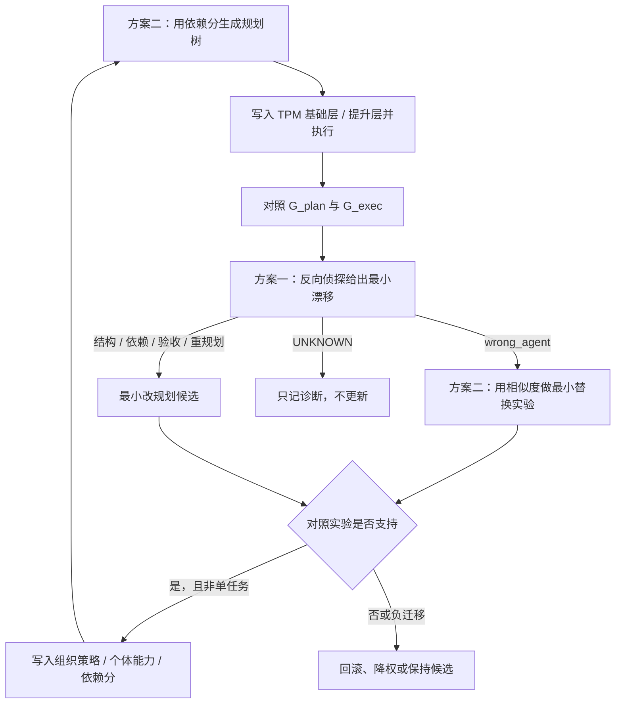

# uBuddy 痛点与创新点 V4：跨人任务组织的可归因自进化

> 状态：阶段 2–4 契约已落地，合成可行性已通过（2026-09-10）。当前研究主张的规范入口。  
> 主张冻结：[ubuddy-pain-points-innovations-v4-claim-freeze.zh-CN.md](ubuddy-pain-points-innovations-v4-claim-freeze.zh-CN.md)  
> 契约：[TPM](ubuddy-v4-tpm-contract.zh-CN.md) · [RDMD](ubuddy-v4-rdmd-protocol.zh-CN.md) · [CPDB](ubuddy-v4-cpdb-protocol.zh-CN.md)  
> 可行性：[ubuddy-v4-feasibility-report.zh-CN.md](ubuddy-v4-feasibility-report.zh-CN.md)

V3 把依赖集束同时用于跨人披露、决策充分性和联合进化。V4 不再走这条并排主线。跨人看见什么交给任务公共 memory；研究只回答组织如何在规划与现实分叉后做**最小、可对照、可回滚**的自进化。

---

## 1. 与 V3 的关系

| V3 | V4 |
|---|---|
| 三个痛点：披露两难、公共状态不稳、错误长期更新 | 一个痛点：跨人任务组织无法准确自进化 |
| 创新二：最小充分披露前沿 | 删除主创新；改由三层公共 memory + 工程审查 |
| TDB 同时回答披露 / 归因 / 更新 | 公共 memory 管看见什么；方案一管偏在哪；方案二管找谁换谁 |
| 依赖集束 = 任务关系边上的十维状态后验 | 依赖集束 = 能力画像上的依赖分 + 相似度 |
| Probe 证书驱动进化 | 双树对照 + 相似替换实验驱动进化 |

旧三模块文档、TDB 主线方法和投影训练保留为历史实现，不在本文展开，也不作为当前论文贡献继续扩张。

---

## 2. 统一问题

> 在跨人、跨组织、多 Agent 任务中，如何让参与者默认只使用同一份任务公共 memory 的基础层与提升层进行协作；并在规划理想路径与现实可执行路径出现差异后，用反向侦探找到最小漂移，用能力画像依赖集束做最小能力改动的替换实验，从而把组织规划、个体能力和协作边的更新限制在有对照证据的最小改动上？

分工固定为：

```text
任务公共 memory     看见什么（工程底座，非主创新）
方案一 反向侦探     偏在哪（最小漂移）
方案二 能力画像集束 找谁、换谁、差在哪项能力
自进化门禁         改组织还是改个体，以及何时准许写入
```

---

## 3. 唯一主痛点

### P_evo：跨人任务组织无法准确自进化

跨人任务不是单 Agent 自我改 prompt。组织先规划拆分、依赖和人选，个体再执行；执行中会出现改派、重试、局部重规划和版本错配。最终验收只给出一个成败标签，不足以回答：

- 是规划理想路径本身不可执行，还是执行偏离了可执行规划；
- 应改组织结构、验收契约，还是改某个 Agent 的一项能力；
- 一次成功补救能不能写进下一轮策略。

若没有最小漂移定位，系统会把执行树上所有新增节点都当成“应该永久加入的组织结构”。  
若没有最小能力改动实验，系统会一次换掉多项能力，无法知道到底是哪一项细节导致结果变化。

因此主痛点拆成两个可测子问题。

### P_drift：找不到最小漂移源

规划树是 AI / 组织的理想路径，执行树是现实可走路径。二者分叉后，真正有用的是**能解释后续变化的那个最小改动点**，不是差异点清单。

### P_swap：换人改能力时改得太大，归因落空

A 与 C 合作差，若换成完全不像 A 的 D，结果变好也无法说明是哪项能力差。应换成与 A 最像的 B，尽量只动一项能力，才能做归因。

不作为当前痛点：隐私—决策两难、公共图对应多个私有世界时的动作稳定性。这些由公共 memory 的默认可见性和原始层申请处理，不进主创新。

---

## 4. 工程底座：任务公共 memory

任务公共 memory（TPM）是该任务的唯一协作记忆。依赖集束不再决定“向谁公开哪些字段”。

### 4.1 三层

```text
基础层  G_plan、G_exec、节点状态、版本、结构依赖边
提升层  系统省检后的摘要（里程碑、结果版本、阻塞、验收、风险）
原始层  全部原始上下文（对话、文件、中间产物、未脱敏内容）
```

本任务参与者默认只看见前两层。原始层默认关闭。其他任务要读本任务原始层，必须申请。

### 4.2 基础层：规划树与执行树

沿用全链路已有对象，只固定它们在 V4 中的角色。

**规划树 \(G^{plan}\)**：截至执行前，各级 uBuddy 认为应该如何完成任务。可逐层补全，但本轮执行开始前冻结。需求变化则生成新规划版本，不覆盖旧版。

**执行树 \(G^{exec}\)**：从规划副本出发，按真实事件追加：派发、开始、产出、阻塞、重试、改派、局部重规划、提交、验收。当前状态是事件历史的投影，不是唯一事实。

对照时至少检查：缺节点、计划外节点、边增删或改向、串并行变化、计划 / 实际 Agent、输入输出契约、结果版本、失败与重试是否有原因。合理重规划必须留下新规划版本和原因，不能把原规划改写成“一开始就是这样”。

### 4.3 提升层：省检摘要

省检只写提升层，例如：

- 当前里程碑与进度；
- 采用了哪个结果版本；
- 阻塞原因的非敏感表述；
- 验收通过 / 失败的摘要；
- 已知风险提示。

省检失败的条目不进入提升层，也不写入基础层。密钥、真实路径、私聊全文、未授权附件不得出现在提升层。

### 4.4 原始层访问（工程，非贡献）

```text
申请单：申请方任务、用途、节点或时间窗、是否只要摘录
  → AI 预审：范围、密钥/PII、用途是否与申请任务相关
       通过 / 驳回 / 转人工
  → 通过后交任务 Owner（必要时数据 Owner）终审
  → 批准则签发短时、可审计、可撤回的只读授权
```

没有授权时，其他任务只能使用该任务已公开的基础层和提升层。审查失败不阻塞本任务继续执行。完整规则留给阶段 2，本文不把它写成算法。

---

## 5. 方案一：规划—执行双树对照 + 反向侦探最小漂移

### 5.1 思想

训练时先有正确路径，再在某一节点做一次已知小改动，让后续部分或全部节点发生变化。模型看不见注入点，只看见原路径和变化后路径，去找那个最小漂移。这是“凶手手法已知、让模型当侦探”，不是让模型先规划再自我解释。

推理时把规划树当作理想路径、执行树当作现实路径，侦探输出最小漂移假设。第一版只定位，不直接给完整修复方案。

### 5.2 对象

对齐后的双树差：

\[
\Delta(G^{plan},G^{exec})
=
\{
v^{miss},v^{extra},e^{\Delta},a^{\Delta},ver^{\Delta},acc^{\Delta}
\}
\]

其中节点缺失 / 多余、边变化、Agent 变化、版本变化、验收变化都可以出现，但其中多数是**后果**。侦探要找的是最小源：

\[
\hat{c}
=
\operatorname{RDMD}(G^{plan},G^{exec})
\]

\(\hat{c}\) 绑定一个节点或一条边、一种漂移类型、一组证据节点。证据不足时输出 `UNKNOWN`，不编造唯一凶手。

第一版漂移类型：

```text
missing_dependency   漏了必要依赖或前置验收
wrong_agent          派了能力不匹配的 Agent
wrong_version        用了过期或不该消费的结果版本
wrong_acceptance     验收条件错或过宽过严
local_replan         中途局部重规划改变了后续可走路径
```

### 5.3 合成监督：已知手法再让侦探去找

```text
1. 取一条正常可执行流程（教程、工作流或 AI 生成的节点图）→ G*
2. 在隐藏节点 v* 注入一次小改动 δ*（类型取自上一节）
3. 由生成器（规则或 AI）推演后续哪些节点会变、哪些不变 → G'
4. 样本 = (G*, G', c*)，其中 c* = (v*, δ*)
5. 模型只输入 (G*, G')，预测 ĉ；损失对 c* 计算
```

约束：

1. 主训练集每次只注入一次最小改动。
2. 后续变化允许全变或部分变；标签是注入点，不是所有变点。
3. 另建无注入对照，监督为“无漂移”；用于压误报。
4. 多注入样本只用于评测拒答 / `UNKNOWN`，不进主监督。
5. 生成器必须把 `c*` 写进样本元数据，评测不得用模型自标。

这比从真实失败日志里反标根因容易：标答在注入时已确定。

### 5.4 推理用法

任务结束后（或关键里程碑后）：

```text
读取 TPM 基础层中的 G_plan、G_exec
对齐节点 / 边 / 结果版本
RDMD → ĉ 或 UNKNOWN
若 ĉ 属于 wrong_agent → 交给方案二做相似替换
若 ĉ 属于结构 / 依赖 / 验收 / 局部重规划 → 生成最小规划改动候选
单任务记录诊断，不写长期策略
```

规划树向执行树靠近只是候选来源之一，不是优化目标。成功执行里的临时补救（人工插入、随机重试、更贵模型）不得被侦探直接当成应写入组织的结构。

### 5.5 规格级指标

| 指标 | 含义 |
|---|---|
| Top-1 / Top-3 命中 | \(\hat{c}\) 是否等于注入点 |
| 类型准确率 | 漂移类型是否正确 |
| 冗余率 | 额外指控的无关节点数 |
| 无漂移误报 | 对照样本上输出了漂移 |
| 多因拒答率 | 多注入样本上输出 `UNKNOWN` 的比例 |

阶段 1 只定义这些指标。数据生成器、模型和真实任务评测属于阶段 3。

---

## 6. 方案二：基于能力画像的依赖集束

### 6.1 思想

根据 Agent 能力画像初始化两类分数：谁该一起协作，谁在失败后最适合用来做最小能力改动实验。合作历史可以调整依赖分，但加分指数递减，避免老搭档锁死规划。

### 6.2 两个分数

**依赖分 \(D(A,B)\)**  
A 的产出是否适合作为 B 的输入。例如信息整理与文案写作依赖分高。用于**一开始的规划**：优先把高依赖分的 Agent 放进同一条协作链。

**相似度 \(S(A,B)\)**  
A 与 B 的 skill、任务族、可替换历史有多近。例如两个做 PPT 的相似度高。用于**执行不佳时换人**：选与原 Agent 最像的替代者，使能力改动尽量小，从而把结果差归因到二者之间那一项细节能力。

禁止：

- 把 \(D\) 和 \(S\) 加权成一个“依赖集束总分”再拿去归因；
- 用 \(S\) 当首选协作信号（两个很像的 PPT Agent 未必该互相依赖）；
- 用 \(D\) 当换人信号（高依赖的下游写作者不能替代上游整理者）。

### 6.3 初始化与更新

初始化以能力画像为主，人工可标：

- 依赖分：按“产出类型 → 输入类型”是否匹配；
- 相似度：按 skill 重叠、任务族重叠。

合作成功后：

\[
D_{t+1}(A,B)=D_t(A,B)+\eta\,\delta_t\,\exp(-\lambda n_{AB})
\]

\(n_{AB}\) 为已成功合作次数。\(\lambda\) 使后来的成功几乎不再加分。

合作失败：不把 \(D\) 直接打到零，先进入替换实验。替换实验的结果可以下调 \(D\) 或标记某项能力缺口，但必须留下对照记录。

相似度不因单次成败大幅改写；只有稳定的可替换证据才小幅更新。

规划时冻结一次能力选择快照，事后不得用最新画像改写当时为什么选了这个人。这一点沿用已有协作原型。

### 6.4 最小能力改动替换实验

```text
观察：C 与 A 合作效果不佳
固定：任务、规划结构、C、验收器
替换：A → B，B = argmax_x S(x, A) 且 x ≠ A
比较：与 A 合作 vs 与 B 合作

若变好：归因到 A 与 B 的能力差（取画像中不一致的那一项或少数几项）
若差不多或更差：更可能是结构 / 依赖 / 验收问题，交回方案一，不继续随机换人
```

对照至少包括：相似替换、随机替换、只改规划不换人。没有这三项，不得说“已经精确定位到某项能力”。

### 6.5 规格级指标

| 指标 | 含义 |
|---|---|
| 规划选人命中 | 高依赖分配对是否优于随机 / 仅文本匹配 |
| 替换邻近度 | 实际替换者与原 Agent 的 \(S\) 是否显著高于随机 |
| 能力差可辨识性 | 相似替换后，标注能力差与画像差的一致率 |
| 随机替换对照 | 相似替换是否比随机换人更能分离能力因素 |
| 锁死程度 | 依赖分指数递减是否避免老搭档垄断规划 |

阶段 1 只定义指标和标注对象。标注规范与模型训练属于阶段 4。

---

## 7. 自进化闭环

两条方案按时间衔接，不并列成两个产品。



### 7.1 什么时候改什么

| 侦探输出 | 优先动作 | 不优先 |
|---|---|---|
| `wrong_agent` | 相似替换实验；确认后更新个体能力或以后选人 | 立刻改组织模板 |
| `missing_dependency` / `wrong_acceptance` | 最小改规划或契约 | 换一个不像的 Agent |
| `wrong_version` | 改版本消费规则或输入检查 | 当能力不足 |
| `local_replan` | 判断是应写入模板的结构，还是一次性补救 | 整段复制执行树 |
| `UNKNOWN` | 停 | 强行进化 |

### 7.2 门禁

1. 单任务只产生诊断和候选。
2. 没有对照实验不更新。
3. 更新带 `applicableWhen`（任务类型、规模、交付级别等）。
4. 在未见同类任务上收益为负则回滚。
5. 正式比较至少四种：不更新、只改组织、只改个体、联合更新。联合方案只有多任务收益高于单层时，才能称为联合进化有效。

可更新对象只有：组织规划策略、个体能力、协作边依赖分。投影策略、披露求解器和 `CERTIFIED` 证书不再出现在更新槽位里。

---

## 8. 训练与验收（规格，未实施）

阶段 1 只冻结“训什么、用什么标答、怎样才算过”，不启动训练。

### 8.1 方案一数据协议

每条样本必须能重放：

```text
graph_id, G_star, G_prime, injected_node, injected_type,
changed_nodes, unchanged_nodes, generator_id, seed
```

切分按图族 / 工作流来源，禁止同一条原路径的注入变体同时出现在训练和测试中。主结果看单注入定位；无注入误报和多注入拒答单独报表。

### 8.2 方案二标注协议

人工可直接标：

- 一对 Agent 的依赖分（规划是否该协作）；
- 一对 Agent 的相似度（失败时是否适合替换）；
- 替换实验后“能力差是哪一项”的短标签。

模型只学习拟合这些分数与标签，不学习一个隐式总分。历史合作次数只进入依赖分更新公式，不进入相似度主标注。

### 8.3 闭环最小验收

同一任务族上至少能跑通：

```text
依赖分规划 → 执行入 TPM → 双树对照 → 侦探定位
 → 相似替换或最小改规划 → 对照收益 → 允许或拒绝写入
```

在此之前不得写“生产自进化已验证”。合成侦探基准可以先于真实任务单独出结果。

### 8.4 明确停做的训练

不再把以下内容当 V4 主线扩张：finite-world 最小披露 solver、投影头 `CERTIFIED` 拟合、TDB 十维状态后验作为归因监督、披露成本最优性。已有 run 可归档为历史协议证据。

---

## 9. 工程附录：原始层审查

本附录不是创新点，只避免阶段 2 之前口径漂移。

申请单至少包含：申请方任务 ID、用途、节点或时间窗、只要摘录还是要原文。  
AI 预审只做范围、密钥 / PII、用途相关性，输出通过 / 驳回 / 转人工。  
人工终审是任务 Owner；涉及他人数据时增加数据 Owner。  
授权短时、只读、可撤回，每次读取进审计日志。  
实现可以是工单 + ACL，不需要新的研究模型。

---

## 10. 当前边界与阶段状态

- [x] 阶段 0–1：主张与方案骨架
- [x] 阶段 2：TPM 三层与申请审查契约（未接真实库表）
- [x] 阶段 3：反向侦探合成协议 + 非训练基线（未训练模型）
- [x] 阶段 4：依赖分 / 相似度协议 + 替换归因（未做人工标注）
- [x] 可行性：合成闸门通过，见可行性报告
- [ ] 阶段 5–6：真实任务、噪声传播、标注模型和跨任务负迁移

复现：`npm run experiment:v4-feasibility`

下一步若继续，优先给侦探合成器加噪声与合法重规划，并开始小样本画像标注；不要恢复最小披露训练。
