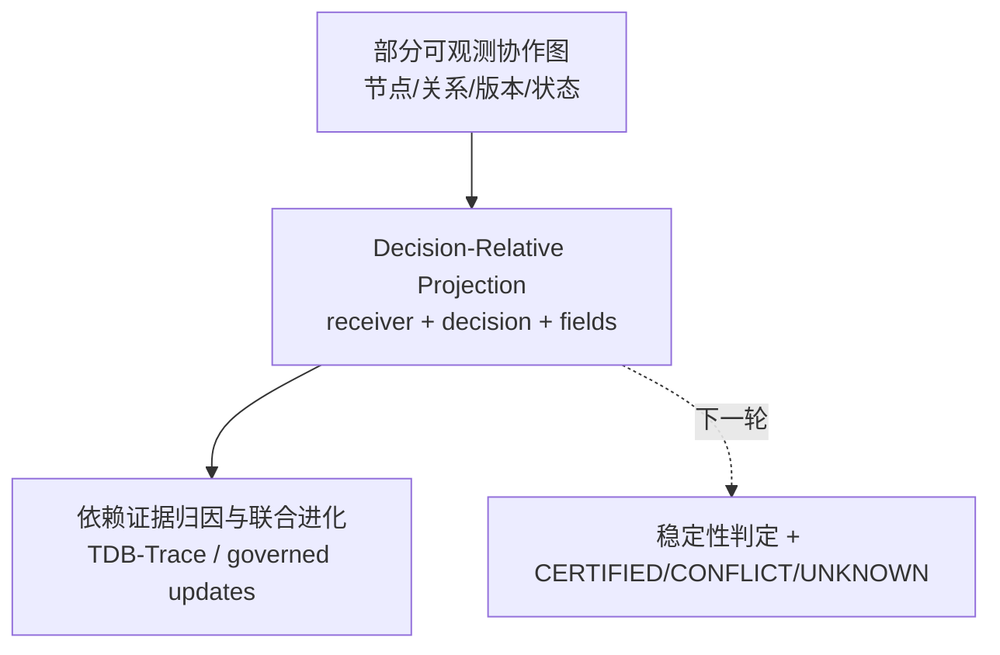

# 技术实现渐进式进化 V1：决策相对公共投影

本轮只做一处兼容增强：在现有 `buildCollaborationStateGraph` 的结果之上增加纯函数 `projectDecisionRelativeGraph`。它绑定原图授权查看者，并按关联关系与请求字段筛选状态项、结果版本。决策类型作为上下文保留，尚未决定字段需求；返回值明确标记充分性 `UNKNOWN`，不会把字段齐全等同于决策充分。原有数据库 schema、API 响应和图构建逻辑保持不变。

实现位置：`cloud/src/modules/collaboration/stateGraph.mjs`。测试位于 `cloud/test/collaboration-state-graph.test.mjs`，覆盖接收者过滤、字段条件和跨委托结果隔离。

## 三位独立审稿人评分

| 维度 | Reviewer A：新颖性 | Reviewer B：技术深度 | Reviewer C：系统可信度 |
|---|---:|---:|---:|
| 本轮实现 | 6.4/10 | 6.1/10 | 7.8/10 |

审稿意见：该 helper 建立接收者绑定的投影接口；但当前仍是确定性字段/关系过滤，决策类型只是上下文标签，尚未计算信息单元的边际决策价值，也没有三态证明语义。因此它是第一步接口准备，不能单独宣称决策充分或最小充分披露算法。评分是研究潜力判断，不能作为论文录用结论。

## 主航线中的增量位置

## 风险与下一轮边界

当前投影以 `receiverUserId` 过滤端点关系，无法表达“接收者虽非端点但承担组织决策”的授权语义；`requestedFields` 也只是客户端字段请求，尚未由决策需求推导。下一轮应在不改动主图 schema 的前提下增加 `queryId/actionSet` 和投影稳定性摘要，并让未知/冲突状态显式进入返回值。
