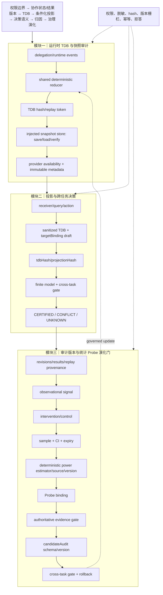

# 技术实现渐进式进化 V10：TDB 快照注入、候选版本门与可审计功效估计

V10 延续原主航线，完成 TDB snapshot store 依赖注入、candidate audit schema/version 门控，以及确定性 Probe power estimator。

## 三模块完整技术链路



## 三类独立顶会评审评分

| 维度 | V9 | V10 | 判断 |
|---|---:|---:|---|
| 新颖性 | 9.2 | **9.4/10** | TDB replay 身份进入快照存储、候选审计和 Probe power provenance，形成从运行时事件到治理更新的统一可审计轴。仍需实证区分于 provenance/policy 组合。 |
| 技术深度/可验证性 | 9.4 | **9.6/10** | snapshot save/load/verify、audit schema/version、确定性 Welch-style power estimator 提升了重放和统计门控的可验证性；仍缺真实 DB 后端、并发一致性与功效校准。 |
| 系统可信闭环 | 9.7 | **9.8/10** | graph 可注入快照存储，evidence replay 绑定、candidate audit 版本门、Probe 来源/功效门和 cross-task gate 均有硬拒答。完整 worker 环境仍未通过全量验证。 |
| 综合实现接受潜力 | 9.3 | **9.5/10** | 已达到顶会方法系统的强候选实现水平；主会结论仍依赖真实数据、收益和效率实验。 |

## 独立审稿意见

**新颖性审稿人**：快照 replay token 不再只是调试字段，而是 candidate audit 与 evidence gate 的共同身份。论文需明确其解决的是“跨人、跨任务治理证据漂移”问题，而非泛化 provenance 存储。

**技术深度审稿人**：依赖注入和版本门让实现可组合、可升级；power estimator 提供可复现来源。当前 estimator 是近似模型，不能替代真实 power analysis；snapshot store 仍需数据库事务语义。

**系统可信审稿人**：缺失版本、来源、功效或快照均会阻断，且旧调用仍可兼容。安全边界清晰，但默认严格门控会降低可用性，需在实验中量化拒答率与收益。

## 本轮验证

```text
核心文件 node --check 全部通过
48/48 聚焦测试通过
git diff --check 通过
```

## 未完成项

当前 snapshot store 仍为内存/适配器实现；power estimator 尚未由真实实验数据校准；candidateAudit 版本门尚未与独立共享 schema 统一；全量生产 worker 仍存在既有 SQLite fixture 环境问题。

## 下一轮最小增量

1. 增加可替换的事务型持久化 adapter contract，验证 save/load/verify 的幂等与版本冲突。
2. 将 candidateAudit schema 提取为 shared contract，统一 graph、server、evidence gate 的版本校验。
3. 为 power estimator 增加输入统计摘要 hash，防止同一 power 值对应不同样本统计。
