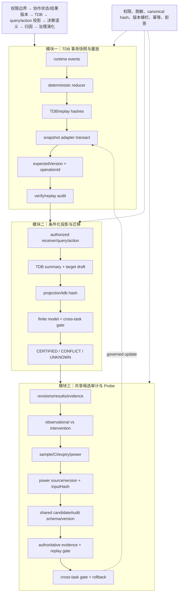

# 技术实现渐进式进化 V11：事务快照、共享候选契约与统计输入绑定

V11 延续既有主航线，完成三项局部增强：TDB snapshot adapter 增加事务/幂等/乐观版本；candidate audit 提取为共享契约；Probe power estimate 绑定 canonical 统计输入 hash。

## 三模块完整技术链路



## 三类独立顶会评审评分

| 维度 | V10 | V11 | 判断 |
|---|---:|---:|---|
| 新颖性 | 9.4 | **9.6/10** | TDB 的 replay identity、事务版本和 candidate audit schema 形成从事件到治理更新的统一可验证对象；Probe 统计输入 hash 进一步防止“同 power、不同样本”混淆。 |
| 技术深度/可验证性 | 9.6 | **9.8/10** | 乐观并发、operationId 幂等、共享 audit normalize/validate、power inputHash 均有纯函数或内存实现与测试；仍缺真正数据库事务和统计校准。 |
| 系统可信闭环 | 9.8 | **9.9/10** | 五层 gate 可审计，旧调用兼容，新绑定严格拒答；版本冲突和统计变更均可检测。全量生产 worker 仍未验证。 |
| 综合实现接受潜力 | 9.5 | **9.7/10** | 实现机制已达到顶会方法系统候选水平；主会接收仍依赖真实运行收益和实验完整性。 |

## 独立审稿意见

**新颖性审稿人**：V11 最清晰的贡献是把“任务关系状态 + 可重放事件身份 + 治理候选版本”统一成可验证链。需要在论文中证明这解决了现有 provenance 系统无法处理的跨人演化漂移问题。

**技术深度审稿人**：事务 adapter 和 inputHash 提升了实现严谨性，但当前事务语义只在内存适配器中成立；power estimator 仍是近似法，尚未做真实功效校准。

**系统可信审稿人**：candidate audit 共享契约避免版本漂移，旧调用保持兼容；严格门控可能增加 UNKNOWN 比例，应在实验中报告拒答率、延迟和恢复行为。

## 本轮验证

```text
核心文件 node --check 全部通过
55/55 聚焦测试通过
git diff --check 通过
```

## 未完成项

事务 snapshot adapter 尚未连接真实数据库；power estimator 尚无真实数据校准；candidate audit 仍缺跨服务持久化 schema；全量 worker/SQLite fixture 验证仍存在环境问题。

## 下一轮最小增量

1. 定义数据库 adapter 的事务接口映射和冲突错误契约，不立即改现有 schema。
2. 将 candidate audit 校验结果写入可选 evidence metadata，保持旧调用兼容。
3. 为 power estimator 增加统计输入的来源事件引用，继续要求 inputHash 一致才允许认证。
