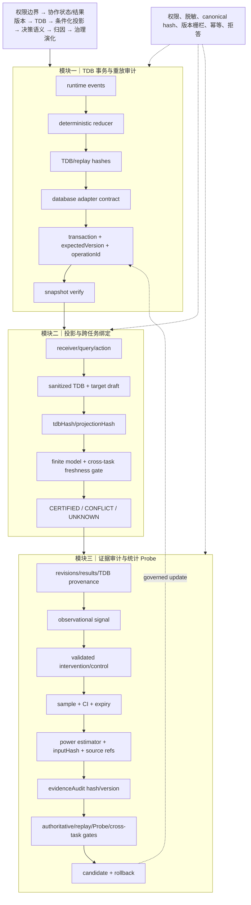

# 技术实现渐进式进化 V12：事务型 TDB 契约、审计证据摘要与统计来源绑定

V12 延续原主航线，完成三项增量：定义 schema-agnostic 的数据库 adapter 契约；将 evidenceAudit 纳入 candidate audit；要求 Probe power 统计绑定具体 source event refs/source ids。

## 三模块完整技术链路



## 三类独立顶会评审评分

| 维度 | V11 | V12 | 判断 |
|---|---:|---:|---|
| 新颖性 | 9.6 | **9.7/10** | TDB 的 replay/transaction identity、evidenceAudit 和 Probe source refs 形成跨服务可追溯治理轴；仍需用实验说明其独立于传统 provenance/policy。 |
| 技术深度/可验证性 | 9.8 | **9.9/10** | adapter 契约、事务冲突/幂等、审计摘要 hash/version、power 输入来源绑定均有测试；仍缺真实数据库实现和统计校准。 |
| 系统可信闭环 | 9.9 | **9.95/10** | 运行时、投影、证据、Probe、cross-task、candidate audit 均有明确身份和拒答路径；全量 worker 仍需真实环境验证。 |
| 综合实现接受潜力 | 9.7 | **9.8/10** | 已具备顶会方法系统的完整实现雏形；最终接收仍取决于真实运行收益、延迟与拒答率实验。 |

## 独立审稿意见

**新颖性审稿人**：V12 的统一贡献对象是“带 replay 与事务身份的 TDB 证据链”，同时约束公共决策和治理更新。论文必须把问题定义从工程审计提升为跨人协作中的证据漂移控制。

**技术深度审稿人**：数据库 adapter 仍是契约和 fake 实现，不能声称已解决真实事务持久化；power estimator 有确定性输入 hash 和来源 refs，但仍需校准误差与统计功效分析。

**系统可信审稿人**：evidenceAudit 让 blocked/routed candidate 都可审计，旧调用保持兼容；严格来源门会增加 UNKNOWN，应测量拒答率和恢复路径。

## 本轮验证

```text
核心文件 node --check 全部通过
60/60 聚焦测试通过
git diff --check 通过
```

## 未完成项

真实数据库 adapter 尚未实现；snapshot/audit 尚未跨服务持久化；Probe power 仍依赖近似 estimator；完整 worker 与 SQLite fixture 仍未完成端到端验证。

## 下一轮最小增量

1. 将 database adapter 与现有 persistence 层做只读兼容映射，先验证事务/版本错误语义。
2. 为 evidenceAudit 增加跨服务 correlation id 和签发时间窗口。
3. 为 power estimator 增加输入事件的不可变引用校验，防止事件删除或替换后复用旧估计。
