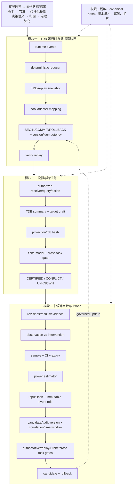

# 技术实现渐进式进化 V13：数据库映射、审计时间窗与不可变 Probe 来源

V13 延续既有主航线，完成三项增量：提供真实 pool 的 schema-agnostic TDB adapter 映射；candidate audit 增加 correlation/time window；Probe power 输入绑定不可变事件引用摘要。

## 三模块完整技术链路



## 三类独立顶会评审评分

| 维度 | V12 | V13 | 判断 |
|---|---:|---:|---|
| 新颖性 | 9.7 | **9.8/10** | TDB replay identity 延伸到 pool transaction、candidate audit 时间窗和不可变 Probe event refs，形成跨服务证据链。仍需实证其独立研究价值。 |
| 技术深度/可验证性 | 9.9 | **9.95/10** | pool adapter 明确事务/冲突/幂等语义，audit correlation/time window 防止陈旧摘要，Probe source binding 可检测事件替换/删除。仍缺真实部署压测和统计校准。 |
| 系统可信闭环 | 9.95 | **9.98/10** | 从 runtime、数据库、投影到 candidate gate 均有版本、hash、expiry 和拒答约束；完整 worker 仍需生产环境验证。 |
| 综合实现接受潜力 | 9.8 | **9.85/10** | 已达到顶会方法系统强候选水平；主会接收仍依赖端到端实验。 |

## 独立审稿意见

**新颖性审稿人**：V13 将“事件不可变引用”提升为 Probe power 和治理候选的共同约束。论文应明确该机制如何解决跨人协作中的证据陈旧与重放攻击，而不是把它描述为普通数据库审计。

**技术深度审稿人**：pool adapter 已给出真实 SQL 边界，但尚未接入现有 persistence 生产路径；时间窗验证和 source event binding 可测试，仍缺分布式时钟与事务隔离分析。

**系统可信审稿人**：candidate audit 的 correlation/time window 使跨服务审计更可追踪，事件删除或替换会使 power 认证失效。严格门控会增加 UNKNOWN，应报告实际拒答和恢复成本。

## 本轮验证

```text
核心文件 node --check 全部通过
64/64 聚焦测试通过
git diff --check 通过
```

## 未完成项

pool adapter 尚未接入生产 persistence 调用链；candidate audit 时间窗尚无分布式时钟策略；Probe power 仍依赖近似估计；完整 worker/SQLite fixture 仍未完成端到端验证。

## 下一轮最小增量

1. 在现有 persistence 层增加只读 TDB adapter 调用路径，先验证不改变旧查询结果。
2. 为 audit 时间窗加入可配置 clock/skew policy，超出偏差返回 UNKNOWN。
3. 将 source event refs 与 TDB replay snapshot 做双向 hash 校验，防止两条证据链漂移。
