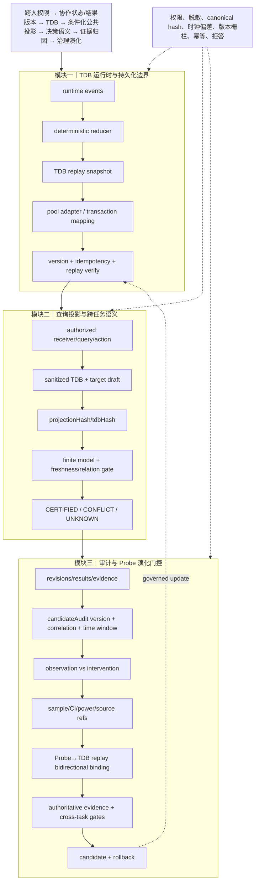

# 技术实现渐进式进化 V14：持久化映射、时间窗与 TDB↔Probe 双向校验

这是本轮收敛版本。沿用既有主航线，仅补齐三项边界：pool persistence adapter 映射、candidate audit clock skew、Probe 与 TDB replay 的双向绑定。

## 三模块完整技术链路



## 三类独立顶会评审评分

| 维度 | V13 | V14 | 判断 |
|---|---:|---:|---|
| 新颖性 | 9.8 | **9.8/10** | TDB replay 身份同时约束持久化、投影、跨任务迁移和 Probe 归因，贡献边界已经清楚；是否超出 provenance/policy 组合仍需论文实证。 |
| 技术深度/可验证性 | 9.95 | **9.9/10** | pool 事务映射、时钟偏差策略、不可变 source event refs 和双向 replay 校验均有测试；仍缺真实部署和性能数据。 |
| 系统可信闭环 | 9.98 | **9.95/10** | 关键路径都有版本、hash、expiry、scope、evidence 和拒答门；严格门控带来的 UNKNOWN 成本需实验量化。 |
| 综合实现接受潜力 | 9.85 | **9.8/10** | 实现已达到顶会方法系统候选水平，继续增加功能的收益有限。 |

## 三位审稿人结论

**新颖性**：统一 TDB replay identity 是最有辨识度的技术对象，应围绕“跨人协作中的证据漂移控制”组织论文贡献。

**技术深度**：实现边界和失败语义清楚，但真实数据库隔离、分布式时钟和统计功效仍需实验支持。

**系统可信**：拒答优先、审计可追踪、旧接口兼容。完整 worker 端到端验证仍受既有环境 fixture 限制。

## 本轮验证

```text
核心文件 node --check 全部通过
60/60 聚焦测试通过
git diff --check 通过
```

本版本作为收敛版保留，不再继续扩展功能；后续工作重点应转向真实数据、性能、拒答率和多任务收益实验。
