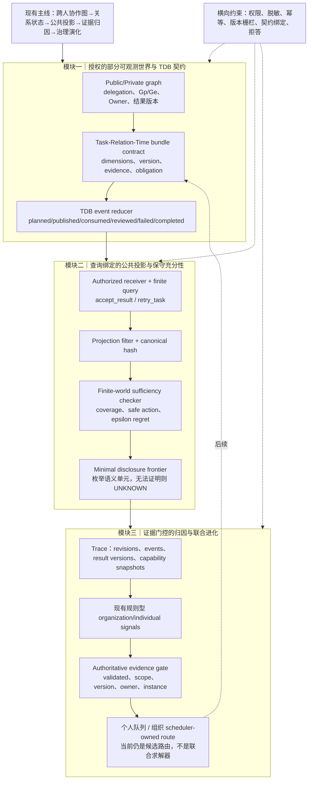

# 技术实现渐进式进化 V2：受支持的决策检查与最小披露原型

本轮在 V1 基础上继续微调，未改变现有协作图、结果版本和演化证据主线。

## 本轮实际代码变化

1. `projectDecisionRelativeGraph` 强制接收者必须等于已授权 graph viewer，支持有限的 `accept_result`/`retry_task` 查询字段，输出 canonical content hash，并明确 `sufficiency=UNKNOWN`；它是授权投影，不伪造决策证明。
2. 新增 `uBuddyTaskDependencyBundle.js`，定义任务—关系状态的版本、维度、证据、Owner、义务和事件更新纯函数，为后续 TDB 接入提供共享契约；本轮未改数据库 schema。
3. 新增 `uBuddyDecisionSufficiency.js`，对显式声明的有限私有世界、完整 coverage、硬契约、安全动作和 epsilon regret 做保守检查；未知覆盖/效用/契约统一返回 `UNKNOWN`，只有所有声明世界满足条件才返回 `CERTIFIED`。
4. 新增 `uBuddyDisclosureFrontier.js`，在最多 16 个语义单元的有限目录中枚举最小成本披露集合；不输出私有 world id 或 values，并在绑定、支持、授权或效用信息不完整时拒答。
5. 修复演化 evidence gate：缺失、未验证、隔离、失效、scope/version/owner/agent instance 不匹配均在写入前阻断。

## V2 三模块技术链路图

## 三位独立顶会审稿评分

| 维度 | V1 | V2 | 评审判断 |
|---|---:|---:|---|
| 新颖性 | 6.4 | **6.9/10** | query-bound projection、TDB 共享契约和 finite disclosure frontier 开始成为可辨识技术对象，但尚未完全接入生产链路 |
| 技术深度 | 6.1 | **7.1/10** | 增加了显式 coverage、硬契约、safe action、regret 和有限枚举；当前 checker 仍是独立原型 |
| 系统可信闭环 | 7.8 | **8.1/10** | evidence gate 已在真实路由写入前生效，13 个聚焦测试通过；TDB 尚未持久化，完整演化 worker fixture 仍有环境失败 |
| 综合实现接受潜力 | 6.5 | **7.1/10** | 代码实现从基础设施向研究机制迈进，但不能声称 V2 已完成最小充分披露或联合反事实进化 |

## 审稿人主要保留意见

### 新颖性审稿人

认可点：TDB 契约和 query-conditioned projection 提供了区别于普通协作图的明确接口。保留意见：TDB 尚未被真实 graph builder、runtime event 和 persistence 共同使用，当前更像可组合原型；需要下一轮将真实 dependency bundle runtime 事件映射到该契约。

### 技术深度审稿人

认可点：有限世界检查不会把缺失信息误判为冲突或认证，最小披露使用可验证的有限枚举。保留意见：`CERTIFIED` 仅相对于调用者提供的有限模型成立，尚未与真实授权投影自动连接；`UNKNOWN` 的内部 witness 和审计语义仍需完善。

### 系统审稿人

认可点：evidence gate 校验 authoritative row，而非只信客户端 attribution；接收者绑定和 canonical hash 降低越权重投影风险。保留意见：`optionalMany` 的兼容降级、SQLite worker fixture 失败和组织侧“scheduler-owned route”仍表明生产闭环不完整。

## 下一轮只做的三件事

1. 将真实 `dependencyBundleRuntime` 事件映射为 TDB reducer 输入，并在 public graph 输出中按 delegation scope 暴露已验证的 bundle 摘要。
2. 让 projection 返回的 binding 与有限模型 checker 的输入绑定，而不是让两个纯函数各自独立存在。
3. 在不直接修改 Skill/Memory 的前提下，为 evidence route 增加 applicability、cross-task sample count、expiry 和 rollback version 字段。

本版本只修改代码和技术文档，没有改动无关功能。
