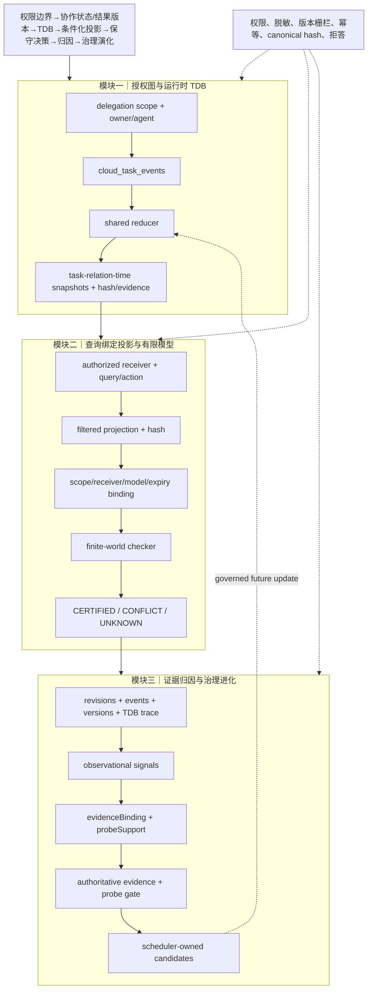

# 技术实现渐进式进化 V3：运行时 TDB、查询证书桥接与因果证据门控

本轮沿用“跨人权限边界 → 协作状态/结果版本 → TDB → 条件化公共投影 → CERTIFIED/CONFLICT/UNKNOWN → 证据归因 → 治理演化”主航线，仅做局部增强。

## 本轮实际改动

1. `cloud_task_events` 经共享 `taskDependencyBundleTraceFromEvents` 稳定排序、折叠为 task–relation–time TDB trace；输出保留 event、actor、agent、evidence ref 与 canonical hash。未新增 schema，不能宣称已持久化 TDB。
2. projection binding 绑定 receiver、query、action set、scope、projection hash、model/evaluator version 与 expiry；只有 live finite model 且完全匹配才运行 sufficiency checker，否则 UNKNOWN。
3. attribution 明确 observational 与 probe_supported；无 validated intervention/probe/counterfactual 证据时 evolution candidate 硬阻断。规则型 signal 仍不是因果效应估计。

## V3 三模块完整链路

## 三位独立顶会审稿评分

| 维度 | V2 | V3 | 评审判断 |
|---|---:|---:|---|
| 新颖性 | 6.9 | **7.6/10** | TDB 已被 runtime event→trace 使用，projection hash-bound certificate 与 probe gate 形成可辨识组合；尚缺跨任务复用和真实 intervention effect。 |
| 技术深度/可验证性 | 7.1 | **7.8/10** | 稳定 reducer、binding、coverage/contract/regret gate 可测；仍缺持久化、并发一致性和复杂度界限。 |
| 系统可信闭环 | 8.1 | **8.5/10** | scope、authoritative evidence、expiry 和 probe hard gate 已在聚焦链路生效；完整 worker fixture 仍受既有 SQLite migration 问题影响。 |
| 综合实现接受潜力 | 7.1 | **7.8/10** | 具备较强方法论文潜力；补齐跨任务治理、真实 Probe 与持久化审计后才接近顶会稳妥接收。 |

## 主要保留意见与下一轮

- 新颖性：需证明 TDB 不是 provenance graph 与 policy checker 的简单拼接。
- 技术深度：当前按请求计算，尚无持久化 trace、重放/并发证明。
- 系统可信：`optionalMany` 将缺表与无事件合并为空；既有 SQLite fixture 失败限制完整闭环结论。

下一轮只做三项：将 TDB hash 纳入 projection binding；统一 shared reducer、删除 stateGraph 重复 helper；增加 cross-task applicability/expiry contract，继续通过治理队列和 rollback 更新。
