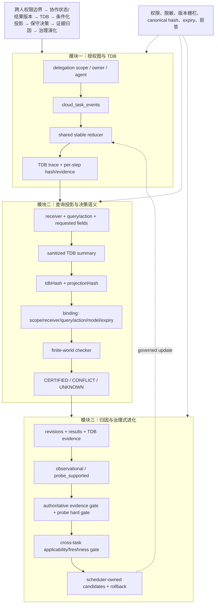

# 技术实现渐进式进化 V4：TDB 绑定投影与跨任务适用性门控

V4 沿用既有主航线，完成三项小步演进：TDB 摘要进入决策投影绑定；runtime 事件统一使用 shared reducer；新增跨任务适用性与 freshness 契约。

## 三模块完整技术链路



## 三类独立顶会评审

| 维度 | V3 | V4 | 评审判断 |
|---|---:|---:|---|
| 新颖性 | 7.6 | **7.9/10** | “任务—关系—时间 TDB → query 投影 hash → 决策证书”绑定更完整；跨任务 transfer gate 增加了可辨识机制。仍需证明不是 provenance + policy 的直接组合。 |
| 技术深度/可验证性 | 7.8 | **8.1/10** | TDB 变化会使旧证书失效，shared reducer 消除语义漂移，跨任务契约检查 hash、关系、freshness、dimension evidence。仍缺持久化审计、并发重放证明和复杂度分析。 |
| 系统可信闭环 | 8.5 | **8.7/10** | 权限、脱敏、evidence gate、probe gate、expiry 和 hash binding 均有聚焦测试。完整 worker fixture 的既有 SQLite migration 问题仍限制端到端结论。 |
| 综合实现接受潜力 | 7.8 | **8.1/10** | 已接近顶会方法论文的实现可信度；主会接收仍依赖跨任务 runtime 接入、真实 Probe effect 与持久化治理审计。 |

## 审稿人保留意见

**新颖性审稿人**：V4 的贡献边界比 V3 清楚，但跨任务适用性目前是 shared pure contract，尚未证明能在真实多任务场景提高决策质量。

**技术深度审稿人**：projection 的 `tdbHash` 绑定解决了图变化后的证书陈旧问题；然而 TDB 仍在请求时折叠，缺少数据库级 snapshot、幂等重放和并发冲突模型。

**系统可信审稿人**：拒答路径和证据身份校验较强；`optionalMany` 仍可能把 provider 缺失静默成空事件，需暴露 availability 状态。

## 本轮验证

```text
node --check cloud/src/modules/collaboration/stateGraph.mjs
聚焦测试：23/23 passed
```

## 下一轮最小增量

1. 将 cross-task applicability gate 接入 projection/evolution routing，但缺失真实 source bundle 时保持 UNKNOWN/BLOCKED。
2. 为 TDB trace 增加 provider availability 与 snapshot/replay metadata，区分“无事件”和“数据源不可用”。
3. 设计受支持 Probe effect 的纯函数 contract，并要求与 TDB evidence refs、delegation scope、版本绑定；不自动修改 Skill/Memory。
