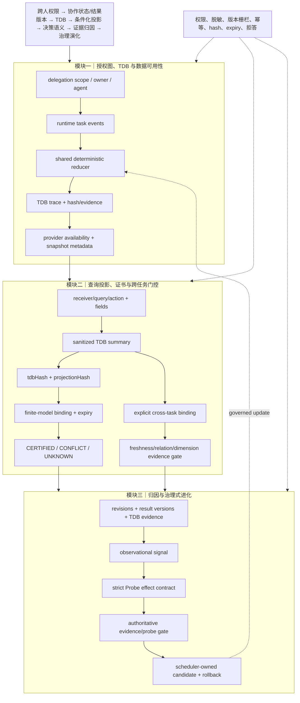

# 技术实现渐进式进化 V5：跨任务门控、Probe 契约与 TDB 可用性

V5 在不改变主架构的前提下，把跨任务适用性接入决策投影，并补充 provider availability 与严格 Probe effect 契约。

## 三模块完整技术链路



## 三类独立顶会评审评分

| 维度 | V4 | V5 | 判断 |
|---|---:|---:|---|
| 新颖性 | 7.9 | **8.2/10** | TDB hash-bound projection、显式 cross-task transfer gate、provider availability 与 Probe/observation 分离形成较清晰的机制组合；仍需真实多任务收益证据。 |
| 技术深度/可验证性 | 8.1 | **8.4/10** | 适用性检查 freshness/relation/evidence，Probe 检查 treatment/control、validated、scope/version/TDB hash，provider 状态可审计；仍缺持久化 snapshot、并发重放证明与复杂度界限。 |
| 系统可信闭环 | 8.7 | **8.9/10** | 投影、TDB、证据、Probe 均有拒答和 hash/expiry 约束，且 provider 缺失不再静默等价于无事件；完整 worker fixture 的既有 migration 风险仍未消除。 |
| 综合实现接受潜力 | 8.1 | **8.4/10** | 已具备顶会方法论文的完整机制雏形；接收仍取决于 runtime evolution 接入、真实 Probe 和端到端评测。 |

## 三位审稿人意见

**新颖性审稿人**：V5 的核心可表述为“同一带时间和证据身份的 TDB 同时约束公共决策、跨任务迁移和治理更新”。但纯契约层仍需与现有 provenance/policy 工作做明确差异分析。

**技术深度审稿人**：shared reducer、hash binding、freshness gate 和 Probe contract 提供了可重放、可拒答的局部语义；尚未形成数据库快照、跨任务校准或联合优化算法。

**系统可信审稿人**：provider availability 明确区分 no event、no task run、schema partial 和 unavailable，提升了故障可解释性；但生产端到端结论仍受既有 SQLite fixture migration 失败限制。

## 本轮验证

```text
node --check cloud/src/modules/collaboration/stateGraph.mjs
28/28 聚焦测试通过
```

## 尚未宣称完成的能力

TDB 尚未持久化为独立审计表；Probe contract 尚未从真实干预运行中产生 effect；cross-task gate 尚未自动驱动 evolution worker；因此 `CERTIFIED` 仍只表示显式有限模型或显式绑定契约下的局部保证。

## 下一轮最小增量

1. 把 Probe effect 结果以 evidence ref 接入 attribution routing，并要求 TDB hash 与 delegation scope 一致。
2. 为 TDB trace 增加可选 snapshot/replay token，验证同一事件序列的确定性重放。
3. 将 cross-task applicability 作为 evolution candidate 的必要门控条件，缺失时保持 UNKNOWN/BLOCKED。
