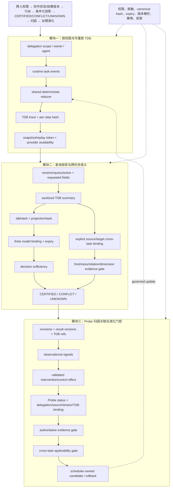

# 技术实现渐进式进化 V6：可重放 TDB、跨任务演化门控与 Probe 闭环

V6 继续沿用既有主航线，完成三个最小增量：TDB deterministic snapshot/replay、cross-task applicability 进入 evolution route、严格 Probe effect 进入演化硬门。

## 三模块完整技术链路



## 三类独立顶会评审评分

| 维度 | V5 | V6 | 判断 |
|---|---:|---:|---|
| 新颖性 | 8.2 | **8.5/10** | TDB 的时间/证据身份同时约束投影、跨任务迁移和演化路由；Probe 与 cross-task gate 让贡献边界更清晰。仍需与 provenance/policy 组合方法做实证区分。 |
| 技术深度/可验证性 | 8.4 | **8.7/10** | replay token/hash 提供确定性重放证据，Probe 要求 validated treatment/control 和绑定，cross-task gate 检查 freshness/关系/维度证据。尚无数据库持久化 snapshot、并发证明和复杂度界限。 |
| 系统可信闭环 | 8.9 | **9.1/10** | 普通归因不能绕过 Probe、authoritative evidence 或 cross-task applicability；缺失均明确 UNKNOWN/BLOCKED，冲突为 CONFLICT。完整 worker 端到端仍受既有 fixture migration 风险限制。 |
| 综合实现接受潜力 | 8.4 | **8.7/10** | 机制完整度已达到顶会方法论文候选水平；仍需真实多任务和干预实验才能支撑主会接收。 |

## 三位独立审稿意见

**新颖性审稿人**：最强贡献是把同一 TDB hash 作为公共投影、跨任务适用性和 Probe 证据的共同身份锚点。当前仍主要证明“可拒绝不安全迁移”，需要展示迁移成功时的实用收益。

**技术深度审稿人**：snapshot/replay token 使事件序列可做确定性审计；有限模型和 Probe contract 的保证条件清楚。缺口是 token 尚未落入持久化层，且没有跨任务 calibration 或联合优化算法。

**系统可信审稿人**：evolution route 现在要求 authoritative evidence、Probe effect 和 cross-task applicability 三道门，默认阻断路径可靠。归因接口没有目标 query/TDB binding 时始终 UNKNOWN 是正确的保守边界，但会降低当前系统的可用吞吐。

## 本轮验证

```text
node --check stateGraph.mjs
node --check uBuddyTaskDependencyBundle.js
node --check uBuddyProbeEffect.js
node --check server.mjs
32/32 聚焦测试通过
```

## 仍未完成的能力

当前没有独立 TDB 审计表；Probe effect 仍由显式调用方提供，尚未由真实干预运行自动生成；cross-task gate 虽已进入 route，但 attribution endpoint 未自动构造目标 binding，因此默认保持 UNKNOWN/BLOCKED。这些边界不能被包装为端到端联合进化已完成。

## 下一轮最小增量

1. 在不改变 schema 的前提下，将 replay token 作为 attribution/evolution evidence 的审计字段传播。
2. 从 query-conditioned projection 显式生成 cross-task target binding，减少“永远 UNKNOWN”但不放宽认证条件。
3. 为 Probe effect 增加 treatment/control 样本计数、置信区间和 expiry contract，仍由治理队列决定最终更新。
