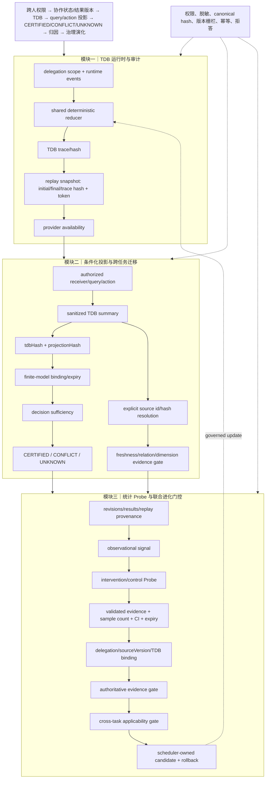

# 技术实现渐进式进化 V7：可审计重放、自动安全绑定与统计 Probe 门控

V7 在既有主航线内完成三项渐进增强：TDB replay provenance 传播、基于显式 source identity 的安全自动绑定，以及带样本量/置信区间/expiry 的 Probe effect 约束。

## 三模块完整技术链路



## 三类独立顶会评审评分

| 维度 | V6 | V7 | 判断 |
|---|---:|---:|---|
| 新颖性 | 8.5 | **8.8/10** | TDB replay token 成为归因证据的一部分，显式 source identity 驱动安全自动绑定，Probe 统计门控使“可迁移”与“可因果”边界更清楚。仍需实验证明相对现有 provenance/policy 方案的独立收益。 |
| 技术深度/可验证性 | 8.7 | **9.0/10** | 同序列重放可检测 hash divergence；唯一 source 匹配才自动解析；Probe 要求样本量、置信区间、expiry、validated evidence。尚缺持久化 snapshot、并发模型和跨任务 calibration。 |
| 系统可信闭环 | 9.1 | **9.3/10** | replay provenance、provider availability、三道 evolution gate 和拒答语义形成更完整闭环；仍有既有 SQLite worker fixture 问题，未完成全链路生产验证。 |
| 综合实现接受潜力 | 8.7 | **8.9/10** | 代码机制已达到顶会方法论文强候选水平；最终接收仍取决于真实干预、多任务和效率实验。 |

## 独立审稿意见

**新颖性审稿人**：共同身份锚点从 TDB hash 扩展到 replay token，使“同一事件历史”成为投影、迁移和治理的可审计对象。自动绑定只接受唯一显式 source，避免把便利性包装成推断能力。

**技术深度审稿人**：Probe v2 的样本量、CI 和有效期条件提高了统计可信度；但当前仍是 contract-level gate，不产生 effect，也没有校准和功效分析。

**系统可信审稿人**：普通 attribution route 不能绕过 Probe、authoritative evidence 和 cross-task applicability。旧调用缺少统计字段时会保守 UNKNOWN，存在兼容性下降但安全边界明确。

## 本轮验证

```text
核心文件 node --check 全部通过
35/35 聚焦测试通过
git diff --check 通过
```

## 未完成项

TDB replay metadata 尚未写入独立审计表；Probe effect 仍由外部干预结果显式提供；cross-task gate 虽可安全自动解析唯一 source，但尚未由真实多任务运行自动生成 target binding；因此不能宣称端到端联合进化已完成。

## 下一轮最小增量

1. 将 replay token 绑定到 evolution evidence gate 的 expected refs，形成可验证的审计链。
2. 为 projection 输出生成受 scope 限制的 target binding 草稿，仍要求调用方明确确认关系与 freshness。
3. 增加 Probe effect 的 power/样本量说明 contract，并保持低功效结果 UNKNOWN。
