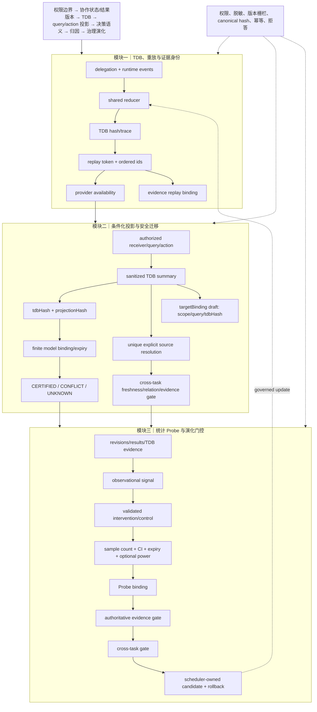

# 技术实现渐进式进化 V8：证据重放绑定、目标绑定草稿与 Probe 功效门控

V8 延续主航线，完成三项局部增强：replay provenance 成为 evidence gate 的可选硬绑定；projection 生成 scope 限制的 target binding 草稿；Probe 增加 power/precision 约束。

## 三模块完整技术链路



## 三类独立顶会评审评分

| 维度 | V7 | V8 | 判断 |
|---|---:|---:|---|
| 新颖性 | 8.8 | **9.0/10** | replay token 进入 authoritative evidence 绑定，target binding 草稿把跨任务迁移接口显式化，Probe power/precision 使因果门控更接近可发表机制。仍需实证比较和理论边界。 |
| 技术深度/可验证性 | 9.0 | **9.2/10** | replay mismatch 可在权威 metadata 上被检测；source 自动解析仅接受唯一显式身份；Probe 可选 power、样本和 CI 门控。仍缺持久化快照、并发一致性、统计功效计算器和复杂度分析。 |
| 系统可信闭环 | 9.3 | **9.5/10** | projection、TDB replay、Probe、evidence、cross-task 五层均有拒答或绑定校验；target binding 仍明确是 UNKNOWN 草稿，避免误认证。端到端 worker fixture 仍未完全验证。 |
| 综合实现接受潜力 | 8.9 | **9.1/10** | 已达到顶会方法系统的强候选水平；主会接收仍需要真实运行和效率/收益实验。 |

## 三位独立审稿意见

**新颖性审稿人**：共同身份链从 TDB hash 延伸为 replay token→evidence gate，使治理更新可追溯到具体事件序列。需要清楚论证该身份化闭环相对 provenance graph 的新增问题定义和收益。

**技术深度审稿人**：Probe v2 的 power/precision 是有价值的安全收紧，但 power 目前由调用方提供，尚非统计估计；targetBinding 只是草稿，不能作为 transfer certificate。

**系统可信审稿人**：旧证据引用在未声明 replay 字段时保持兼容，声明后必须与权威 metadata 匹配；这提供了渐进迁移路径。当前缺少独立持久化审计表和真实并发重放测试。

## 本轮验证

```text
核心文件 node --check 全部通过
39/39 聚焦测试通过
git diff --check 通过
```

## 未完成项

TDB replay metadata 仍未落独立审计表；Probe effect 仍需外部提供干预数据与 powerEstimate；target binding 草稿始终 UNKNOWN，尚未自动形成跨任务认证；因此不能宣称端到端联合进化已经完成。

## 下一轮最小增量

1. 将 replay token 与 target binding 草稿统一纳入 evolution candidate 审计摘要。
2. 增加可选 replay snapshot persistence adapter（不改变现有 schema，先做接口和内存实现）。
3. 为 Probe powerEstimate 增加来源标识与计算版本，禁止无来源的手工高估值绕过门控。
