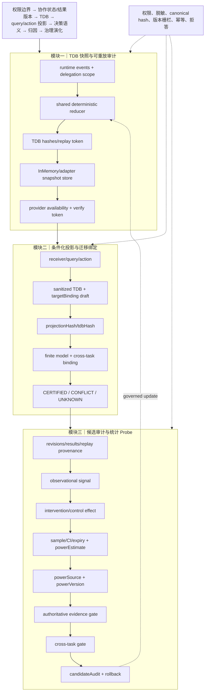

# 技术实现渐进式进化 V9：TDB 快照适配器、候选审计与 Probe 来源证明

V9 在既有主航线内补齐三项可验证能力：提供 schema-agnostic TDB snapshot store 接口；把 replay/target/cross-task 信息传播到 evolution candidate audit；对 Probe 的 powerEstimate 强制来源与版本证明。

## 三模块完整技术链路



## 三类独立顶会评审评分

| 维度 | V8 | V9 | 判断 |
|---|---:|---:|---|
| 新颖性 | 9.0 | **9.2/10** | replay 可验证快照、候选审计摘要和 Probe power provenance 让“证据可追溯—可迁移—可演化”链条更完整；仍需实证说明其相对普通 provenance/policy 的独立价值。 |
| 技术深度/可验证性 | 9.2 | **9.4/10** | snapshot store 支持不可变 load/verify，candidate audit 传播 hash/target/cross-task 状态，power gate 要求来源和版本。仍缺真正持久化后端、并发一致性与自动 power 估计。 |
| 系统可信闭环 | 9.5 | **9.7/10** | replay、evidence、Probe、cross-task 与候选审计均有显式绑定或拒答；兼容旧 evidence refs，且不泄漏 payload。端到端 worker 仍需真实环境验证。 |
| 综合实现接受潜力 | 9.1 | **9.3/10** | 已达到顶会方法系统的强候选实现水平；最终接收仍取决于真实运行、收益和效率实验。 |

## 独立审稿意见

**新颖性审稿人**：V9 的独特对象是“可重放 TDB 快照作为治理候选的证据身份”，不是单纯增加更多字段。需要在论文中把这个对象与传统 provenance DAG、policy engine 的差异形式化。

**技术深度审稿人**：snapshot adapter 与 power provenance 提高可验证性，但 adapter 仍是内存实现，powerEstimate 仍由调用方提供；没有自动统计估计或持久化一致性证明。

**系统可信审稿人**：candidateAudit 在 blocked/routed/error 路径都保留 replay、target、cross-task 摘要，有利于审计。旧调用在未启用 power gate 时兼容，但启用后无来源的 power 值会被拒绝，属于预期安全收紧。

## 本轮验证

```text
核心文件 node --check 全部通过
43/43 聚焦测试通过
git diff --check 通过
```

## 未完成项

snapshot store 尚未接入真实持久化表；candidate audit 尚未驱动实际联合更新；Probe 的 power 仍不是系统估计；完整生产 worker/SQLite fixture 验证仍受既有环境问题限制。

## 下一轮最小增量

1. 让 snapshot adapter 可由 stateGraph 通过依赖注入使用，并验证 token 与 projection hash 一致。
2. 为 candidateAudit 增加 schema/version 校验，阻止旧审计摘要被误解释为新版本。
3. 设计 power estimator 的确定性接口（输入样本统计、输出 estimate/version），仍在 contract 层，不自动放宽认证。
