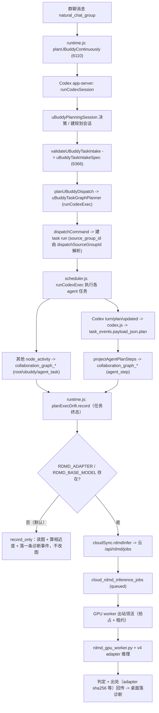

# 代码归属与完整流程（含 Codex 边界）

> 结论先行：你的判断成立。这个仓库的绝大部分源码不是我们自己写的，是一次性从
> `iLearn-Agent/Janus` 拉进来的；Codex 接口全在那批拉来的代码里。我们真正自己写的
> 只有 16 个桌面文件 + 一批云端/实验文件。但有一条必须说清的耦合：**我们的 RDMD 代码
> 不调用 Codex，可它消费的数据只有 Codex 会生产。**
>
> 核验基准：分支 `main`，HEAD `467d93f`，分叉点 `94e5172`，`upstream = github.com/iLearn-Agent/Janus`。

---

## 一、仓库是怎么来的（证据）

### 1.1 分叉点根本没有源码

```
$ git ls-tree --name-only 94e5172
.gitignore  AGENTS.md  LICENSE  PROJECT_MEMORY.md  README.md  README.zh-CN.md
assets  cloud  config  deploy  docs  network  package-lock.json  package.json  scripts
```

`94e5172`（`v1.1.3`）是一个**只有 README / config / 打包脚本的快照**，`src/` 连目录都不存在。
它里面唯一跟 codex 有关的东西是两个模板：`config/codex/config.toml.template`、`config/codex/auth.json.template`。

### 1.2 一次提交拉进全部源码

```
$ git show --shortstat --format="%h %ad %s" --date=short ca4437f
ca4437f 2026-08-27 Preserve current Janus development state
563 files changed, 270688 insertions(+), 18 deletions(-)
```

`ca4437f` 是 `94e5172` 的直接子提交，**一个提交 +270,688 行**，`src/` 从此出现。

### 1.3 拉进来的是别人的代码，不是我们写的

对 `ca4437f` 新增的 464 个 `src/` 文件逐个比对 `upstream/main`：

- 与 `upstream/main` **逐字节相同**：**462 个**
- `upstream/main` 也没有的：**2 个**（`uBuddyCollaborationGraph.js`、`collaborationGraphStoreMethods.js`）

抽样 25 个文件做 blob 哈希比对：25/25 与 upstream 完全相同、0 个不同、0 个缺失。
即 `ca4437f` 是一次**外部快照导入**，不是原创开发。

### 1.4 我们真正改了什么

`94e5172..HEAD` 在 `src/` 下 474 个文件变化，**修改（M）= 0 个，全部是新增（A）** ——
因为分叉点没有 `src/`，谈不上"改"。

从**拉入点**算起才看得见我们的改动：

```
$ git diff --name-status ca4437f HEAD -- src
M  src/main/cloudSync.js
M  src/main/modules/collaboration/application/createDelegationRuntimeApi.js
A  src/main/modules/collaboration/application/planExecDriftCloudTransport.test.js
A  src/main/modules/collaboration/application/planExecDriftService.js
A  src/main/modules/collaboration/application/planExecDriftService.test.js
A  src/main/modules/collaboration/application/planExecDriftShadow.test.js
M  src/main/modules/collaboration/infrastructure/ubuddyFeatureFlags.js
A  src/main/modules/collaboration/infrastructure/ubuddyFeatureFlags.test.js
M  src/main/modules/persistence/infrastructure/collaborationGraphStoreMethods.js
M  src/main/runtime.js
A  src/shared/contracts/uBuddyAgentPlanSteps.js
M  src/shared/contracts/uBuddyCollaborationGraph.js
A  src/shared/contracts/uBuddyPlanExec.js
A  src/shared/contracts/uBuddyPlanExec.test.js
A  src/shared/contracts/uBuddyReverseDetective.js
A  src/shared/contracts/uBuddyReverseDetective.test.js
```

**16 个文件 = 10 个新建 + 6 个在上游文件上的挂接点。这就是我们在桌面端的全部自有代码。**

### 1.5 归属总表

| 层 | 我们自己写的 | 从上游拉来的 |
| --- | --- | --- |
| 桌面 `src/` | 16 个（10 新 + 6 挂接） | 464 个（`ca4437f`） |
| 云端 `cloud/` | 19 个独有 + 7 个挂接 | 其余 |
| 实验/工具 `scripts/`、`experiments/` | 约 95 个 `_rdmd_*` 与 `rdmd_*`、整个 `rdmd_detective_dataset/` | 其余 |

云端我们自己的改动规模：`ca4437f..HEAD` 共 15 个文件、`+2666 / −37`，其中
`cloud/src/modules/rdmd/{index,privacy,backend,contract}.mjs` 是新增的 RDMD 云侧模块，
迁移 `094/096/097` 是新增的协作图与作业表。

---

## 二、Codex 的边界（你要的答案）

### 2.1 Codex 全部集中在拉来的宿主里

`src/main/codex.js`（3,491 行 / ~145 KB）是唯一的进程出口，**5 个 spawn 点**：

| 行 | 调用 | 用途 |
| --- | --- | --- |
| 816 | `spawn(codexBin, appServerArgs, …)` | app-server 单轮执行（主路径） |
| 2424 | `spawn(codexBin, appServerArgs, …)` | 原生线程压缩 |
| 2613 | `spawn(codexBin, appServerArgs, …)` | goal 更新 |
| 3393 | `spawn(command, args, …)` | 通用 `runProcess`（exec / doctor / `--version` / model catalog） |
| 380 | `spawnSync('taskkill', …)` | Windows 进程树终止 |

实际跑的子命令只有 4 类：`app-server`、`exec` / `exec resume`、`--version`、`debug models`。
依赖是 npm 包 `@openai/codex@0.145.0`（`package.json:202`），三个平台的 electron-builder 都会
把 `node_modules/@openai/codex*` 和原生 `codex.exe` / `codex` 一起打包。

### 2.2 uBuddy 的 7 个规划器直接 import Codex

```
$ rg -n "from '\.\./\.\./\.\./codex\.js'" src/main/modules/orchestration
uBuddyCollaborationPlanner.js:1   import { runCodexSession } from '../../../codex.js';
uBuddyContinuousPlanner.js:1      import { runCodexSession } from '../../../codex.js';
uBuddyTaskIntakePlanner.js:1      import { runCodexSession } from '../../../codex.js';
uBuddyTaskGraphPlanner.js:1       import { runCodexExec } from '../../../codex.js';
uBuddyTurnDecisionPlanner.js:1    import { runCodexExec } from '../../../codex.js';
uBuddyTaskReadinessAuditor.js:1   import { runCodexExec } from '../../../codex.js';
uBuddyDeliveryReviewService.js:5  import { runCodexExec } from '../../../codex.js';
```

也就是说，**群任务的"想"（持续规划 / 任务图 / 轮次决策 / 交付复盘）
全部由 Codex 进程产出**，是拉来的代码。我们没写过这些规划器。

**更正（2026-09-19，逐调用点核查后）**：这 7 个里有 **3 个是死代码**，全仓库无任何 import/call：

| 文件 | 状态 | 出口 |
| --- | --- | --- |
| `uBuddyContinuousPlanner.js` | 活跃（群任务主规划器） | `runCodexSession` |
| `uBuddyTurnDecisionPlanner.js` | 活跃（单聊/秘书回合决策） | `runCodexExec` |
| `uBuddyTaskGraphPlanner.js` | 活跃（本地 Agent 任务图） | `runCodexExec` |
| `uBuddyDeliveryReviewService.js` | 活跃（交付验收） | `runCodexExec` |
| `uBuddyCollaborationPlanner.js` | **死代码** | — |
| `uBuddyTaskIntakePlanner.js` | **死代码**（其 `decideUBuddyTaskIntake`；同文件另有 5 个被活跃使用的辅助函数） | — |
| `uBuddyTaskReadinessAuditor.js` | **死代码** | — |

真实主链是：`planUBuddyContinuously`（群任务，`createCollaborationGroupRuntimeApi.js:677`）
→ `proposeUBuddyTaskGraph`（任务图）→ scheduler 执行 → `reviewUBuddyTaskDelivery`（交付复盘）。
**改那 3 个死文件不会产生任何效果。**

### 2.3 我们自己的代码零 Codex 引用（这一点是干净的）

两个独立核验：

1. **挂接点 diff 里 codex 一行未碰**
   ```
   $ git diff ca4437f HEAD -- <那 6 个挂接文件> | rg codex
   （空）
   ```
2. **10 个新文件里 codex 只出现在注释里，没有任何 import**
   `planExecDriftService.js` 的 import 只有：`node:fs` / `node:os` / `node:path` /
   `node:child_process` + 我们自己的 `../../../../shared/contracts/uBuddyReverseDetective.js`。
   云端 `cloud/src/modules/rdmd/**` 与 `cloud/src/modules/collaboration/**` grep `codex` 同样为空。

### 2.4 但有一条不能装作看不见的耦合：数据来源只有 Codex

`src/shared/contracts/uBuddyAgentPlanSteps.js` 的文件头把这件事写死了：

```
// ## 数据来源只有一个
//
//   Codex app-server 的 `turn/plan/updated` 通知
//     -> src/main/codex.js（activityType: 'plan'）
//     -> src/main/scheduler.js（TASK_PROCESS_STRUCTURED_FIELDS 白名单含 'plan'）
//     -> task_events.payload_json.plan
```

下面还明确写了："**除了 task_events，没有第二条通路**"，并且实测过 rollout JSONL 里没有 plan 数据。

结论：**RDMD 的 `agent_step` 层（也就是 G_exec 的细粒度证据）只能从 Codex 产生的
`task_events.payload_json.plan` 投影出来。** 我们的代码不调用 Codex，但拿不到 Codex 的数据就没有
可对比的"执行路径"。这是真正的边界，不是代码风格问题。

---

## 三、完整流程（端到端）



### 3.1 分步说明

1. **入口**：群聊消息（`sourceType='natural_chat_group'`）进入 `runtime.js`，
   在 6110 行调用 `planUBuddyContinuously`（来自拉来的 `uBuddyContinuousPlanner.js`）。
   上层建 `uBuddyPlanningSession`，记录 `threadEpoch` / `revision`。
2. **想（拉来的代码，跑 Codex）**：持续规划 → 任务图 → 轮次决策 → 交付复盘，
   每一步都是一次 Codex 进程调用（in-take / 就绪审计的规划器是死代码，不参与）。产出 `dispatchCommand`。
3. **派发**：`planUBuddyDispatch` 产出派发指令，在 `runtime.js` 建 task run。
   这里我们改了 6 处：把硬编码的 `source_group_id: ''` 换成
   `dispatchSourceGroupId(dispatchCommand)`（`runtime.js:12499`）。
4. **做（拉来的代码，跑 Codex）**：
   `scheduler.js` 用 `runCodexExec` 执行每个 agent 任务。
5. **采集**：Codex 的 `turn/plan/updated` 经 `codex.js` → `scheduler.js` 白名单，
   落到 `task_events.payload_json.plan`。这是 plan step 的**唯一**来源。
6. **建图**：`projectAgentPlanSteps` 把 plan step 投影成协作图的 `agent_step` 层
   （四层：`root` → `ubuddy` → `agent_task` → `agent_step`）。
7. **判定（我们的代码）**：任务到终态时，`runtime.js:1240` 附近调
   `planExecDrift.record({ task })`（不 await，异步自吞异常）。
8. **三态通道**：
   - 默认（无 `RDMD_ADAPTER` / `RDMD_BASE_MODEL`）：**不跑模型**，只读图 + 算相近度 +
     落一条 `rdmd_plan_exec_drift` 诊断事件，动作恒为 `record_only`。
   - 有模型且选云：`cloudSync.rdmdInfer()` → `POST /api/rdmd/jobs` → `cloud_rdmd_inference_jobs`。
   - 有模型且显式 `RDMD_TRANSPORT=local_spawn`：本地起 Python 子进程，**不回落**。
9. **云侧（我们的代码）**：`cloud/src/modules/rdmd/index.mjs` 建作业（去重键 = 一个 task run 一作业）、
   `privacy.mjs` 白名单过滤载荷、`private_assistant` 会话入队即拒。
10. **GPU worker（我们的代码）**：AutoDL 不开入站端口，所以 worker **出站**领活，
    抢占 + 租约 + 退避；产出判定与出处（adapter sha256 / base model id / 契约版本）。
11. **动作侧（我们的代码，默认闸死）**：`record_only` → `shadow` → `apply` 三级。
    `apply` 需要**同时**满足能力位 `ubuddy_plan_exec_drift_apply` 与度量门
    `shadowApplyGate`（`SHADOW_MIN_OBSERVATIONS = 30`）。真实已观察提案数是 **0**，
    所以 `apply` 在真实环境里不可达 —— 闭环接好且**可证被闸住**。

---

## 四、我们真正拥有的东西

| 类别 | 文件 |
| --- | --- |
| RDMD 契约 | `src/shared/contracts/uBuddyReverseDetective.js`、`uBuddyPlanExec.js`、`uBuddyCollaborationGraph.js`、`uBuddyAgentPlanSteps.js` |
| RDMD 服务 | `src/main/modules/collaboration/application/planExecDriftService.js` |
| 建图/存储 | `src/main/modules/persistence/infrastructure/collaborationGraphStoreMethods.js` |
| 能力位 | `src/main/modules/collaboration/infrastructure/ubuddyFeatureFlags.js`（新增两个 flag） |
| 云侧推理 | `cloud/src/modules/rdmd/{index,privacy,backend,contract}.mjs` + 迁移 `094/096/097` |
| GPU worker | `scripts/rdmd_gpu_worker.py`、`scripts/train_qlora_rdmd.py`、`scripts/eval_rdmd_qlora.py` |
| 评测闸门 | `scripts/rdmd_acceptance.py`、`scripts/rdmd_ood_gate.mjs`、`scripts/rdmd_shadow_report.mjs` |
| 数据集与报告 | `experiments/rdmd_detective_dataset/**`（含 `ubuddy_recon/` 全部文档） |

---

## 五、结论与风险

**结论**

- 你的判断成立：`src/` 97.5%（462/474）是上游拉的，Codex 接口全在那批里。
- 我们的自有代码干净：零 Codex import，6 个挂接点 diff 里 codex 一行未碰。
- 但**数据耦合是真的**：`agent_step` 只来自 Codex 的 `turn/plan/updated`。
  只要还在这套宿主里跑群任务，"执行路径"这条证据链就绕不开 Codex。

**风险**

1. **别改挂接点之外的拉来文件**：16 个自有文件之外都是上游快照，改动会让下次同步变复杂。
2. **`apply` 不可达是设计，不是 bug**：想让它可达必须先把真实底料观测数做上去。
3. **云端那半的落脚点未定**：`RDMD_CLOUD_URL` 目前"只判断不路由"，改它不影响提交目标。
