# 自有代码审计（逐文件：职责 / 接口 / 调用点）

> 配套文档：[CODE_OWNERSHIP_AND_FLOW.zh-CN.md](CODE_OWNERSHIP_AND_FLOW.zh-CN.md)（归属与端到端流程）。
> 本文是它的展开：把**每一个属于我们的文件**的职责、导出接口、调用点、以及需要留意的问题逐条列清。
>
> 基准：HEAD `467d93f`；`upstream/main` = `799b10b`；fork 分叉点 `94e5172`。

---

## 〇、判定方法（怎么区分"我们的"和"拉来的"）

一条规则，可复现：

```bash
git cat-file -e upstream/main:<path>    # 不存在 → 我们的
git diff --stat upstream/main HEAD -- <path>   # 存在但有差异 → 我们的（派生态）
```

注意：`ca4437f`（"Preserve current Janus development state"）**不是纯上游快照**，它自身已含 fork 工作，
所以**不要**拿它当基线来判断归属——必须拿 `upstream/main`。

**结果**：审计范围内的**全部** RDMD 工具链与实验树、以及桌面/云端的下列文件，均为自有；
除 3 个云端 evol 文件外没有任何一个是上游的字节复制品。

---

## 一、总览

| 层 | 自有文件 | 说明 |
| --- | --- | --- |
| 桌面 `src/` | 16（10 新增 + 6 挂接） | RDMD 契约、服务、四层图扩展 |
| 云端 `cloud/` | 25（14 模块 + 4 迁移 + 6 挂接 + 2 支撑） | RDMD 作业队列、隐私白名单、协作图 |
| 工具链 `scripts/` | 20（worker / 训练 / 评测 / 闸门 / 运维） | 全部自有 |
| 实验 `experiments/rdmd_detective_dataset/` | 117（tracked） | 语料生成、SFT、OOD/对抗探针、recon 全部自有 |

---

## 二、桌面层（`src/`）

### 2.1 新增文件（10 个，全部自有）

#### (1) `src/shared/contracts/uBuddyReverseDetective.js` — 16 个导出

纯数学模块，**零依赖、零 IO、零 env**。RDMD 的核心。

| 导出 | 职责 |
| --- | --- |
| `UBUDDY_RDMD_VERSION` | 契约版本 `ubuddy_reverse_detective_v1` |
| `RDMD_DRIFT_TYPES` | 5 种漂移类型枚举 |
| `RDMD_GRAPH_LAYERS` | 四层枚举 `root/ubuddy/agent_task/agent_step` |
| `RDMD_LAYER_WEIGHTS` | 分层权重（容器 1–2，工作单元 4） |
| `RDMD_PROXIMITY_DEFAULTS` | 相近度默认参数 `0.5/0.5/0.8` |
| `normalizeDriftGraph` / `cloneDriftGraph` | 图归一化与深拷贝 |
| `contrastDriftGraphs` | plan vs exec 的结构差分 |
| `detectMinimalDrift` | 选出唯一归因根，返回 `no_drift`/`drift`/`UNKNOWN` |
| `injectMinimalDrift` | 训练用：合成一处带标答的漂移 |
| `routeEvolution` | 判定 → `record_only`/`similar_swap`/`minimal_plan_edit` |
| `planExecProximity` / `reachesProximity` | 加权相近度打分与阈值判定 |
| `singlePlanEdits` / `applyPlanEdit` / `minimalPlanEdits` | 枚举、应用、选出**改一处即停**的最小编辑 |

**调用点（5 处）**：`cloud/src/modules/rdmd/contract.mjs:9`（转出给云）、
`planExecDriftService.js:111`（唯一生产消费者）、3 个测试文件。

#### (2) `src/shared/contracts/uBuddyPlanExec.js` — 29 个导出

`(G_plan, G_exec)` 的纯契约：节点形状、按 `kind` 的分层必填、门禁、case 组装。

关键接口：

- `PLAN_EXEC_CONTRACT_VERSION = 'ubuddy_plan_exec_v2'`（第 105 行）
- `PLAN_EXEC_REQUIRED_FIELDS_BY_KIND`（107）— 声明式必填
- `planExecRequiredFieldsForKind`（190）— **有效**必填 = 声明 ∩ 模型可见 ∩ 该侧可写
- `planExecFieldIsIndependent`（232）— 准入规则 (a) 的代码化
- `planExecSide`（157）/ `planExecFieldExistsOnSide`（162）— 准入规则 (c)
- `planExecModelView`（247）— 只投影模型可见字段
- `planExecCase`（314）— 组装 `{id, G_star, G_prime}`
- `planExecContractGaps` / `summarizePlanExecGaps` / `planExecMetricReadiness` | 缺口与就绪度
- `buildPlanExecGraphs`（424）— **核心装配器**：图行 + 提案 + 首次 plan → `(G_plan, G_exec)`
- `planStepNodeId`（560）— 与 store 投影共用的 step 节点 id 公式

**调用点（4 处）**：`cloud/src/modules/rdmd/contract.mjs:10`、
`collaborationGraphStoreMethods.js:18`（8 个符号）、2 个测试。

#### (3) `src/shared/contracts/uBuddyAgentPlanSteps.js` — 8 个导出

`turn/plan/updated` 载荷的纯归一化器。**零依赖**。

| 导出 | 职责 |
| --- | --- |
| `UBUDDY_AGENT_PLAN_STEP_VERSION` | `ubuddy_agent_plan_steps_v1` |
| `UBUDDY_AGENT_PLAN_MAX_STEPS` | 上限 50（防坏载荷撑爆图） |
| `normalizeAgentPlanStepStatus` | 归一到 `completed`/`running`/`queued` |
| `normalizeAgentPlanStep` | 单步归一（`label←step`、`detail←description`） |
| `normalizeAgentPlan` | 载荷 → `{supported, explanation, steps}`；截断载荷**失败关闭** |
| `agentPlanEventsFromTaskEvents` | 过滤出 `activityType==='plan'` 的事件 |
| `foldAgentPlanEvents` | 折叠成最新 steps + 已取消 + revision 记账 |
| `firstAgentPlan` | 取首个可用 plan（G_plan 的 agent 层） |

**调用点（1 处）**：`collaborationGraphStoreMethods.js:8`。

> **数据来源警告**：本文件头写明 plan step 的**唯一**来源是 Codex app-server 的
> `turn/plan/updated`（见归属文档 §2.4）。这是 RDMD 与 Codex 唯一真正的耦合。

#### (4) `src/main/modules/collaboration/application/planExecDriftService.js` — 24 个导出

RDMD 的服务层：接线推理通道、算度量、按三级动作阶梯落记录。

**依赖**：`node:fs/os/path/child_process` + `uBuddyReverseDetective.js`。**不 import codex。**
**读取的 env**：`RDMD_ADAPTER`、`RDMD_BASE_MODEL`、`RDMD_PREDICT_PY`、`RDMD_PYTHON`、
`RDMD_DEVICE`、`RDMD_TIMEOUT_MS`、`RDMD_CLOUD_URL`、`RDMD_TRANSPORT`（540–590 行的
`resolveRdmdInferenceConfig`）。
**读取的能力位**：`planExecDrift`（1050）、`planExecDriftApply`（1057）。

关键接口分组：

- 常量：`RDMD_PLAN_EXEC_RECORD_VERSION`(113)、`RDMD_TRANSPORTS=['cloud','local_spawn','none']`(119)、
  `RDMD_ACTION_PHASES=['record_only','shadow','apply']`(138)、
  `RDMD_SHADOW_FOLLOWUP_EVENT`(143)、`RDMD_PLAN_PRIOR_EVENT`(151)、`RDMD_TASK_FAMILY_VERSION`(366)
- 动作阶梯：`resolveDriftPhase`(164，失败关闭)、`shadowProposal`(178)、
  `shadowApplyGate`(427，失败关闭：observed≥30 且 rate≥0.6)
- 影子度量：`observeShadowFollowUp`(225)、`summarizeShadowAgreement`(278)
- 任务族：`planExecFamilyShape`(369)、`planExecTaskFamily`(396)
- 前验：`planPriorFromRecord`(464)、`planExecPlanPriorEventId`(503)
- 事件 id：`planExecDriftEventId`(510)、`planExecDriftFollowUpEventId`(519，幂等)
- 推理：`resolveRdmdInferenceConfig`(540)、`rdmdInferenceArgs`(593)、
  `runRdmdInference`(612，**永不抛**)、`runCloudRdmdInference`(703)
- 纯记录：`truthQualification`(826，仅 `completed` 算真值)、`planExecDriftRecord`(843)
- 工厂：`createPlanExecDriftService`(1032) → `{inspect, record, config}`

**调用点**：生产上**只有** `src/main/runtime.js:224`（import）、`:1196`（实例化）、
`:1245`（终态触发）。其余 3 处为测试。

**副作用（运行期，非导入期）**：
- 起 Python 子进程跑 `predict.py`（612）；
- 在 `os.tmpdir()` 建/删 `janus-rdmd-*` 临时目录（620、640）；
- 经注入的 `cloudInfer` 走 HTTP（703）；
- 通过注入的 `store.recordTaskEvent` 写三种事件：`rdmd_plan_exec_drift`(1248)、
  `..._followup`(1140)、`..._plan_prior`(1223)；
- **从不修改协作图**（测试里有断言）。

#### (5)–(10) 六个测试文件

| 文件 | 行数 | 守护的性质 |
| --- | --- | --- |
| `planExecDriftService.test.js` | 480 | 每条"不可用"路径都降级到 `record_only` |
| `planExecDriftCloudTransport.test.js` | 366 | 真实 HTTP 桌面↔云接缝；真起 Express + `pg-mem` |
| `planExecDriftShadow.test.js` | 945 | 影子只写 `task_events`，**永不**改图 |
| `ubuddyFeatureFlags.test.js` | 44 | `planExecDriftApply` 保持默认关 |
| `uBuddyPlanExec.test.js` | 297 | 契约 + 度量/求解器 |
| `uBuddyReverseDetective.test.js` | 160 | 漂移检测 / 相近度 / 最小编辑 |

### 2.2 挂接点（6 个）

#### `src/main/runtime.js`（+83 / −1）

| 位置 | 改动 | 性质 |
| --- | --- | --- |
| 224 | 新增 `createPlanExecDriftService` import | 附加 |
| 1162 / 1177 | 云游标改用 `graph.revision` 而非 `recentEvents` 窗口 | **改上游行为（修 bug）** |
| 1196–1210 | 实例化 `planExecDrift`（cloud 传**函数**，实时解析登录态） | 附加 |
| 1245–1249 | 终态 microtask 里 `planExecDrift.record()`，不 await、自吞异常 | 附加 |
| 3199/3415/3540/3667/3689/3711 | `source_group_id: ''` → `dispatchSourceGroupId(...)` | **改上游行为（修 bug）** |
| 12497–12504 | 新增 `dispatchSourceGroupId(command)` | 附加 |

后两项是一组：硬编码空串让"总结发回来源群"与"任务卡返回来源群"**永久静默失效**。

#### `src/main/cloudSync.js`（+83 / −1）

| 位置 | 改动 | 性质 |
| --- | --- | --- |
| 1914–1955 | 新增 `CloudSyncService.rdmdInfer()`：提交 + 轮询到终态，**失败一律抛** | 附加 |
| 同上 | 读 `RDMD_CLOUD_WAIT_MS`（默认 90s）、`RDMD_CLOUD_POLL_MS`（默认 2s） | 附加 |
| 5520 | `RDMD_TERMINAL_JOB_STATUSES = ['completed','unavailable','failed_terminal']` | 附加 |
| 5540 | `readDesktopPackageVersion` 剥 BOM | **改上游行为（修 bug）** |

`failed_retryable` 刻意**不**算终态——租约到期会被重新领取。

#### `src/main/modules/collaboration/application/createDelegationRuntimeApi.js`（+6 / −0）

第 3807–3811 行：peer-coordination 消息真正发出**之后**，才调
`store.recordCollaborationCoordinationEdge?.({...})`。可选调用，缺失即 no-op。

#### `src/main/modules/collaboration/infrastructure/ubuddyFeatureFlags.js`（+40 / −0）

新增两个能力位：

| 能力位 | 字符串 | 默认 | 管什么 |
| --- | --- | --- | --- |
| `planExecDrift` | `ubuddy_plan_exec_drift` | **开** | 只落诊断事件，不改图（投影型开关） |
| `planExecDriftApply` | `ubuddy_plan_exec_drift_apply` | **关** | 解锁 `shadow` 级；`apply` 还需度量门 |

env 键：`JANUS_UBUDDY_PLAN_EXEC_DRIFT` / `JANUS_UBUDDY_PLAN_EXEC_DRIFT_APPLY`。
`planExecDriftApply` 被加进 `SAFE_DEFAULT_OFF`（98–108）。

#### `src/main/modules/persistence/infrastructure/collaborationGraphStoreMethods.js`（+258 / −6）

四层图的投影与读取，RDMD 的**数据入口**。

| 位置 | 改动 |
| --- | --- |
| 3–23 | 新增三组 import（plan steps、plan/exec、深度策略） |
| 36–38 | `STRUCTURAL_EDGE_KINDS` 加入 `sequence_of` |
| 107–116 | 深度守卫改用**归一化前**的 `requestedDepth` + 按 `kind` 上限 | 
| 262–286 | 新增 `recordCollaborationCoordinationEdge`（幂等的 `coordinates_with`） |
| 307–380 | 新增 `readPlanExecGraphs` → **`(G_plan, G_exec)` 的产物接口** |
| 410–418 | 快照补 `groupId`（否则云端群成员写权限是死代码） |
| 483–548 | 新增 `projectAgentPlanSteps`（`parent_of`/`sequence_of`，丢步标 `cancelled`） |
| 553–558 | `graphPathExists` 动态化 `kind IN (...)` |
| 632–651 | 新增 `proposalNodesFromTaskRun` |

#### `src/shared/contracts/uBuddyCollaborationGraph.js`（+24 / −4）

| 位置 | 改动 |
| --- | --- |
| 3–5 | 节点 `kind` 加入 `agent_step`（第 4 层） |
| 6–8 | 边 `kind` 加入 `sequence_of`、`coordinates_with` |
| 15 | `UBUDDY_COLLABORATION_MAX_UBUDDY_DEPTH` 变为真正被引用 |
| 17–24 | 新增 `COLLABORATION_GRAPH_MAX_DEPTH = {root:0, ubuddy:1, agent_task:2, agent_step:3}` |
| 26–29 | 新增 `collaborationMaxDepth(kind)` |
| 105–108 | 深度钳制改为按 `kind`（原先所有 kind 都被钳到 2） |

---

## 三、云端层（`cloud/`）

### 3.1 RDMD 模块（4 个，全部新增）

#### `cloud/src/modules/rdmd/index.mjs` — 4 个导出（+2 转出）

RDMD 作业队列。常量：`LEASE_MINUTES = 15`(51)、`MAX_VERDICT_BYTES = 64KB`(52)。

| 导出 | 行 | 职责 |
| --- | --- | --- |
| `RDMD_PLAN_EXEC_CONTRACT_VERSION` / `RDMD_RULE_VERSION` | 55 | 转出，保证 worker 与云同一份定义 |
| `registerRdmdRoutes` | 57 | 注册 4 条 `/api/rdmd` 路由 |
| `createPostgresRdmdService` | 92 | `submit` / `claim` / `recordVerdict` / `read` |
| `stableStringify` | 416 | key 排序的规范 JSON，用于 case 哈希 |

内部：`upsertOpenJob`(213)、`claimOne`(233)、`finalizeJob`(280)、
`normalizeVerdict`(315)、`normalizeProvenance`(350)。
env：`RDMD_CLOUD_BACKEND`(94)、`RDMD_CLOUD_ENABLED`(95，须字面 `"true"`)。

**调用点**：`cloud/src/server.mjs:132`(import) / `:360`(注册)。

#### `cloud/src/modules/rdmd/privacy.mjs` — 7 个导出

**零依赖**的隐私白名单。

- `RDMD_CLOUD_NODE_FIELDS`(27)：`id, kind, title, agentId, version, acceptance, artifact, stage, inputs, output, summary, status`
- `RDMD_CLOUD_EDGE_FIELDS`(33)：`id, from, to, kind`
- `RDMD_CLOUD_CASE_FIELDS`(48)：`id, G_star, G_prime`
- `RDMD_CLOUD_GRAPH_FIELDS`(51)：`nodes, edges`
- `assertRdmdCloudEligible`(60)：会话级硬门（能力位 + 会话类型；`private_assistant` 入队即拒）
- `buildRdmdCloudPayload`(83)：纯白名单投影
- `auditRdmdCloudPayload`(116)：**路径级**泄漏审计器

#### `cloud/src/modules/rdmd/backend.mjs` — 4 个导出

可插拔后端。`RDMD_BACKENDS = ['null','gpu_worker']`(18)。
`nullBackendVerdict`(21) 立即返回 `UNKNOWN` + `model_not_configured`；
`resolveRdmdBackend`(46) 遇到未知值回退 null 并带 `warning`。

#### `cloud/src/modules/rdmd/contract.mjs` — 4 个导出

转出两个共享契约 + 云侧枚举 `RDMD_CLOUD_VERDICT_STATUSES = ['drift','no_drift','UNKNOWN']`(18)
+ `RDMD_RULE_VERSION = 'rdmd_cloud_jobs_v1'`(27)。

### 3.2 协作/组织模块（4 个 + 2 支撑，全部新增）

| 文件 | 导出 | 职责 |
| --- | --- | --- |
| `collaboration/collaborationGraph.mjs` | 2 | `publishCollaborationGraph`(5)（全量/增量 upsert + 参与人鉴权）、`readCollaborationGraph`(129)（按 graphId/groupId/delegationId/taskRunId + `afterRevision` 游标）。内部 `safePublicJson`(166) 屏蔽 `prompt\|memory\|credential\|secret\|token\|password\|api_?key\|workspace_?root\|file_?path` |
| `collaboration/stateGraph.mjs` | 5 | `buildCollaborationStateGraph`(14)、`buildCollaborationAttribution`(102)、`projectDecisionRelativeGraph`(281)、`buildTdbTrainingEpisode`(747)、`publicTraceMetadata`(809) |
| `collaboration/capabilitySelection.mjs` | 6 | HMAC 选择令牌（`create`/`verify`，timing-safe）、候选查询(28)、快照(79/119)、访问域内画像(124) |
| `organizationEvolution.mjs` | 1 | `registerOrganizationEvolutionRoutes`(21)，7 条 `/api/evolution/organization/*` |
| `collaboration/evolutionEvidenceGate.mjs` | 1 | `evaluateEvolutionEvidenceGate`(2)，纯证据门 |
| `collaboration/tdbSnapshotRead.mjs` | 1 | `readTdbSnapshot`(8) |

### 3.3 迁移（4 个，全部新增）

| 迁移 | 内容 |
| --- | --- |
| `094_ubuddy_collaboration_graph.sql` | 建 4 张表：`collaboration_graphs` / `_nodes` / `_edges` / `_events`；6 个索引；**显式 GRANT** 给 `janus_api` 与 `janus_migrator`。`_nodes` 有 `depth BETWEEN 0 AND 2` 与 `progress BETWEEN 0 AND 100` |
| `095_ubuddy_orgbench_evolution_head.sql` | 只加一个索引（head 标记） |
| `096_ubuddy_collaboration_graph_agent_step.sql` | **DROP** `depth` 的 CHECK（用 `DO $$` 兜底按定义匹配），放行 `agent_step` 的 depth 3 |
| `097_rdmd_inference_jobs.sql` | 建 `cloud_rdmd_inference_jobs`（23 列）；状态 CHECK 允许 **7 个** 值：`queued, claimed, running, completed, unavailable, failed_retryable, failed_terminal`；出处 CHECK 按终态区分；3 个索引（含 `WHERE status IN ('queued','claimed','running')` 的部分唯一索引做去重） |

### 3.4 挂接点（6 个）

| 文件 | 相对基线 | 改动 |
| --- | --- | --- |
| `cloud/src/server.mjs` | +133 / −6 | 注册 RDMD 路由(360)；`routeCollaborationAttributionToEvolution` 转 export 并硬化（证据门、探针效应绑定、跨任务适用性、候选审计四道硬门）；BOM 修复 |
| `cloud/src/db.mjs` | +8 / −2 | 迁移 head → `097`；执行迁移前剥 BOM |
| `cloud/src/modules/sync/deviceGrants.mjs` | +5 | `VALID_SCOPES` 加入 `rdmd:infer` |
| `cloud/src/modules/collaboration/index.mjs` | +1（vs upstream） | 转出 `publishCollaborationGraph`/`readCollaborationGraph` |
| `cloud/src/modules/evolution/modelProvider.mjs` | +12（vs upstream） | 增加 OpenAI 兼容 env 回退 |
| `cloud/src/modules/evolution/worker.mjs` | +8（vs upstream） | 记忆操作的 `effect` 与 `activeVersionId` 返回并持久化 |

> 注意：后 3 个文件相对 `ca4437f` **没有 diff**（因为它们的改动更早被折进 `ca4437f`），
> 只有相对 `upstream/main` 才看得见。这正是"不能拿 `ca4437f` 当基线"的原因。

### 3.5 `/api/rdmd` 四条路由

| 方法 | 路径 | 行 | 鉴权 | 行为 |
| --- | --- | --- | --- | --- |
| POST | `/api/rdmd/jobs` | 69 | JWT 会话 | 提交；`not_eligible` 返回 200，否则 201 |
| POST | `/api/rdmd/jobs/claim` | 75 | device grant 作用域 **`rdmd:infer`** | 领活，返回 ≤4 个作业 + 租约 + 契约版本 |
| POST | `/api/rdmd/jobs/:id/verdict` | 80 | device grant **`rdmd:infer`** | 回传判定；出处不全或作业未领取 → 409 |
| GET | `/api/rdmd/jobs/:id` | 85 | JWT 会话 | 属主范围内轮询状态/判定 |

### 3.6 作业状态机

- 云代码会写：`queued` → `claimed` →（`completed` \| `unavailable` \| `failed_terminal`）
- **终态**：`completed`、`unavailable`、`failed_terminal`（都写 `completed_at`）
- 领取事务（`claimOne` 233–276）：**先收尸**（耗尽重试且租约过期的 → `failed_terminal`），
  再 `FOR UPDATE SKIP LOCKED` 选一条，再置 `claimed` + 15 分钟租约 + `attempt_count+1`
- 重试完全靠**租约过期 + 重新领取**；`max_attempts` 默认 2

---

## 四、工具链（`scripts/`，20 个，全部自有）

### 4.1 GPU worker 与推理

`scripts/rdmd_gpu_worker.py`（16.5 KB）—— 出站领取的 worker。完整回路：

1. **启动**：校验 `RDMD_DEVICE_GRANT` / `RDMD_ADAPTER` / `RDMD_BASE_MODEL`(269–276)；
   算 `adapter_sha256`（哈希 `adapter_model.safetensors`，无则拒绝启动，103–116）；
   导入**部署版** `rdmd_detective` 读 `CONTRACT_VERSION`(294, 119–123)。
2. **领活**：`POST /api/rdmd/jobs/claim`(301–302)，batch 钳到 1–4。
   **契约不匹配就一条判定都不出并 exit 3**(320–325)。
3. **推理**：校验载荷有 `G_star`/`G_prime`，否则不产出(219–222)；
   `run_predict` 起 `predict.py`，600s 超时(127–147)。
   **退出码 2 → 不出判定**，作业留在 claimed 等租约重排(228–231)。
4. **归一 + 出处**：`verdict_from_record`(151–212)，未知状态归 `UNKNOWN`；
   任何 `valid != True` **降级为完整弃权**并把原主张存进 `unusable_claim:`(183–201)。
5. **回传**：`POST /api/rdmd/jobs/{jobId}/verdict`(235–244)，带
   `adapterSha256`/`baseModelId`/`contractVersion`/`ruleVersion`/`workerVersion`。
   **契约与规则版本取云端下发值，绝不自报**(29–36)。

### 4.2 训练与评测

| 文件 | 职责 | 入口 |
| --- | --- | --- |
| `train_qlora_rdmd.py` | QLoRA 训练，**只读** `sft/train.jsonl` + `development.jsonl` | `experiment:rdmd-worker:test` 之外，主要经远端部署脚本 |
| `eval_rdmd_qlora.py` | 对 SFT 金标给预测打分，**从不**作为训练输入 | `--split/--adapter` |
| `rdmd_trivial_baseline.py` | 规则 A–E 确定性基线 | `--splits` |

### 4.3 闸门

| 文件 | 职责 | 退出码 |
| --- | --- | --- |
| `rdmd_acceptance.py` | 适配器 go/no-go | 0 可用 / 1 不可用 / 2 数据不足 / 3 未测 |
| `rdmd_ood_gate.mjs` | OOD/对抗基线闸门（可重跑，会重新生成语料） | 0 全过 / 1 失败 / 3 未测 |
| `rdmd_shadow_report.mjs` | **只读**影子一致性报告（真 `janus.db`） | 2 用法错 / 3 打不开库 |

### 4.4 运维/部署

`rdmd_cloud_deploy.py`（部署 `cloud/` 到 `/root/Janus`）、`rdmd_remote_deploy.py`（训练包）、
`rdmd_worker_deploy.py`（只推 worker + 推理依赖）、`rdmd_cloud_e2e.mjs`（**无 mock** 的
云+Postgres E2E）、`rdmd_ssh.py`、`rdmd_remote_put.py`、`rdmd_remote_get.py`、
`_rdmd_worker_daemon.sh`（start/stop/status/log）、`_rdmd_zombie_sweep.sh`（真库验证僵尸作业收尸）。

---

## 五、实验树（`experiments/rdmd_detective_dataset/`，117 个 tracked，全部自有）

```
rdmd_detective_dataset/
  data/          原始语料 + labels/summary/cache（*.jsonl 被 gitignore）
  sft/           SFT 行 + manifest/baseline（*.jsonl 与 smoke/ 被 gitignore）
  deploy/        predict.py + rdmd_detective.py（CONTRACT_VERSION 的单一真源）+ examples + 测试
  lib/           生成/校验库（graph、gates、sft、obfuscate、rng、forms、localTeacher、llmClient）
  prompts/       golden_system.txt、propagate_system.txt
  ubuddy_recon/  真数据侦察（SQLite/Postgres 导出 + 探针 + 报告）
```

核心文件：`generate.mjs`(13.5KB) → `prepare_sft.mjs`(8.2KB)；
探针 `make_ood.mjs`(23.5KB)、`make_adversarial.mjs`(17.6KB)、`score_ood.py`(26KB)；
`deploy/rdmd_detective.py`(26.3KB) 是 `CONTRACT_VERSION="ubuddy_plan_exec_v2"` 的单一真源。

`ubuddy_recon/` 关键工具：`export_ubuddy_task_samples.mjs`（PG）、
`export_ubuddy_sqlite_samples.mjs`（SQLite）、`build_gplan_gexec.mjs`（真 G_plan/G_exec）、
`route_evolution_e2e.mjs`、`stepDependencyMapLib.mjs`、以及全部中文报告。

**持久化边界**：`experiments/rdmd_runs/`、`sft/*.jsonl`、`data/*.jsonl`、
`ubuddy_recon/_graphs/`、`scripts/_rdmd_env.ps1` 都被 gitignore——
**干净克隆下必须重新生成语料**才能跑 acceptance。

---

## 六、接口契约（自有代码之间的接缝）

```mermaid
flowchart LR
  subgraph desktop [桌面]
    Store["collaborationGraphStoreMethods.readPlanExecGraphs"]
    Contract["uBuddyPlanExec.buildPlanExecGraphs"]
    Svc["planExecDriftService.createPlanExecDriftService"]
    Sync["cloudSync.rdmdInfer"]
  end
  subgraph cloud [云端]
    Routes["/api/rdmd/jobs (submit/claim/verdict/read)"]
    Privacy["privacy.buildRdmdCloudPayload"]
    Jobs["cloud_rdmd_inference_jobs"]
  end
  subgraph gpu [GPU 盒]
    Worker["rdmd_gpu_worker.py"]
    Predict["deploy/predict.py"]
  end
  Store --> Contract --> Svc
  Svc --> Sync --> Routes
  Routes --> Privacy --> Jobs
  Jobs --> Worker --> Predict
  Worker -->|"verdict + 出处"| Routes
```



| 接缝 | 生产方 | 消费方 |
| --- | --- | --- |
| `(G_plan, G_exec)` | `readPlanExecGraphs`(307–380) | `buildPlanExecGraphs`(424) |
| 诊断记录 | `planExecDriftRecord`(843) | `store.recordTaskEvent` |
| 云推理调用 | `cloudSync.rdmdInfer`(1914) | `planExecDriftService` 的 `cloud()` 注入 |
| 作业提交/轮询 | `POST/GET /api/rdmd/jobs*` | 桌面 `cloudSync` |
| 作业领取/回传 | `POST /api/rdmd/jobs/claim`、`/:id/verdict` | `rdmd_gpu_worker.py` |
| 契约版本 | `deploy/rdmd_detective.py::CONTRACT_VERSION` | worker 启动时读取，与云端下发值比对 |

---

## 七、发现的问题（按严重度）

### 高：判定回传缺属主校验（安全）

`cloud/src/modules/rdmd/index.mjs` 的 `recordVerdict`(185–191) 只按作业 `id` 查，
**从不**比对 `job.owner_user_id` 与 `req.rdmdGrant.userId`；handler(80–82) 也把 grant user 丢了。
于是任何持有 `rdmd:infer` 的设备可以给**任意** job id 回传判定。
这与迁移 `097`(28–29) 注释里写的"worker 判定回传时用它做交叉校验，防止一个 device grant
把判定写到别人的作业上"**直接矛盾**——那道交叉校验没有实现。
（`read`(197) 是有属主范围的，只有 verdict 这条漏了。）

### 中：两个状态是半成品

`running` 与 `failed_retryable` 被 schema CHECK 允许、也被选活/收尸条件覆盖，
但**云代码从不写入**这两个值。而且**没有退避实现**：没有任何地方把 `available_at` 往后推，
也没有任何地方置 `failed_retryable`——`index.mjs` 151–153 的注释描述了一个不存在的机制。
重试完全隐式依赖租约过期。

### 中：迁移授权不一致

`094` 显式给 `janus_api` 授了权，`097` **一条 GRANT 都没有**。
若应用角色依赖显式授权，`cloud_rdmd_inference_jobs` 在运行时可能不可达。

### 低：死导入

`cloud/src/modules/organizationEvolution.mjs:4` 的 `UBUDDY_ORG_PLAYBOOK_VERSION` 从未被引用。

### 高：tracking 缺口（干净克隆会丢东西）

以下文件**未被 git 跟踪、也未被 ignore**，干净克隆会**静默丢失**：

| 文件 | 影响 |
| --- | --- |
| `scripts/tdb_completion.py` | 被 `train_qlora_rdmd.py:14` `from tdb_completion import encode_completion` 导入 → **训练器在干净克隆下跑不起来** |
| `src/shared/contracts/uBuddyTaskPublicMemory.js` | 被 `uBuddyCollaborationGraph.js` 系列引用 → **契约集不完整** |
| `ubuddy_recon/{CODE_OWNERSHIP_AND_FLOW,LOCAL_BUILD_AND_REMOTE_STATE,OWN_STACK_INTENT}.zh-CN.md` | 文档丢失 |

另有 `data/`、`sft/` 的 `*.jsonl` 被 gitignore（预期内，但必须知道要重新生成）。
`ubuddy_recon/_graphs/gplan_gexec_summary.json` 是被跟踪的例外，反而会在忽略目录里幸存。

---

## 八、可安全改动的边界

| 可以放心改 | 不要动（上游快照） |
| --- | --- |
| 桌面 16 个文件（10 新增 + 6 挂接） | `src/` 其余 **464** 个文件（`ca4437f` 拉来的上游快照） |
| 云端 `cloud/src/modules/rdmd/**`、`collaboration/**`、`organizationEvolution.mjs` | `cloud/` 其余上游文件 |
| 4 个迁移（094–097） | — |
| `scripts/` 的 20 个 RDMD 工具 | `scripts/` 里上游自带的打包/校验脚本 |
| `experiments/rdmd_detective_dataset/**` | — |

改动挂接点之外的上游文件会让下次同步上游变复杂；
改动 codex 相关文件（`codex.js` 等 9 个）等于改宿主，与本次方向（接受宿主依赖）不一致。

> **补记（2026-09-19）**：`src/main/modules/orchestration/application/` 下 7 个规划器里
> **有 3 个是死代码**（`uBuddyCollaborationPlanner.js`、`uBuddyTaskIntakePlanner.js` 的
> `decideUBuddyTaskIntake`、`uBuddyTaskReadinessAuditor.js`），全仓库无调用点。
> 它们是上游文件，不属于我们；但**改它们不会有任何效果**——真正生效的是
> `uBuddyContinuousPlanner`（群任务主规划）、`uBuddyTurnDecisionPlanner`、
> `uBuddyTaskGraphPlanner`、`uBuddyDeliveryReviewService` 这四个。
