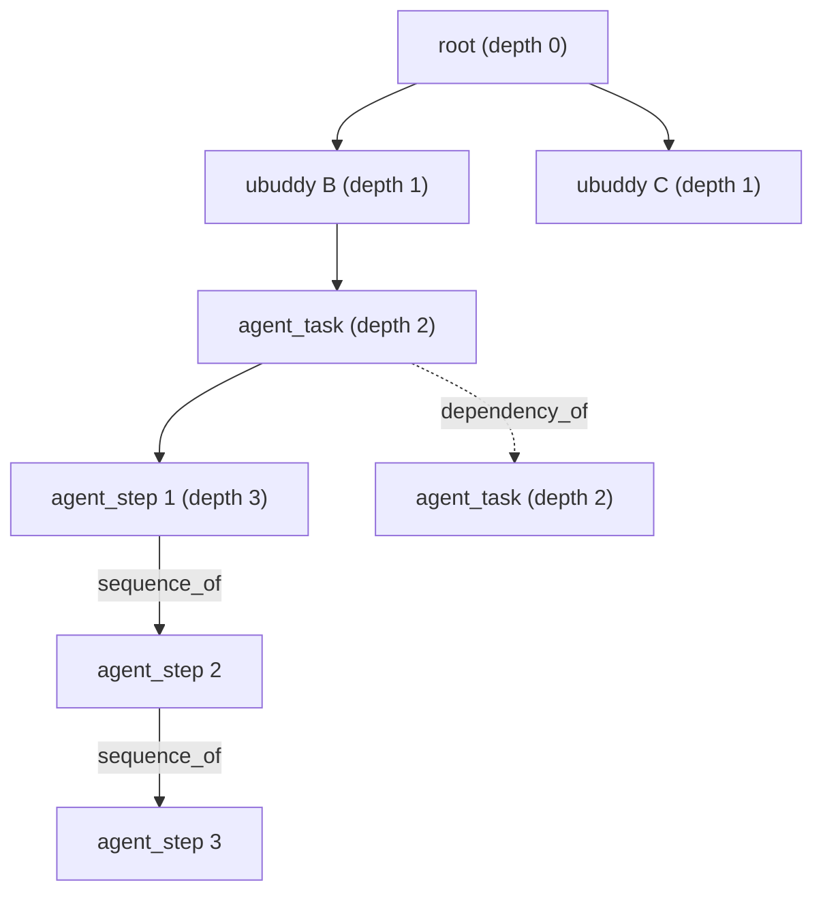

# G_plan / G_exec：真值与「最小改动」的定义

> 相关：`G_PLAN_G_EXEC.zh-CN.md`（旧构造：组织层 + rollout 层，已被本文件的分层定义取代）、
> `UBUDDY_RECON.zh-CN.md`（数据侦察）、`deploy/INTEGRATION.zh-CN.md`（接入契约）
> 实现：`src/shared/contracts/uBuddyReverseDetective.js`（`planExecProximity` / `minimalPlanEdits`）
> 日期：2026-09-16

本文件只定义**语义**。不含实现细节，不含适配器。

---

## 0. 一句话

> **规划图与执行图不必收敛到相等。** 只要规划图改一处就能与执行图达到「相近效果」，
> 就停手 —— 这不是近似，这是防过拟合的机制。

---

## 1. 两个图

| | G_plan（规划图） | G_exec（执行图） |
| --- | --- | --- |
| 是什么 | 组织层规划 + agent 层规划 | 组织层实际 + agent 层实际 |
| 组织层来源 | `task_runs.metadata_json.taskGraphProposal`（planner 的原始提案） | `task_nodes`（含 fallback 节点） |
| agent 层来源 | 每个 `task_node` **首次** `turn/plan/updated` 的 steps | 该 `task_node` 实际执行的步骤序列 |
| 边 | planner 的 `dependencies` | 实际发生的顺序/依赖 |

**分层。** 图有四层（`RDMD_GRAPH_LAYERS`）：

| kind | 层 | 权重 | 说明 |
| --- | --- | --- | --- |
| `root` | 容器 | 1 | 发起方 uBuddy |
| `ubuddy` | 容器 | 2 | 每个参与方的 uBuddy |
| `agent_task` | 工作单元 | 4 | 一个被派的工作单元 |
| `agent_step` | 工作单元 | 4 | agent 自己规划的执行步骤 |

容器层权重低于工作单元层，因为**级联发生在工作单元之间**，容器的变化本身不携带归因信息。

**图的形状（群任务，K 个参与方）**：



`sequence_of` 链是整张图上**唯一的真链来源**，也是「漂移的后果要 ≥3 跳后才可见」能成立的前提。

---

## 2. 真值：成功任务的执行图

> **G_exec 只有在任务成功时才是真值。**

| 任务结局 | 处置 |
| --- | --- |
| **成功**（`task_nodes.status='completed'`，run 正常收口） | **G_exec 作为真值**，可参与「最小改动」的求解 |
| 失败 / 取消 | **不当真值**，只产出诊断（`record_only`） |

理由：失败任务的执行图描述的是「这条路走不通」，不是「本来应该怎么走」。
把它当真值会让规划图向一个错误终点收敛 —— 这正是自进化最危险的失败模式。

**与训练集的关系。** 训练集（`data/*.jsonl`）是**注入式监督**：先记 gold（`injected_node/type/form`），
再推演后果。真实数据没有注入的标答，所以真实数据上：
- **可以有**：诊断（`detectMinimalDrift`）与「最小改动」候选（`minimalPlanEdits`）
- **不能有**：准确率、因果正确性的声称

---

## 3. 「相近效果」的度量

`planExecProximity(G_plan, G_exec, options)` 返回：

```text
score = (nodeScore * nodeWeight + edgeScore * edgeWeight) / (nodeWeight + edgeWeight)

nodeScore = 分层加权的节点集 F1
            权重 = RDMD_LAYER_WEIGHTS[kind]
            recall    = 匹配权重 / G_plan 总权重
            precision = 匹配权重 / G_exec 总权重
edgeScore = 边集 Jaccard
```

默认 `nodeWeight = edgeWeight = 0.5`，两侧空集视为该分量满分（空 = 一致）。

**为什么是 F1 而不是「相等比例」。** 规划图与执行图的节点数天然不同（执行会新增 fallback、
agent 会拆出更多步骤）。用相等比例会把「执行图更大」本身当成漂移。F1 对两侧规模差异对称。

---

## 4. 「改一处即停」

`minimalPlanEdits(G_plan, G_exec, { threshold })`：

1. 若**当前**相近度已 ≥ 阈值 → `alreadySatisfied = true`，不改。
2. 否则枚举**单处**规划改动（`singlePlanEdits`）：
   - `align_node`：改一个已有节点的字段，使其与执行图一致
   - `add_edge`：补一条执行图里有、规划图没有的边
   - `add_node`：加一个执行图里有、规划图没有的节点
   - `drop_node` / `drop_edge`：删掉规划图里多余的一处
3. 逐条试：**只要改这一处就能让相近度达阈值，就停**（`reached = true`）。
4. 多处都够时，取**最省的那一处**（`editCost` 排序：改字段 < 加边 < 加节点 < 删东西）。

**候选必须来自真实执行过的现实。** 不允许凭空发明 —— 自进化的候选池是
「执行图里已经出现过、但规划图里没有」的东西。

**阈值不是 1。** `threshold` 默认 0.8。要求完全对齐就是过拟合：
把某一次执行的具体形态当成普遍规律，下次遇到不同任务时会退化。
「相近」的准确含义是：**规划图改这一点之后，能达到与执行图相近的效果**。

---

## 5. 四条边界（必须遵守）

1. **失败/取消的任务不产出真值**，只产出诊断。
2. **一对一链式级联（A→B→C）会分裂成多张图** —— 群任务是本轮的对象，
   链式级联是已记录、未修的缺口（`parentDelegationId` 无人写）。
3. **`task_graph_revisions` 的 `before_json`/`after_json` 不能当快照用** ——
   它是按节点的裁剪增量，且从不显式存边。
4. **`version` / `acceptance` 在真实数据上填的是常量**（无语义来源）。
   用它们做相近度会静默降分，必须如实标注。

---

## 6. 复现

```bash
cd Janus
node --test src/shared/contracts/uBuddyReverseDetective.test.js
```

契约实现：`src/shared/contracts/uBuddyReverseDetective.js`
（`RDMD_GRAPH_LAYERS` / `RDMD_LAYER_WEIGHTS` / `RDMD_PROXIMITY_DEFAULTS` /
`planExecProximity` / `reachesProximity` / `singlePlanEdits` / `applyPlanEdit` / `minimalPlanEdits`）

---

## 7. 群任务的图是怎么攒起来的（核实结论，2026-09-16）

第 1 节的「图的形状」是目标。这一节记录它在**产品链路里到底成不成立**。
结论是：形状成立，但**成图的位置和最初设想不一样**，这一点直接影响第 4 节的读取通路。

### 7.1 谁在写 `collaboration_graph_*`

| 入口 | 触发时机 |
| --- | --- |
| `createDelegationRuntimeApi` 委托被接受、task run 建出来 | 接收方 uBuddy 收下分工 |
| `createDelegationRuntimeApi` 委托进度上报 | 每次 progress 记录 |
| `projectTaskRunToCollaborationGraph` | task node 状态变化、`agent_step` 的 plan 事件 |

三条路都汇到 `ensureCollaborationGraphForDelegation(delegation)`。它按
`delegation.groupId || group_id || metadata.groupId` 取分组，再交给
`stableCollaborationGraphId({ groupId })` —— 所以**群内所有 delegation 的切片落在同一个 graphId 上**，
节点数不是问题。

### 7.2 群任务创建路径**不**直接建图（与计划的假设不同）

群任务创建走的是 `collaborationGroupMethods.createCollaborationGroup`，它**直接**
`INSERT INTO agent_delegations (... group_id ...)`，**从不**调用 `ensureCollaborationGraphForDelegation`
（全仓库只有 `collaborationGraphStoreMethods.js` 与 `createDelegationRuntimeApi.js` 两处引用它）。

所以图是**逐台设备惰性生成**的，每台设备只有自己那一片：

- 接收方 B 的设备：`root + ubuddy(del_B) + B 的 agent_task + B 的 agent_step`
- 发起方 A 的设备：除非 A 自己也有一份带 `collaborationGroupId` 的 task run，否则**这张图根本不存在**

### 7.3 桌面端**只推不拉**

`src/main/**` 里对云侧 `readCollaborationGraph` 的引用数是 **0**。

于是「1 root + K ubuddy + Σ task_nodes」这个形状**只存在于云端**：每台设备把自己的切片推上去，
云端按 `graphId` 求并集。**单机本地库上永远看不到完整群图。**

这一点对第 4 节是决定性的：产品侧读取模块要么从云端拉，要么就得如实承认自己读的是「本机切片」。

### 7.4 云侧授权：成立，但曾经是死代码

云侧 `publishCollaborationGraph` 的授权有三条分支（发起人本人 / 委托参与方 / 群成员），
读取走 `storedGraphParticipant`（同样含群成员分支）。

但群成员分支查的是 `collaboration_graphs.root_group_id`，这一列来自**第一版快照**的
`graph.groupId`。而本地 `getCollaborationGraph` 之前**不返回 `groupId`**，
所以 `root_group_id` 永远是空串，云侧的群成员分支从未生效 ——
**本地（`graphPermissions` 用本地 `root_group_id`）认为群成员能读，云端却会 403。**

已修：`getCollaborationGraph` 现在返回 `groupId: row.root_group_id`。
回归测试在 `cloud/test/ubuddy-collaboration-graph.test.mjs`
（`cloud publish authorizes every graph participant…`）。

### 7.5 uBuddy↔uBuddy 协调边

缺口是「群内各 uBuddy 之间只有 `root→ubuddy`，没有协调边」。核实结果：

全仓库只有**一条**协调通路 —— `createDelegationRuntimeApi` 里
`metadata.type === 'ubuddy_peer_coordination'` 的那条消息（由 `taskCoordinationRequest` 触发）。
它的形态是**星形，不是网状**：接收方 uBuddy → 发起方 uBuddy，**永远不会是兄弟 uBuddy 之间**。

实测（`_probe_coordination_signals.mjs`，5 张消息表共 211 条消息）：`ubuddy_peer_coordination`
出现 **0 次** —— 这条通路在产品里从未真正跑过。

处置：新增边类型 `coordinates_with` + `store.recordCollaborationCoordinationEdge()`，
在协调消息**成功发出之后**补边，方向固定为「接收方 uBuddy → 发起方 uBuddy」。
边界身份是结构性的，所以一对 uBuddy 之间只有一条边，多次协调把 `reason` 累积进 `reasons`。

- 只在图已存在时补边，绝不顺手建图
- `coordinates_with` **不进** `STRUCTURAL_EDGE_KINDS` —— 它的方向和 `delegates_to` 相反，
  算进环检测会把正常的 `root→ubuddy` 误判成环
- **兄弟 uBuddy 之间的边明确不做**：现在没有任何数据源能支撑它。
  按「不写适配器直到料被观测到」，硬造一条边只会污染模型输入

### 7.6 本轮不修（记录在案）

- 一对一链式级联（A→B→C）分裂成多张图
- `parentDelegationId` 只被读、全仓库无人写
- `runtime.js` 把 `source_group_id` 硬编码为空串，导致「禁止嵌套委托」守卫不触发
- `collaborationGroupMethods.createCollaborationGroup` 不投影图（7.2）—— 本轮只记录

---

## 8. 训练语料的两族，以及它欠着的一件事（2026-09-16）

第 1 节的形状进了产品图（做法 C），语料也必须跟着变 —— 旧语料只有「叶子平铺」一种骨架，
模型没见过「容器 → 工作单元 → 子步骤链」。所以 `generate.mjs` 现在产出**两个族**：

| 族 | 骨架 | 占比 |
| --- | --- | --- |
| `flat_work_units` | 旧的四种结构（线性 / 分叉 / 晚菱形 / 侧轨），每个节点都是 `agent_task` | `1 - groupShare` |
| `layered_group` | `root` → `ubuddy` → `agent_task` → `agent_step`，子步骤成 2–6 步的链 | `groupShare`（默认 0.5） |

`kind` 是**结构字段，模型看不到它**：`lib/sft.mjs` 的 `publicGraph` 与 Python 的 `public_graph`
都不取它；但「相近度」度量按层加权（第 1 节的权重表）要读它。
缺省是 `agent_task` —— 旧的平铺族每个节点本身就是"一个工作单元"，不因为加了这一族而退化。

**v4 又加了第 12 个可见字段 `status`**（执行状态）。它和 `kind` 的处境正相反：`kind` 是
给度量读的、不给模型看；`status` 是给模型看的**唯一** step 层漂移信号，所以它在
`schema.json` 里的防泄漏方式从"任意位置禁止"收窄成"图顶层禁止"（`forbiddenGraphRootKeys`）——
节点上的 `status` 合法，`label.status` 那种整块标签并进图仍然会被拦。

**step 层的形态不按业务域分。** 计划里的第 N 步被砍掉、某一步换了执行者、某一步还在用
上一版计划的说法 —— 这在十个域里是同一件事。硬套 domain 目录只会造出「行业研究的第 5 步
用销售话术」这类不存在的组合，而模型会去学那个组合。所以 `forms.mjs` 多了一张
`STEP_CATALOG`，只在 `kind === 'agent_step'` 时启用；它的 `far` 写的是"同一条链上的后续
步骤受害"，而不是"交付物受害"——计划图上的漂移首先污染的是链。

### 8.1 这一族欠着的一件事（2026-09-17 已解：契约按 kind 缩窄）

**这一节记录的是当初的"未解"，保留原文以便复核结论是怎么变的。**

语料的硬不变量曾是**每个节点的 11 个内容字段都非空**，产品侧的守卫
（`planExecContractGaps` / `predict.py` 的 `check_case_contract`）就是照这条判的：
空字段 = 落在训练支持集外，模型会拿空字段给出一个**自信的**答案。

而真实的 `agent_step` 节点**现在只有一行步骤文本**。Codex 的 `turn/plan/updated` 给的
每个 step 就是 `{ step, status }`，plan 级多一个 `explanation`；`projectAgentPlanSteps` 的公开投影
出于隐私（`step.detail` 可能是工具原始输出、文件内容）刻意只取 `title ← step 文本` 与
`status`。也就是说 —— **即使绕开公开投影、本地直读 `task_events`**，11 字段里能填的也只有
`title`（和 plan 级的 `summary ← explanation`）：`artifact` / `stage` / `inputs` / `output` /
`acceptance` 这五项在 step 层**根本没有任何来源**。这一步的产出是什么、下游读什么、
按什么验收 —— 现在没有任何地方记录。

**当时的三个选项里，选的是"缩窄语料"，不是"让产品多记字段"。** 理由是：那条路要在产品侧
新增一类采集（子步骤的产出/验收/下游输入）才能填满 11 字段，属于**为契约造数据**；
而契约本来的职责是描述"模型能看到什么"。所以 v4 反过来做 —— 让契约与语料都按 `kind`
缩窄到**真实有来源**的字段：

| kind | plan 侧必需 | exec 侧必需 |
| --- | --- | --- |
| `root` | `title` | `title` |
| `ubuddy` | `title` | `title` |
| `agent_task` | `title` | `title` `summary` `output` |
| `agent_step` | `title` `status` | `title` `status` |

三条支撑规则（写死在 `uBuddyPlanExec.js` 与 `rdmd_detective.py`，两侧字面同步）：

1. **准入规则**：一个字段进入某 `kind` 的必需集，必须同时有 (a) `PLAN_EXEC_FIELD_SOURCES`
   里的**独立**来源（不是 `missing`/`constant`），(b) 该层投影代码确实会写它。
   `version` / `acceptance` 是归一化补出来的常量而非信号，所以永远不进必需集。
2. **按侧分档**：`G_plan` 是意图、`G_exec` 是结果。`agent_task` 的 `summary`/`output`
   只在执行侧有来源（规划侧投影不写它们），所以只在 exec 侧必需 —— 否则**每一个**
   真实群任务都会在闸门上被打回。
3. **缺 `kind` 回退最严一档**（`agent_task`），绝不静默放宽。

"不许用编造内容绕过去"这条原则没有变，只是绕开的对象换了：不是给 step 节点编 acceptance，
而是**不许把 step 层撑到它没有来源的宽度**。

### 8.2 step 层只承载 4/5 种漂移（能力削减，显式记录）

缩窄之后 step 层只剩 `title` + `status` 两个真信号（`agentId` 从所属任务继承、有值但不是独立信号）。
五种漂移里，**`wrong_acceptance` 在 step 层没有承载方式**：它依赖"验收标准被改松了"这个事实，
而 plan step 的载荷只有 `{step, status}` —— 在 step 层没有任何地方写着验收标准。
所以 `STEP_CATALOG` 不提供它，`STEP_TIER_MISSING_FORMS` 显式写出原因，
`dataset.test.mjs` 把期望集合写成 `['local_replan','missing_dependency','wrong_agent','wrong_version']` 并断言
`Object.keys(STEP_TIER_MISSING_FORMS) === ['wrong_acceptance']` —— 将来谁把它加回 step 层，测试会立刻红。

剩下四种在**窄字段集内**的表达方式（`lib/forms.mjs#STEP_CATALOG`）：

| 漂移 | step 层上的信号（`gold`） | `far` 的后果落在哪 |
| --- | --- | --- |
| `missing_dependency` | **一个字段都不改** —— 砍掉来自上一步的 `sequence_of` 边，信号就是"链上少一环"。只砍步骤之间的边，绝不砍所属任务的包含边 | 下游 `agent_task` 的 `output`/`summary`（模型的主战场在那里） |
| `wrong_agent` | `agentId` 换成别的执行者 | 同链后续步骤的 `status` 变 `blocked` |
| `wrong_version` | `title` 措辞改成"还在用上一版计划的说法" | 同上 |
| `local_replan` | **增一个 step 节点**（从真凶这一步派生出一个计划外的环节，另一种形态是"并入下一环"的措辞） | 同上 |

两处刻意的设计：

- **`missing_dependency` 不给真凶补自述**。给真凶补一句 `far` 文本等于把结构信号换成一句可背的话，
  模型会去学那句话而不是"链断了"。所以它的 `gold` 返回空对象。
- **`status` 的后果只走级联通道**（`far` / `inferDownstream`），禁止直接给真凶打标。
  真凶上出现的 `status` 变化是**级联的产物**，不是注入本身 —— 否则模型只要学"谁 status 变了就选谁"。
  这条与 §8 顶部"注入的后果必须经由与其它派生字段同一条通道"是同一条规矩。

**`local_replan` 为什么是"派生一步"而不是"在链中间插一环"。** 后者看起来更自然，
但它要改掉真凶的**出边**（把原后继接到新节点后面），而 `firstEffectHop` 会把"出边变了"
算作那条边的目标节点发生了变化 —— 于是首因落在 hop 1，撞上 `minHopToFirstEffect = 3`。
要放行就得给这一类样本开个口子，而那条门的作用恰恰是"答案不许紧挨着变化点"。
改成"只加一条新出边、一条既有边都不动"，冲突就消失了：级联照旧 ≥3 跳，
而新增的这一步由 `insertedNodesOf` 显式报给 `gates.mjs`。

**顺带挖出来的一个坑（已修）**：`gates.mjs` 的 `extra_node_unexplained` 只认"真凶在
**star 图**上的后代"，而注入新增的节点在 star 图里根本不存在 —— 于是**所有**结构性
`local_replan` 样本都被判死，step 层一条都进不了语料（实测 223/223 全灭），
只剩"标题里写一句『并入下一环』"这种可背诵的形态。现在新节点走**显式声明 + 结构判据**
（必须挂在某个真凶的下游，且不得与真凶/诱饵重合）这条路，声明的 ID 落在
`label.inserted_nodes`，并加了一条端到端回归用例（`dataset.test.mjs`）——
只测"形态能生成"是漏掉这个 bug 的原因，样本"能存活"必须单独测。

配套加了一条**捷径守卫**（`validate.mjs#statusShortcutBaseline`）：只看 status 的规则在漂移样本上的
Top-1 必须低于 0.35。它防的正是"模型其实只学会了读 status"——`status` 是强信号，不证明语料
不能靠它作弊，缩窄 step 层就没有意义。

---

## 9. 动作侧：为什么先落影子，而不是直接改规划（2026-09-17）

`ubuddy_plan_exec_drift_apply` 从注释里的占位变成了真正的**能力位**，并且默认**关闭**。
它开的不是"改规划"，而是**影子**：把提案记下来、不执行，然后看执行图后来真实发生了什么。
`RDMD_ACTION_PHASES = ['record_only', 'shadow']` —— `'apply'` **不在枚举里**，
`planExecDriftShadow.test.js` 直接断言它不可达：加真动作必须改这个常量，改不了就没有绕过去的路。

### 9.1 三条理由

1. **提案在执行完成时已经不可回改。** 记录发生在 run 终态（与 `recordTerminal` 同一个
   `queueMicrotask`，见 `planExecDriftService.js` 顶部），那时 `G_exec` 已经定型、任务已经交付。
   所以 `minimal_plan_edit` 的真实目标**只能是下一轮同类任务的规划先验**，不是"修正这一次"。
   一个改不了任何东西的动作，先做证据、后做动作，顺序上没有损失。
2. **§2 的那个失败模式。** 把未验证的判定接到产品上，就是让规划图向一个错误终点收敛。
   影子阶段在"判定"和"改产品"之间插了一层，代价只是多写一行事件。
3. **"模型验收过了"不构成开真动作的条件。** 验收门量的是**语料上的分类准确性**，
   影子量的是**在真实任务上执行侧会不会印证这个提案**。这是两个不同的量：
   前者可以靠语料构造刷到很高（§8.2 的捷径守卫就是为这个加的），
   后者只能靠真实任务累积。

### 9.2 影子阶段到底记什么

`payload.shadow` 只在能力位开着时出现（关着时**连这个键都没有**，与今天逐字节一致）：

```text
shadow: {
  executable: false,                                  // 字面上的不可执行
  proposal: { op, nodeId|edgeId, fields, target, score, source },
  followUp: null,                                     // 写记录的这一刻，后续还没发生
}
```

两处刻意的口径：

- **`target` 必须记下来。** 只记"改哪些字段"的话，事后无法判断"现实有没有走到那里"——
  `target` 是"现实自己走到这一步"这个判据的唯一依据。
- **`decision.action` 仍然是 `record_only`。** 影子不改决策，只是在旁边多留一份证据。
  `phase` 与有没有影子块**同源**（都从 `applyEnabledFor(task)` 推出），
  所以不会出现"`phase=shadow` 却没有提案"这种自相矛盾的行。

### 9.3 后续怎么观察

`recordShadowFollowUps` 在**同组后续 run** 收尾时读到更晚的 `revision` 时触发
（扫 `scope.taskRunIds`，不是只看当前 run —— 因为同一个 run 只会被评估一次）：

| 自律 | 内容 |
| --- | --- |
| 必须是更晚的图 | `revision <= proposalRevision` 直接跳过。同一版图不观察，那时现实还没机会发生 |
| 幂等 | 事件 id = `(提案事件 id, revision)`。同一版图反复评估只写一条 |
| 覆盖语义 | 图真的往后走了就**再观察一次**，`summarizeShadowAgreement` 里后到的观察覆盖先到的（越晚的图越是最终形态） |
| 不改历史 | 原记录一个字节都不复写 —— 它说的是"我当时提了什么"，那是历史事实 |

五种结局，其中两种值得单独说：

- `carried_out` / `partially_carried_out` / `not_carried_out`：字段命中全集 / 命中一部分 / 一个都没动。
  **部分命中不算命中** —— 把"半对"读成"对"正是这类度量最容易自欺的地方。
- `node_gone` / `edge_gone`：提案里的节点/边在新图上已经不存在。这**不是** `not_carried_out`：
  "漂移自己消失了"与"漂移还在且没人管"要分开看。
  图读不到时返回 `null`（未观测），**不能**默认成 `node_gone` —— 没有证据时不许断言。

### 9.4 度量口径：分母是 observed，不是 proposals

```text
agreementRate = carried_out / observed        // observed = 有更晚的图可看的提案
sampleSufficient = observed >= SHADOW_MIN_OBSERVATIONS (30)
```

- **`unobserved` 单列。** "提了但还没机会发生"和"提错了"是两件事，混进分母会把时间问题读成准确率问题。
- **30 不是统计功效，是"按 op 分布还看得过来"。** 影子阶段真正要判断的是
  **每一类 op 各自**的一致性（`align_node` 的可信度和 `add_edge` 不可能是一回事），
  而不是一个总数 —— 只有 3 条观察的 op 给不出任何结论，所以低于阈值时 `sampleSufficient=false`，
  不产出结论。
- 开真动作的条件由这个度量定，不由"模型验收过了"定。

### 9.5 在真机上怎么查

首选 `scripts/rdmd_shadow_report.mjs` —— 它把下面这两份证据合起来，按 op 报一致率，
并直接说出"还差多少条观察"：

```powershell
node scripts/rdmd_shadow_report.mjs "$env:USERPROFILE\.janus\data\janus.db"
node scripts/rdmd_shadow_report.mjs "$env:USERPROFILE\.janus\data\janus.db" --json
```

它**只读**（`DatabaseSync(..., { readOnly: true })`，一份报告不写一行），
也没有"开动作"的开关：开动作要改的是 `RDMD_ACTION_PHASES`，那是一次显式的代码改动。
报告本身有测试（含"跑完报告不写任何一行"），因为它就是那个"判断能不能开"的工具 ——
没被断言过的判据工具可能一直在把 `unobserved` 算进分母。

要自己写查询的话，诊断记录在 `task_events`（桌面端 SQLite），`payload_json` 是 JSON 列：

```sql
-- 影子提案（能力位开着时才存在）
SELECT task_run_id, json_extract(payload_json, '$.phase')            AS phase,
       json_extract(payload_json, '$.shadow.proposal.op')            AS op,
       json_extract(payload_json, '$.shadow.proposal.nodeId')        AS node_id,
       json_extract(payload_json, '$.shadow.proposal.target')        AS target,
       json_extract(payload_json, '$.graphRevision')                 AS rev
FROM task_events WHERE event_type = 'rdmd_plan_exec_drift';

-- 后续观察（对每条提案的一致性证据）
SELECT task_run_id,
       json_extract(payload_json, '$.proposalRef.eventId')           AS proposal,
       json_extract(payload_json, '$.fromRevision')                  AS from_rev,
       json_extract(payload_json, '$.toRevision')                    AS to_rev,
       json_extract(payload_json, '$.outcome')                       AS outcome,
       json_extract(payload_json, '$.metricScore')                   AS score
FROM task_events WHERE event_type = 'rdmd_plan_exec_drift_followup';
```

键名与 JS 侧**完全一致**（`graphRevision` / `proposalRef` / `metricScore`）：`payload_json` 是
`JSON.stringify(payload)` 原样落库（见 `recordTaskEvent`），没有任何下划线转换 ——
只有 `task_graph_nodes` 那类**投影列**才是 snake_case。

**后续挂在提案那条 run 上**（不是触发观察的那条）：它是"这条提案后来怎么样了"的证据，
跟着提案走，一条提案的时间线才在一个地方。
```sql
-- 影子提案（能力位开着时才存在）
SELECT task_run_id, json_extract(payload_json, '$.phase')            AS phase,
       json_extract(payload_json, '$.shadow.proposal.op')            AS op,
       json_extract(payload_json, '$.shadow.proposal.nodeId')        AS node_id,
       json_extract(payload_json, '$.shadow.proposal.target')        AS target,
       json_extract(payload_json, '$.graphRevision')                 AS rev
FROM task_events WHERE event_type = 'rdmd_plan_exec_drift';

-- 后续观察（对每条提案的一致性证据）
SELECT task_run_id,
       json_extract(payload_json, '$.proposalRef.eventId')           AS proposal,
       json_extract(payload_json, '$.fromRevision')                  AS from_rev,
       json_extract(payload_json, '$.toRevision')                    AS to_rev,
       json_extract(payload_json, '$.outcome')                       AS outcome,
       json_extract(payload_json, '$.metricScore')                   AS score
FROM task_events WHERE event_type = 'rdmd_plan_exec_drift_followup';
```

键名与 JS 侧**完全一致**（`graphRevision` / `proposalRef` / `metricScore`）：`payload_json` 是
`JSON.stringify(payload)` 原样落库（见 `recordTaskEvent`），没有任何下划线转换 ——
只有 `task_graph_nodes` 那类**投影列**才是 snake_case。


---

## 10. P1 实测：真实 case 到底过不过闸门（2026-09-19）

§8.1 收窄契约的**全部理由**是"让真实 case 能进模型"。这件事此前**从未在真实数据上量过**
（旧记录只有一句"6/6 violating"，而那个数字是 v1 契约下测的）。本节是实测，两个投影都跑了。

**被测库**：`C:\Users\zhang\.janus-test\data\janus.db`（只读打开，一行未改），6 个 task run / 13 个 task node。

### 10.1 三组数字

| 契约 | 投影 | 违约 case | 问题形状 |
| --- | --- | --- | --- |
| v1（旧记录） | 侦察 | 6/6 | 两侧都缺 `artifact`/`stage`/`inputs`/`output`/`summary` |
| v2 | **侦察**（`route_evolution_e2e.mjs` A 段） | 6/6 | 全部是 `G_prime:<node>:empty_summary` / `empty_output` |
| v2 | **产品形状**（`_probe_real_gate_from_db.mjs`） | **3/6** | 只有 `G_prime:<node>:empty_output` ×4 |

第二行和第三行的差，不是契约的差，是**投影的差** —— 这正是本节最要紧的一件事。

- **侦察投影**（`gplanGexecLib#buildOrganizationalGraphs`）直读 `task_nodes`，投出来的节点
  **不带 `kind`、不带 `summary`、不带 `output`**。缺 `kind` 按第 3 条支撑规则回退到最严的
  `agent_task` 档，于是 exec 侧必然缺 `summary`/`output`。
  它量的是"**这个投影缺什么**"，不是"**真实数据缺什么**"。
- **产品形状投影**按 `uBuddyPlanExec.js#execNodeOf` 的字段来源投：
  `summary ← result_summary ‖ wait_reason ‖ error_text ‖ objective`、
  `output ← result_text`、`kind = 'agent_task'`。`task_nodes` 里这些列都有值
  （`objective` 13/13、`result_text` 9/13、`result_summary` 9/13），所以能真判。

**产品形状下 3/6 通过**：`cc995071`、`44f274a2`、`4e1015ef` 全部过闸门，`jsGaps=0`。
"真实 case 过不了闸门"这句话，对**多节点且全部成功**的真实群任务**已经不成立**。

### 10.2 残余缺口只有一档，形状很干净

剩余 4 个问题**全部**是同一种，且落在同一类节点上：

```text
task_ea7888e7…  node=7bf656b8  status=failed     result_text=''  objective='基于公开要求与可靠常识，围绕可乐的定义与分类…'
task_231b6eeb…  node=af239874  status=failed     result_text=''  objective='依据公开要求，整理可乐的定义与分类、起源与发展…'
task_60e1bf8f…  node=8a4a057d  status=cancelled  result_text=''  objective='基于已核验的章节蓝图，用中文撰写字典学习…'
task_60e1bf8f…  node=007454c9  status=cancelled  result_text=''  objective='Review all blocking term…'
```

结论：**`exec` 侧 `agent_task` 的 `output` 被无条件要求，而 `failed` / `cancelled` 节点按定义
没有 `result_text`。** 任何包含一个未成功节点的真实任务，都会永久卡在闸门外。

这与当初产生支撑规则 2（按侧分档）的逻辑是**同一条**：不要把一个在该处**根本没有来源**的
字段收进必需集。`summary` 有来源（`objective` 兜底），所以它没出问题；`output` 没有。

- 缺的是**按节点终态再分一档**：`output` 只在"确有产出"的节点上必需；未成功节点的漂移信号
  是它的 `status`，不是它的 `output`（与 §8.2 说 `agent_step` 用 `status` 承载漂移同源）。
- **本轮不改契约。** 改闸门会改变哪些 case 进模型，进而牵动 v4 语料与已验收的模型——
  那是一次需要明确决策的契约版本推进（v2 → v3），不该顺手做。**本节只提供判据与数字。**

### 10.3 顺带修掉的一个测量 bug（否则上面的数字都是假的）

`gplanGexecLib#buildOrganizationalGraphs` 里，`edgesOf()` 读的是**原始行**的
`dependencies_json`，但规划侧被喂的是 `toNode()` **映射之后**的对象（该对象没有这个字段）：

```js
plan: { nodes: planNodes, edges: edgesOf(planNodes) },   // planNodes 已被 toNode 映射 -> 恒零边
exec: { nodes: execNodes, edges: edgesOf(nodes) },       // 喂原始行 -> 有边
```

后果不是"少几条边"：**同一批行、同样的依赖**，G_plan 恒零边而 G_exec 有边。实测
`44f274a2` / `cc995071` / `60e1bf8f` 三个任务的 G_star 与 G_prime **节点 id 完全相同**，
G_prime 有 2/3/2 条边、G_star 却是 `[]`。规则基线把这读成"每个依赖都缺失"，
于是**在 3 个真实任务上稳定制造出假漂移**。

修法是一行级：规划侧改喂 `edgesOf(planRows)`（未映射的原始行）。修前修后对照：

| | 规则基线动作分布 |
| --- | --- |
| 修前 | `{"record_only":3,"minimal_plan_edit":3}` ← 3 条假 `local_replan` |
| 修后 | `{"record_only":6}` ← **全部 no_drift** |

`node --test ubuddy_recon.test.mjs` 修后仍 6/6 通过。

这与 [§前文] "依赖边全空"的旧结论有关，但**成因不是数据**：本库 `task_nodes` 13 行里
**7 行 `dependencies_json` 非空**（9/15 对 `_real_prod` / `_real_test` 的两份快照上确实是 `[]`，
那是另外两个库、另一个时间点）。所以"两图零边"在**这一份库上**至少一半是投影 bug 造出来的。

### 10.4 复现

```powershell
# 侦察投影（A 段仍是它，数字含"投影缺字段"的成分）
node experiments/rdmd_detective_dataset/ubuddy_recon/route_evolution_e2e.mjs `
  "$env:USERPROFILE\.janus-test\data\janus.db" _e2e_v2_fixed

# 产品形状投影（P1 的权威数字；WITH_CONTAINERS=0/1 两版结论一致）
$env:WITH_CONTAINERS="1"
node experiments/rdmd_detective_dataset/ubuddy_recon/_probe_real_gate_from_db.mjs `
  "$env:USERPROFILE\.janus-test\data\janus.db" _real_gate_db_cont
```

两个探针都**只读**真实库，不改产品代码；产物写在被 gitignore 的目录里
（含真实任务标题，不入库），本节是它们的受追踪结论。
