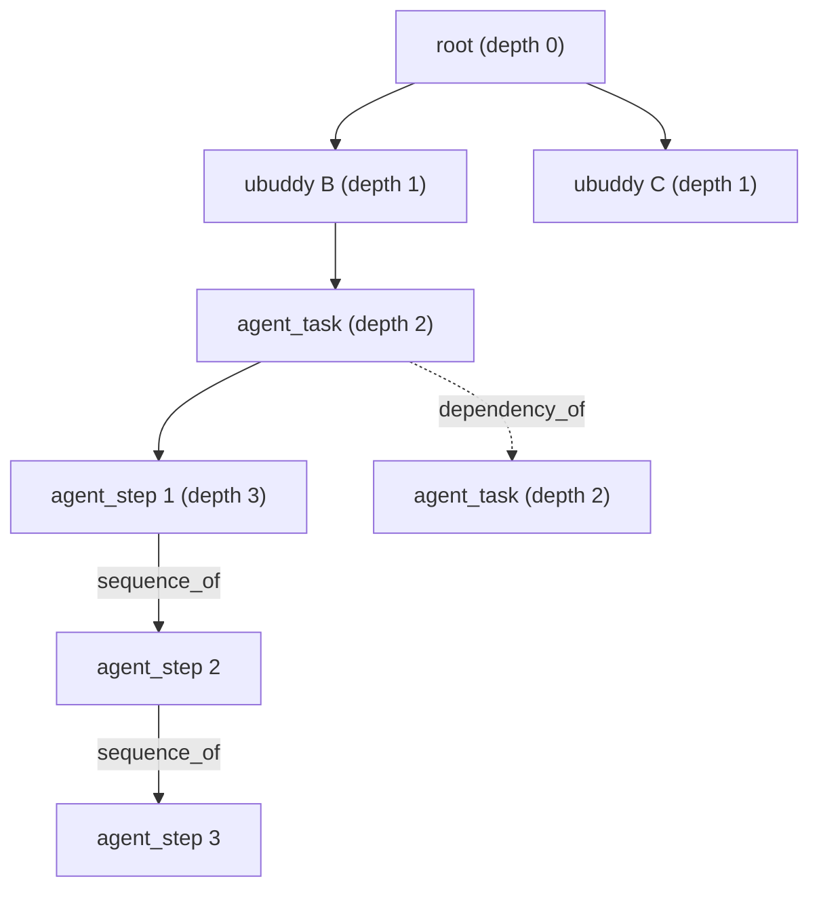

# G_plan / G_exec：真值与「最小改动」的定义

> 相关：`G_PLAN_G_EXEC.zh-CN.md`（旧构造：组织层 + rollout 层，已被本文件的分层定义取代）、
> `UBUDDY_RECON.zh-CN.md`（数据侦察）、`deploy/INTEGRATION.zh-CN.md`（接入契约）
> 实现：`src/shared/contracts/uBuddyReverseDetective.js`（`planExecProximity` / `minimalPlanEdits`）
> 日期：2026-09-16

本文件只定义**语义**。不含实现细节，不含适配器。

---

## 0. 一句话

> **规划图与执行图不必收敛到相等。** 只要规划图改一处就能与执行图达到「相近效果」，
> 就停手 —— 这不是近似，这是防过拟合的机制。

---

## 1. 两个图

| | G_plan（规划图） | G_exec（执行图） |
| --- | --- | --- |
| 是什么 | 组织层规划 + agent 层规划 | 组织层实际 + agent 层实际 |
| 组织层来源 | `task_runs.metadata_json.taskGraphProposal`（planner 的原始提案） | `task_nodes`（含 fallback 节点） |
| agent 层来源 | 每个 `task_node` **首次** `turn/plan/updated` 的 steps | 该 `task_node` 实际执行的步骤序列 |
| 边 | planner 的 `dependencies` | 实际发生的顺序/依赖 |

**分层。** 图有四层（`RDMD_GRAPH_LAYERS`）：

| kind | 层 | 权重 | 说明 |
| --- | --- | --- | --- |
| `root` | 容器 | 1 | 发起方 uBuddy |
| `ubuddy` | 容器 | 2 | 每个参与方的 uBuddy |
| `agent_task` | 工作单元 | 4 | 一个被派的工作单元 |
| `agent_step` | 工作单元 | 4 | agent 自己规划的执行步骤 |

容器层权重低于工作单元层，因为**级联发生在工作单元之间**，容器的变化本身不携带归因信息。

**图的形状（群任务，K 个参与方）**：



`sequence_of` 链是整张图上**唯一的真链来源**，也是「漂移的后果要 ≥3 跳后才可见」能成立的前提。

---

## 2. 真值：成功任务的执行图

> **G_exec 只有在任务成功时才是真值。**

| 任务结局 | 处置 |
| --- | --- |
| **成功**（`task_nodes.status='completed'`，run 正常收口） | **G_exec 作为真值**，可参与「最小改动」的求解 |
| 失败 / 取消 | **不当真值**，只产出诊断（`record_only`） |

理由：失败任务的执行图描述的是「这条路走不通」，不是「本来应该怎么走」。
把它当真值会让规划图向一个错误终点收敛 —— 这正是自进化最危险的失败模式。

**与训练集的关系。** 训练集（`data/*.jsonl`）是**注入式监督**：先记 gold（`injected_node/type/form`），
再推演后果。真实数据没有注入的标答，所以真实数据上：
- **可以有**：诊断（`detectMinimalDrift`）与「最小改动」候选（`minimalPlanEdits`）
- **不能有**：准确率、因果正确性的声称

---

## 3. 「相近效果」的度量

`planExecProximity(G_plan, G_exec, options)` 返回：

```text
score = (nodeScore * nodeWeight + edgeScore * edgeWeight) / (nodeWeight + edgeWeight)

nodeScore = 分层加权的节点集 F1
            权重 = RDMD_LAYER_WEIGHTS[kind]
            recall    = 匹配权重 / G_plan 总权重
            precision = 匹配权重 / G_exec 总权重
edgeScore = 边集 Jaccard
```

默认 `nodeWeight = edgeWeight = 0.5`，两侧空集视为该分量满分（空 = 一致）。

**为什么是 F1 而不是「相等比例」。** 规划图与执行图的节点数天然不同（执行会新增 fallback、
agent 会拆出更多步骤）。用相等比例会把「执行图更大」本身当成漂移。F1 对两侧规模差异对称。

---

## 4. 「改一处即停」

`minimalPlanEdits(G_plan, G_exec, { threshold })`：

1. 若**当前**相近度已 ≥ 阈值 → `alreadySatisfied = true`，不改。
2. 否则枚举**单处**规划改动（`singlePlanEdits`）：
   - `align_node`：改一个已有节点的字段，使其与执行图一致
   - `add_edge`：补一条执行图里有、规划图没有的边
   - `add_node`：加一个执行图里有、规划图没有的节点
   - `drop_node` / `drop_edge`：删掉规划图里多余的一处
3. 逐条试：**只要改这一处就能让相近度达阈值，就停**（`reached = true`）。
4. 多处都够时，取**最省的那一处**（`editCost` 排序：改字段 < 加边 < 加节点 < 删东西）。

**候选必须来自真实执行过的现实。** 不允许凭空发明 —— 自进化的候选池是
「执行图里已经出现过、但规划图里没有」的东西。

**阈值不是 1。** `threshold` 默认 0.8。要求完全对齐就是过拟合：
把某一次执行的具体形态当成普遍规律，下次遇到不同任务时会退化。
「相近」的准确含义是：**规划图改这一点之后，能达到与执行图相近的效果**。

---

## 5. 四条边界（必须遵守）

1. **失败/取消的任务不产出真值**，只产出诊断。
2. **一对一链式级联（A→B→C）会分裂成多张图** —— 群任务是本轮的对象，
   链式级联是已记录、未修的缺口（`parentDelegationId` 无人写）。
3. **`task_graph_revisions` 的 `before_json`/`after_json` 不能当快照用** ——
   它是按节点的裁剪增量，且从不显式存边。
4. **`version` / `acceptance` 在真实数据上填的是常量**（无语义来源）。
   用它们做相近度会静默降分，必须如实标注。

---

## 6. 复现

```bash
cd Janus
node --test src/shared/contracts/uBuddyReverseDetective.test.js
```

契约实现：`src/shared/contracts/uBuddyReverseDetective.js`
（`RDMD_GRAPH_LAYERS` / `RDMD_LAYER_WEIGHTS` / `RDMD_PROXIMITY_DEFAULTS` /
`planExecProximity` / `reachesProximity` / `singlePlanEdits` / `applyPlanEdit` / `minimalPlanEdits`）

---

## 7. 群任务的图是怎么攒起来的（核实结论，2026-09-16）

第 1 节的「图的形状」是目标。这一节记录它在**产品链路里到底成不成立**。
结论是：形状成立，但**成图的位置和最初设想不一样**，这一点直接影响第 4 节的读取通路。

### 7.1 谁在写 `collaboration_graph_*`

| 入口 | 触发时机 |
| --- | --- |
| `createDelegationRuntimeApi` 委托被接受、task run 建出来 | 接收方 uBuddy 收下分工 |
| `createDelegationRuntimeApi` 委托进度上报 | 每次 progress 记录 |
| `projectTaskRunToCollaborationGraph` | task node 状态变化、`agent_step` 的 plan 事件 |

三条路都汇到 `ensureCollaborationGraphForDelegation(delegation)`。它按
`delegation.groupId || group_id || metadata.groupId` 取分组，再交给
`stableCollaborationGraphId({ groupId })` —— 所以**群内所有 delegation 的切片落在同一个 graphId 上**，
节点数不是问题。

### 7.2 群任务创建路径**不**直接建图（与计划的假设不同）

群任务创建走的是 `collaborationGroupMethods.createCollaborationGroup`，它**直接**
`INSERT INTO agent_delegations (... group_id ...)`，**从不**调用 `ensureCollaborationGraphForDelegation`
（全仓库只有 `collaborationGraphStoreMethods.js` 与 `createDelegationRuntimeApi.js` 两处引用它）。

所以图是**逐台设备惰性生成**的，每台设备只有自己那一片：

- 接收方 B 的设备：`root + ubuddy(del_B) + B 的 agent_task + B 的 agent_step`
- 发起方 A 的设备：除非 A 自己也有一份带 `collaborationGroupId` 的 task run，否则**这张图根本不存在**

### 7.3 桌面端**只推不拉**

`src/main/**` 里对云侧 `readCollaborationGraph` 的引用数是 **0**。

于是「1 root + K ubuddy + Σ task_nodes」这个形状**只存在于云端**：每台设备把自己的切片推上去，
云端按 `graphId` 求并集。**单机本地库上永远看不到完整群图。**

这一点对第 4 节是决定性的：产品侧读取模块要么从云端拉，要么就得如实承认自己读的是「本机切片」。

### 7.4 云侧授权：成立，但曾经是死代码

云侧 `publishCollaborationGraph` 的授权有三条分支（发起人本人 / 委托参与方 / 群成员），
读取走 `storedGraphParticipant`（同样含群成员分支）。

但群成员分支查的是 `collaboration_graphs.root_group_id`，这一列来自**第一版快照**的
`graph.groupId`。而本地 `getCollaborationGraph` 之前**不返回 `groupId`**，
所以 `root_group_id` 永远是空串，云侧的群成员分支从未生效 ——
**本地（`graphPermissions` 用本地 `root_group_id`）认为群成员能读，云端却会 403。**

已修：`getCollaborationGraph` 现在返回 `groupId: row.root_group_id`。
回归测试在 `cloud/test/ubuddy-collaboration-graph.test.mjs`
（`cloud publish authorizes every graph participant…`）。

### 7.5 uBuddy↔uBuddy 协调边

缺口是「群内各 uBuddy 之间只有 `root→ubuddy`，没有协调边」。核实结果：

全仓库只有**一条**协调通路 —— `createDelegationRuntimeApi` 里
`metadata.type === 'ubuddy_peer_coordination'` 的那条消息（由 `taskCoordinationRequest` 触发）。
它的形态是**星形，不是网状**：接收方 uBuddy → 发起方 uBuddy，**永远不会是兄弟 uBuddy 之间**。

实测（`_probe_coordination_signals.mjs`，5 张消息表共 211 条消息）：`ubuddy_peer_coordination`
出现 **0 次** —— 这条通路在产品里从未真正跑过。

处置：新增边类型 `coordinates_with` + `store.recordCollaborationCoordinationEdge()`，
在协调消息**成功发出之后**补边，方向固定为「接收方 uBuddy → 发起方 uBuddy」。
边界身份是结构性的，所以一对 uBuddy 之间只有一条边，多次协调把 `reason` 累积进 `reasons`。

- 只在图已存在时补边，绝不顺手建图
- `coordinates_with` **不进** `STRUCTURAL_EDGE_KINDS` —— 它的方向和 `delegates_to` 相反，
  算进环检测会把正常的 `root→ubuddy` 误判成环
- **兄弟 uBuddy 之间的边明确不做**：现在没有任何数据源能支撑它。
  按「不写适配器直到料被观测到」，硬造一条边只会污染模型输入

### 7.6 本轮不修（记录在案）

- 一对一链式级联（A→B→C）分裂成多张图
- `parentDelegationId` 只被读、全仓库无人写
- `runtime.js` 把 `source_group_id` 硬编码为空串，导致「禁止嵌套委托」守卫不触发
- `collaborationGroupMethods.createCollaborationGroup` 不投影图（7.2）—— 本轮只记录

---

## 8. 训练语料的两族，以及它欠着的一件事（2026-09-16）

第 1 节的形状进了产品图（做法 C），语料也必须跟着变 —— 旧语料只有「叶子平铺」一种骨架，
模型没见过「容器 → 工作单元 → 子步骤链」。所以 `generate.mjs` 现在产出**两个族**：

| 族 | 骨架 | 占比 |
| --- | --- | --- |
| `flat_work_units` | 旧的四种结构（线性 / 分叉 / 晚菱形 / 侧轨），每个节点都是 `agent_task` | `1 - groupShare` |
| `layered_group` | `root` → `ubuddy` → `agent_task` → `agent_step`，子步骤成 2–6 步的链 | `groupShare`（默认 0.5） |

`kind` 是**结构字段，模型看不到它**：`lib/sft.mjs` 的 `publicGraph` 与 Python 的 `public_graph`
都不取它；但「相近度」度量按层加权（第 1 节的权重表）要读它。
缺省是 `agent_task` —— 旧的平铺族每个节点本身就是"一个工作单元"，不因为加了这一族而退化。

**v4 又加了第 12 个可见字段 `status`**（执行状态）。它和 `kind` 的处境正相反：`kind` 是
给度量读的、不给模型看；`status` 是给模型看的**唯一** step 层漂移信号，所以它在
`schema.json` 里的防泄漏方式从"任意位置禁止"收窄成"图顶层禁止"（`forbiddenGraphRootKeys`）——
节点上的 `status` 合法，`label.status` 那种整块标签并进图仍然会被拦。

**step 层的形态不按业务域分。** 计划里的第 N 步被砍掉、某一步换了执行者、某一步还在用
上一版计划的说法 —— 这在十个域里是同一件事。硬套 domain 目录只会造出「行业研究的第 5 步
用销售话术」这类不存在的组合，而模型会去学那个组合。所以 `forms.mjs` 多了一张
`STEP_CATALOG`，只在 `kind === 'agent_step'` 时启用；它的 `far` 写的是"同一条链上的后续
步骤受害"，而不是"交付物受害"——计划图上的漂移首先污染的是链。

### 8.1 这一族欠着的一件事（2026-09-17 已解：契约按 kind 缩窄）

**这一节记录的是当初的"未解"，保留原文以便复核结论是怎么变的。**

语料的硬不变量曾是**每个节点的 11 个内容字段都非空**，产品侧的守卫
（`planExecContractGaps` / `predict.py` 的 `check_case_contract`）就是照这条判的：
空字段 = 落在训练支持集外，模型会拿空字段给出一个**自信的**答案。

而真实的 `agent_step` 节点**现在只有一行步骤文本**。Codex 的 `turn/plan/updated` 给的
每个 step 就是 `{ step, status }`，plan 级多一个 `explanation`；`projectAgentPlanSteps` 的公开投影
出于隐私（`step.detail` 可能是工具原始输出、文件内容）刻意只取 `title ← step 文本` 与
`status`。也就是说 —— **即使绕开公开投影、本地直读 `task_events`**，11 字段里能填的也只有
`title`（和 plan 级的 `summary ← explanation`）：`artifact` / `stage` / `inputs` / `output` /
`acceptance` 这五项在 step 层**根本没有任何来源**。这一步的产出是什么、下游读什么、
按什么验收 —— 现在没有任何地方记录。

**当时的三个选项里，选的是"缩窄语料"，不是"让产品多记字段"。** 理由是：那条路要在产品侧
新增一类采集（子步骤的产出/验收/下游输入）才能填满 11 字段，属于**为契约造数据**；
而契约本来的职责是描述"模型能看到什么"。所以 v4 反过来做 —— 让契约与语料都按 `kind`
缩窄到**真实有来源**的字段：

| kind | plan 侧必需 | exec 侧必需 |
| --- | --- | --- |
| `root` | `title` | `title` |
| `ubuddy` | `title` | `title` |
| `agent_task` | `title` | `title` `summary` `output` |
| `agent_step` | `title` `status` | `title` `status` |

三条支撑规则（写死在 `uBuddyPlanExec.js` 与 `rdmd_detective.py`，两侧字面同步）：

1. **准入规则**：一个字段进入某 `kind` 的必需集，必须同时有 (a) `PLAN_EXEC_FIELD_SOURCES`
   里的**独立**来源（不是 `missing`/`constant`），(b) 该层投影代码确实会写它。
   `version` / `acceptance` 是归一化补出来的常量而非信号，所以永远不进必需集。
2. **按侧分档**：`G_plan` 是意图、`G_exec` 是结果。`agent_task` 的 `summary`/`output`
   只在执行侧有来源（规划侧投影不写它们），所以只在 exec 侧必需 —— 否则**每一个**
   真实群任务都会在闸门上被打回。
3. **缺 `kind` 回退最严一档**（`agent_task`），绝不静默放宽。

"不许用编造内容绕过去"这条原则没有变，只是绕开的对象换了：不是给 step 节点编 acceptance，
而是**不许把 step 层撑到它没有来源的宽度**。

### 8.2 step 层只承载 4/5 种漂移（能力削减，显式记录）

缩窄之后 step 层只剩 `title` + `status` 两个真信号（`agentId` 从所属任务继承、有值但不是独立信号）。
五种漂移里，**`wrong_acceptance` 在 step 层没有承载方式**：它依赖"验收标准被改松了"这个事实，
而 plan step 的载荷只有 `{step, status}` —— 在 step 层没有任何地方写着验收标准。
所以 `STEP_CATALOG` 不提供它，`STEP_TIER_MISSING_FORMS` 显式写出原因，
`dataset.test.mjs` 把期望集合写成 `['local_replan','missing_dependency','wrong_agent','wrong_version']` 并断言
`Object.keys(STEP_TIER_MISSING_FORMS) === ['wrong_acceptance']` —— 将来谁把它加回 step 层，测试会立刻红。

剩下四种在**窄字段集内**的表达方式（`lib/forms.mjs#STEP_CATALOG`）：

| 漂移 | step 层上的信号（`gold`） | `far` 的后果落在哪 |
| --- | --- | --- |
| `missing_dependency` | **一个字段都不改** —— 砍掉来自上一步的 `sequence_of` 边，信号就是"链上少一环"。只砍步骤之间的边，绝不砍所属任务的包含边 | 下游 `agent_task` 的 `output`/`summary`（模型的主战场在那里） |
| `wrong_agent` | `agentId` 换成别的执行者 | 同链后续步骤的 `status` 变 `blocked` |
| `wrong_version` | `title` 措辞改成"还在用上一版计划的说法" | 同上 |
| `local_replan` | **增一个 step 节点**（从真凶这一步派生出一个计划外的环节，另一种形态是"并入下一环"的措辞） | 同上 |

两处刻意的设计：

- **`missing_dependency` 不给真凶补自述**。给真凶补一句 `far` 文本等于把结构信号换成一句可背的话，
  模型会去学那句话而不是"链断了"。所以它的 `gold` 返回空对象。
- **`status` 的后果只走级联通道**（`far` / `inferDownstream`），禁止直接给真凶打标。
  真凶上出现的 `status` 变化是**级联的产物**，不是注入本身 —— 否则模型只要学"谁 status 变了就选谁"。
  这条与 §8 顶部"注入的后果必须经由与其它派生字段同一条通道"是同一条规矩。

**`local_replan` 为什么是"派生一步"而不是"在链中间插一环"。** 后者看起来更自然，
但它要改掉真凶的**出边**（把原后继接到新节点后面），而 `firstEffectHop` 会把"出边变了"
算作那条边的目标节点发生了变化 —— 于是首因落在 hop 1，撞上 `minHopToFirstEffect = 3`。
要放行就得给这一类样本开个口子，而那条门的作用恰恰是"答案不许紧挨着变化点"。
改成"只加一条新出边、一条既有边都不动"，冲突就消失了：级联照旧 ≥3 跳，
而新增的这一步由 `insertedNodesOf` 显式报给 `gates.mjs`。

**顺带挖出来的一个坑（已修）**：`gates.mjs` 的 `extra_node_unexplained` 只认"真凶在
**star 图**上的后代"，而注入新增的节点在 star 图里根本不存在 —— 于是**所有**结构性
`local_replan` 样本都被判死，step 层一条都进不了语料（实测 223/223 全灭），
只剩"标题里写一句『并入下一环』"这种可背诵的形态。现在新节点走**显式声明 + 结构判据**
（必须挂在某个真凶的下游，且不得与真凶/诱饵重合）这条路，声明的 ID 落在
`label.inserted_nodes`，并加了一条端到端回归用例（`dataset.test.mjs`）——
只测"形态能生成"是漏掉这个 bug 的原因，样本"能存活"必须单独测。

配套加了一条**捷径守卫**（`validate.mjs#statusShortcutBaseline`）：只看 status 的规则在漂移样本上的
Top-1 必须低于 0.35。它防的正是"模型其实只学会了读 status"——`status` 是强信号，不证明语料
不能靠它作弊，缩窄 step 层就没有意义。

---

## 9. 动作侧：为什么先落影子，而不是直接改规划（2026-09-17）

`ubuddy_plan_exec_drift_apply` 从注释里的占位变成了真正的**能力位**，并且默认**关闭**。
它开的不是"改规划"，而是**影子**：把提案记下来、不执行，然后看执行图后来真实发生了什么。
`RDMD_ACTION_PHASES = ['record_only', 'shadow']` —— `'apply'` **不在枚举里**，
`planExecDriftShadow.test.js` 直接断言它不可达：加真动作必须改这个常量，改不了就没有绕过去的路。

### 9.1 三条理由

1. **提案在执行完成时已经不可回改。** 记录发生在 run 终态（与 `recordTerminal` 同一个
   `queueMicrotask`，见 `planExecDriftService.js` 顶部），那时 `G_exec` 已经定型、任务已经交付。
   所以 `minimal_plan_edit` 的真实目标**只能是下一轮同类任务的规划先验**，不是"修正这一次"。
   一个改不了任何东西的动作，先做证据、后做动作，顺序上没有损失。
2. **§2 的那个失败模式。** 把未验证的判定接到产品上，就是让规划图向一个错误终点收敛。
   影子阶段在"判定"和"改产品"之间插了一层，代价只是多写一行事件。
3. **"模型验收过了"不构成开真动作的条件。** 验收门量的是**语料上的分类准确性**，
   影子量的是**在真实任务上执行侧会不会印证这个提案**。这是两个不同的量：
   前者可以靠语料构造刷到很高（§8.2 的捷径守卫就是为这个加的），
   后者只能靠真实任务累积。

### 9.2 影子阶段到底记什么

`payload.shadow` 只在能力位开着时出现（关着时**连这个键都没有**，与今天逐字节一致）：

```text
shadow: {
  executable: false,                                  // 字面上的不可执行
  proposal: { op, nodeId|edgeId, fields, target, score, source },
  followUp: null,                                     // 写记录的这一刻，后续还没发生
}
```

两处刻意的口径：

- **`target` 必须记下来。** 只记"改哪些字段"的话，事后无法判断"现实有没有走到那里"——
  `target` 是"现实自己走到这一步"这个判据的唯一依据。
- **`decision.action` 仍然是 `record_only`。** 影子不改决策，只是在旁边多留一份证据。
  `phase` 与有没有影子块**同源**（都从 `applyEnabledFor(task)` 推出），
  所以不会出现"`phase=shadow` 却没有提案"这种自相矛盾的行。

### 9.3 后续怎么观察

`recordShadowFollowUps` 在**同组后续 run** 收尾时读到更晚的 `revision` 时触发
（扫 `scope.taskRunIds`，不是只看当前 run —— 因为同一个 run 只会被评估一次）：

| 自律 | 内容 |
| --- | --- |
| 必须是更晚的图 | `revision <= proposalRevision` 直接跳过。同一版图不观察，那时现实还没机会发生 |
| 幂等 | 事件 id = `(提案事件 id, revision)`。同一版图反复评估只写一条 |
| 覆盖语义 | 图真的往后走了就**再观察一次**，`summarizeShadowAgreement` 里后到的观察覆盖先到的（越晚的图越是最终形态） |
| 不改历史 | 原记录一个字节都不复写 —— 它说的是"我当时提了什么"，那是历史事实 |

五种结局，其中两种值得单独说：

- `carried_out` / `partially_carried_out` / `not_carried_out`：字段命中全集 / 命中一部分 / 一个都没动。
  **部分命中不算命中** —— 把"半对"读成"对"正是这类度量最容易自欺的地方。
- `node_gone` / `edge_gone`：提案里的节点/边在新图上已经不存在。这**不是** `not_carried_out`：
  "漂移自己消失了"与"漂移还在且没人管"要分开看。
  图读不到时返回 `null`（未观测），**不能**默认成 `node_gone` —— 没有证据时不许断言。

### 9.4 度量口径：分母是 observed，不是 proposals

```text
agreementRate = carried_out / observed        // observed = 有更晚的图可看的提案
sampleSufficient = observed >= SHADOW_MIN_OBSERVATIONS (30)
```

- **`unobserved` 单列。** "提了但还没机会发生"和"提错了"是两件事，混进分母会把时间问题读成准确率问题。
- **30 不是统计功效，是"按 op 分布还看得过来"。** 影子阶段真正要判断的是
  **每一类 op 各自**的一致性（`align_node` 的可信度和 `add_edge` 不可能是一回事），
  而不是一个总数 —— 只有 3 条观察的 op 给不出任何结论，所以低于阈值时 `sampleSufficient=false`，
  不产出结论。
- 开真动作的条件由这个度量定，不由"模型验收过了"定。

### 9.5 在真机上怎么查

首选 `scripts/rdmd_shadow_report.mjs` —— 它把下面这两份证据合起来，按 op 报一致率，
并直接说出"还差多少条观察"：

```powershell
node scripts/rdmd_shadow_report.mjs "$env:USERPROFILE\.janus\data\janus.db"
node scripts/rdmd_shadow_report.mjs "$env:USERPROFILE\.janus\data\janus.db" --json
```

它**只读**（`DatabaseSync(..., { readOnly: true })`，一份报告不写一行），
也没有"开动作"的开关：开动作要改的是 `RDMD_ACTION_PHASES`，那是一次显式的代码改动。
报告本身有测试（含"跑完报告不写任何一行"），因为它就是那个"判断能不能开"的工具 ——
没被断言过的判据工具可能一直在把 `unobserved` 算进分母。

要自己写查询的话，诊断记录在 `task_events`（桌面端 SQLite），`payload_json` 是 JSON 列：

```sql
-- 影子提案（能力位开着时才存在）
SELECT task_run_id, json_extract(payload_json, '$.phase')            AS phase,
       json_extract(payload_json, '$.shadow.proposal.op')            AS op,
       json_extract(payload_json, '$.shadow.proposal.nodeId')        AS node_id,
       json_extract(payload_json, '$.shadow.proposal.target')        AS target,
       json_extract(payload_json, '$.graphRevision')                 AS rev
FROM task_events WHERE event_type = 'rdmd_plan_exec_drift';

-- 后续观察（对每条提案的一致性证据）
SELECT task_run_id,
       json_extract(payload_json, '$.proposalRef.eventId')           AS proposal,
       json_extract(payload_json, '$.fromRevision')                  AS from_rev,
       json_extract(payload_json, '$.toRevision')                    AS to_rev,
       json_extract(payload_json, '$.outcome')                       AS outcome,
       json_extract(payload_json, '$.metricScore')                   AS score
FROM task_events WHERE event_type = 'rdmd_plan_exec_drift_followup';
```

键名与 JS 侧**完全一致**（`graphRevision` / `proposalRef` / `metricScore`）：`payload_json` 是
`JSON.stringify(payload)` 原样落库（见 `recordTaskEvent`），没有任何下划线转换 ——
只有 `task_graph_nodes` 那类**投影列**才是 snake_case。

**后续挂在提案那条 run 上**（不是触发观察的那条）：它是"这条提案后来怎么样了"的证据，
跟着提案走，一条提案的时间线才在一个地方。
```sql
-- 影子提案（能力位开着时才存在）
SELECT task_run_id, json_extract(payload_json, '$.phase')            AS phase,
       json_extract(payload_json, '$.shadow.proposal.op')            AS op,
       json_extract(payload_json, '$.shadow.proposal.nodeId')        AS node_id,
       json_extract(payload_json, '$.shadow.proposal.target')        AS target,
       json_extract(payload_json, '$.graphRevision')                 AS rev
FROM task_events WHERE event_type = 'rdmd_plan_exec_drift';

-- 后续观察（对每条提案的一致性证据）
SELECT task_run_id,
       json_extract(payload_json, '$.proposalRef.eventId')           AS proposal,
       json_extract(payload_json, '$.fromRevision')                  AS from_rev,
       json_extract(payload_json, '$.toRevision')                    AS to_rev,
       json_extract(payload_json, '$.outcome')                       AS outcome,
       json_extract(payload_json, '$.metricScore')                   AS score
FROM task_events WHERE event_type = 'rdmd_plan_exec_drift_followup';
```

键名与 JS 侧**完全一致**（`graphRevision` / `proposalRef` / `metricScore`）：`payload_json` 是
`JSON.stringify(payload)` 原样落库（见 `recordTaskEvent`），没有任何下划线转换 ——
只有 `task_graph_nodes` 那类**投影列**才是 snake_case。


---

## 10. P1 实测：真实 case 到底过不过闸门（2026-09-19）

§8.1 收窄契约的**全部理由**是"让真实 case 能进模型"。这件事此前**从未在真实数据上量过**
（旧记录只有一句"6/6 violating"，而那个数字是 v1 契约下测的）。本节是实测，两个投影都跑了。

**被测库**：`C:\Users\zhang\.janus-test\data\janus.db`（只读打开，一行未改），6 个 task run / 13 个 task node。

### 10.1 三组数字

| 契约 | 投影 | 违约 case | 问题形状 |
| --- | --- | --- | --- |
| v1（旧记录） | 侦察 | 6/6 | 两侧都缺 `artifact`/`stage`/`inputs`/`output`/`summary` |
| v2 | **侦察**（`route_evolution_e2e.mjs` A 段） | 6/6 | 全部是 `G_prime:<node>:empty_summary` / `empty_output` |
| v2 | **产品形状**（`_probe_real_gate_from_db.mjs`） | **3/6** | 只有 `G_prime:<node>:empty_output` ×4 |

第二行和第三行的差，不是契约的差，是**投影的差** —— 这正是本节最要紧的一件事。

- **侦察投影**（`gplanGexecLib#buildOrganizationalGraphs`）直读 `task_nodes`，投出来的节点
  **不带 `kind`、不带 `summary`、不带 `output`**。缺 `kind` 按第 3 条支撑规则回退到最严的
  `agent_task` 档，于是 exec 侧必然缺 `summary`/`output`。
  它量的是"**这个投影缺什么**"，不是"**真实数据缺什么**"。
- **产品形状投影**按 `uBuddyPlanExec.js#execNodeOf` 的字段来源投：
  `summary ← result_summary ‖ wait_reason ‖ error_text ‖ objective`、
  `output ← result_text`、`kind = 'agent_task'`。`task_nodes` 里这些列都有值
  （`objective` 13/13、`result_text` 9/13、`result_summary` 9/13），所以能真判。

**产品形状下 3/6 通过**：`cc995071`、`44f274a2`、`4e1015ef` 全部过闸门，`jsGaps=0`。
"真实 case 过不了闸门"这句话，对**多节点且全部成功**的真实群任务**已经不成立**。

### 10.2 残余缺口只有一档，形状很干净

剩余 4 个问题**全部**是同一种，且落在同一类节点上：

```text
task_ea7888e7…  node=7bf656b8  status=failed     result_text=''  objective='基于公开要求与可靠常识，围绕可乐的定义与分类…'
task_231b6eeb…  node=af239874  status=failed     result_text=''  objective='依据公开要求，整理可乐的定义与分类、起源与发展…'
task_60e1bf8f…  node=8a4a057d  status=cancelled  result_text=''  objective='基于已核验的章节蓝图，用中文撰写字典学习…'
task_60e1bf8f…  node=007454c9  status=cancelled  result_text=''  objective='Review all blocking term…'
```

结论：**`exec` 侧 `agent_task` 的 `output` 被无条件要求，而 `failed` / `cancelled` 节点按定义
没有 `result_text`。** 任何包含一个未成功节点的真实任务，都会永久卡在闸门外。

这与当初产生支撑规则 2（按侧分档）的逻辑是**同一条**：不要把一个在该处**根本没有来源**的
字段收进必需集。`summary` 有来源（`objective` 兜底），所以它没出问题；`output` 没有。

- 缺的是**按节点终态再分一档**：`output` 只在"确有产出"的节点上必需；未成功节点的漂移信号
  是它的 `status`，不是它的 `output`（与 §8.2 说 `agent_step` 用 `status` 承载漂移同源）。
- **本轮不改契约。** 改闸门会改变哪些 case 进模型，进而牵动 v4 语料与已验收的模型——
  那是一次需要明确决策的契约版本推进（v2 → v3），不该顺手做。**本节只提供判据与数字。**

### 10.3 顺带修掉的一个测量 bug（否则上面的数字都是假的）

`gplanGexecLib#buildOrganizationalGraphs` 里，`edgesOf()` 读的是**原始行**的
`dependencies_json`，但规划侧被喂的是 `toNode()` **映射之后**的对象（该对象没有这个字段）：

```js
plan: { nodes: planNodes, edges: edgesOf(planNodes) },   // planNodes 已被 toNode 映射 -> 恒零边
exec: { nodes: execNodes, edges: edgesOf(nodes) },       // 喂原始行 -> 有边
```

后果不是"少几条边"：**同一批行、同样的依赖**，G_plan 恒零边而 G_exec 有边。实测
`44f274a2` / `cc995071` / `60e1bf8f` 三个任务的 G_star 与 G_prime **节点 id 完全相同**，
G_prime 有 2/3/2 条边、G_star 却是 `[]`。规则基线把这读成"每个依赖都缺失"，
于是**在 3 个真实任务上稳定制造出假漂移**。

修法是一行级：规划侧改喂 `edgesOf(planRows)`（未映射的原始行）。修前修后对照：

| | 规则基线动作分布 |
| --- | --- |
| 修前 | `{"record_only":3,"minimal_plan_edit":3}` ← 3 条假 `local_replan` |
| 修后 | `{"record_only":6}` ← **全部 no_drift** |

`node --test ubuddy_recon.test.mjs` 修后仍 6/6 通过。

这与 [§前文] "依赖边全空"的旧结论有关，但**成因不是数据**：本库 `task_nodes` 13 行里
**7 行 `dependencies_json` 非空**（9/15 对 `_real_prod` / `_real_test` 的两份快照上确实是 `[]`，
那是另外两个库、另一个时间点）。所以"两图零边"在**这一份库上**至少一半是投影 bug 造出来的。

### 10.4 复现

```powershell
# 侦察投影（A 段仍是它，数字含"投影缺字段"的成分）
node experiments/rdmd_detective_dataset/ubuddy_recon/route_evolution_e2e.mjs `
  "$env:USERPROFILE\.janus-test\data\janus.db" _e2e_v2_fixed

# 产品形状投影（P1 的权威数字；WITH_CONTAINERS=0/1 两版结论一致）
$env:WITH_CONTAINERS="1"
node experiments/rdmd_detective_dataset/ubuddy_recon/_probe_real_gate_from_db.mjs `
  "$env:USERPROFILE\.janus-test\data\janus.db" _real_gate_db_cont
```

两个探针都**只读**真实库，不改产品代码；产物写在被 gitignore 的目录里
（含真实任务标题，不入库），本节是它们的受追踪结论。

---

## 11. P2 输入侧诊断：三处断点的实测定位（2026-09-19）

§前文把输入侧概括为「计划侧真实数据为 0 / 组织层零边 / 协作图表缺失」。逐个查完之后，
**三处的性质完全不同**：一处是测量 bug、一处是半 bug、只有第三处是真的缺口 ——
而第三处恰好是三者里唯一无法靠改代码解决的。

### 11.1 断点 1：plan 事件「0 条」——不是数据问题，是探针 bug

旧结论（写在两处**产品源码**注释里）：`activityType='plan'` 事件 **0** 条，所以
`agent_step` 层从未物化。

**真因是一行 SQL 加一个吞异常的 catch：**

```js
// _probe_task_events_plan.mjs（修改前）
const q = (sql, params = []) => { try { return db.prepare(sql).all(...params); } catch { return []; } };
...
WHERE activityType = 'plan' OR payload_json LIKE '%"plan":%'   // <-- 别名用在 WHERE
```

- SQLite 只在 `GROUP BY` 那种形式上容忍 SELECT 别名；`WHERE activityType = 'plan'` 直接抛
  `no such column: activityType`。
- `q()` 把异常吞成 `[]`，于是「SQL 写错了」和「表里没有这类数据」变成**同一个输出**。

**最能说明问题的一点**：同一个文件里的直方图查询**也**用了别名，但它恰好是
`WHERE aliAS IS NOT NULL GROUP BY alias` 这种形式、**不抛**。所以修前的输出里同时有
`activityTypeHistogram` 里的 `plan: 6` 和 `planEventRows: 0` —— 两个数字互相矛盾，
而因为两者都"看起来正常"，这个矛盾没被任何人发现。

**修好之后的实测**（只读 `C:\Users\zhang\.janus-test\data\janus.db`）：

| 项 | 值 |
| --- | --- |
| plan 事件条数 | **6** |
| step 总数 | **25** |
| 分布在 | 3 个 task run（`60e1bf8f` 10 / `44f274a2` 12 / `cc995071` 3） |
| 生产者 | `codex` / `codex_app_server` / `event_type=node_activity` |
| step 形状 | `{step, status}`（唯一形状，6/6） |
| status 取值 | `completed` 16 / `pending` 7 / `inProgress` 2，**无意外值** |

**判据逐段对齐**（这才是"能进图"的真正条件）：

- `agentPlanEventsFromTaskEvents`：`activityType === 'plan' && plan !== undefined` → **成立**。
- `normalizeAgentPlan(event.payload.plan)`：`plan` 是数组 → `Array.isArray` 分支 → supported。
- `normalizeAgentPlanStep`：`source.step` 命中 label → 有值、不为 null。
- status 归一：`pending → queued`、`inProgress → running`、`completed → completed`。

> **所以 `codex.js → scheduler.js → task_events.payload_json.plan` 这条采集通路，
> 在真实数据上是已被验证通的。** 这是本轮少有的好消息：采集侧不需要改。
> 它此前被判为"一次都没跑过"，纯粹是测量错误。

**最小修复（已做）**：
1. `WHERE` 改用 `json_extract(payload_json,'$.activityType')`。
2. **`q()` 不再吞异常** —— 查询失败会打印出来并以非零码退出。第 1 条只修了这一次的错法，
   第 2 条修的是"下一次任何 SQL 笔误都继续以'真实数据里没有'的形式汇报出来"。
3. 连带更正两处产品源码注释：`uBuddyAgentPlanSteps.js:16`、`planExecDriftService.js:71`
   （两份都在断言"事件数是 0"）。

### 11.2 断点 2：依赖边「全空」——一半是数据、一半是投影 bug

- **9/15 的记录是真的**：受追踪的 `_graphs/gplan_gexec_summary.json` 当时是
  `planEdgeTotal: 0` / `execEdgeTotal: 0` —— 那时两张图确实都没有边。
- **现在数据不是空的**：本库 13 行 `task_nodes` 里 **7 行 `dependencies_json` 非空**。
- **但 plan 侧仍然是 0 边、exec 侧 7 条** —— 同一批行、同样的依赖。原因是
  `edgesOf()` 读的是**原始行**的 `dependencies_json`，而 plan 侧被喂的是 `toNode()`
  **映射之后**的对象（那个对象没有这个字段）。**已修**（P1，喂 `edgesOf(planRows)`）。
  修后 plan 7 / exec 7，两边节点数与边数**完全一致**。

修前修后的规则基线对照：

| | 6 个真实任务的规则基线动作 |
| --- | --- |
| 修前 | `{"record_only":3,"minimal_plan_edit":3}` ← 3 条 `local_replan` **假漂移** |
| 修后 | `{"record_only":6}` ← 全部 `no_drift` |

> 「两图零边 → 级联推理在真实数据上退化」这个结论，**至少有一半是投影 bug 造成的假象**。

### 11.3 断点 3：`collaboration_graph_*` 缺失——发布缺口，只能靠装新构建

这一处**是真的**，而且三处里只有它无法靠改代码解决。

- **活库**：4 张表全缺；`schema_migrations` 共 95 条，**含** `ubuddy_coordination_contract_v2`，
  **不含** `ubuddy_collaboration_graph_v1`。
- **仓库代码**：`ensureUBuddyCollaborationGraphSchema(db)` 在
  [`sqliteMigrations.js:553`](../../../src/main/modules/persistence/infrastructure/sqliteMigrations.js)
  **无条件调用**，且紧邻它前后的 `ensureUBuddyContinuousPlanningSchema`(551)、
  `ensureUBuddyAgentAllocationSchema`(552)、`ensureUBuddyCoordinationContractV2`(554)
  **都已经在库里记录了** —— 说明这个函数体是被执行到的，只是那一行对应的事情发生过、而这一行没有。

**决定性证据（带对照，避免"搜索路径不对"这种假阳性）**：对已安装的 `app.asar` 做字节搜索。

| asar（安装构建） | `ensureUBuddyCoordinationContractV2`（对照） | `ensureUBuddyCollaborationGraphSchema` | `collaboration_graph_nodes` | `collaborationGraphStoreMethods` |
| --- | --- | --- | --- | --- |
| `Janus Test`（2026-09-17, v4.3.5） | **PRESENT** | **ABSENT** | **ABSENT** | **ABSENT** |
| `Janus`（2026-09-06, v4.3.5） | **PRESENT** | **ABSENT** | **ABSENT** | **ABSENT** |

对照 needle（`ensureUBuddyCoordinationContractV2`）在同一个 asar 里**找得到**，
所以搜索方法本身是有效的；而三个协作图 needle 全缺 —— 与库状态严丝合缝
（库记录了 coordination_contract_v2，没记录 collaboration_graph_v1）。

> **结论：已安装构建里根本没有这段代码。** 不是迁移失败、不是数据缺失、不是设计问题。
> 任何探针侧的、数据侧的、契约侧的工作都**无法**让这 4 张表出现。

**最小修复（只能由人做）**：装一个含该迁移的构建，然后**重启桌面端**
（`ensureUBuddyCollaborationGraphSchema` 是无条件调用的，重启即建表，不需要额外操作）。
建表之后再跑真实群任务，`agent_step` 与 `sequence_of` 才会第一次真正落进图里。

### 11.4 断点清单汇总

| # | 旧结论 | 实测真因 | 最小修复 | 已修? | 需要人? |
| --- | --- | --- | --- | --- | --- |
| 1 | plan 事件 0 条 | 探针 SQL 用别名 + `q()` 吞异常 | `json_extract` 进 WHERE；查询失败可见并非零退出 | ✅ | 否 |
| 2 | 依赖边全空 | 一半是 9/15 的真数据，一半是 `edgesOf` 投影 bug | plan 侧改喂原始行 | ✅ | 否 |
| 3 | `collaboration_graph_*` 缺失 | 安装构建缺该迁移 | **装新构建 + 重启** | ❌ | **是** |

三处都查完之后，输入侧的结论从「断路」变成了**「通到最后一跳，卡在发布」**：

- 采集（codex → scheduler → `task_events.payload_json.plan`）：**已在真实数据上验证通**。
- 投影（`projectAgentPlanSteps` → `agent_step` + `sequence_of`）：代码与真实形状逐段对齐，
  但**一次都没跑过**，因为承载它的表不存在。
- 缺的那一环是**装一个含 `ensureUBuddyCollaborationGraphSchema` 的构建**。

**仍需人做的只有一件**（与 §H 的交接重合）：装新构建、重启、跑 ≥2 个真实群任务。
在那之前，「影子度量」的分母只可能是 0，apply 的度量门不可能被满足 —— 这不是缺陷，
是**闸门在正确地挡着**。

## 12. P2 收尾：在库副本上把「投影与闸门」真跑了一遍（2026-09-19）

§11 的三处断点都是**静态**查出来的（读代码、读库、byte 搜索 asar）。这一节把它们放到
**库副本 + 产品自己的代码**上跑一遍，回答 §11 结尾留下的那句「当 plan 真发出时，投影与闸门是否成立」。

真实库与产品代码**一行未改**：快照是 `_snapshot_db.mjs` 出的单文件副本，所有写入都落在副本上。

### 12.1 先修探针自己的 bug：它从来没跑到过投影那一步

`_probe_layered_graph_e2e.mjs` 的文件头写着「在副本上跑真实迁移」，**代码里没有任何迁移调用**。
后果是一条链式失败：

1. `collaboration_graph_*` 在新快照上不存在（§11.3 的发布缺口）；
2. `projectTaskRunToCollaborationGraph` 抛异常，被 catch 进 `projectionError`；
3. 紧接着那句 `SELECT ... FROM collaboration_graph_nodes` 没有 catch，直接
   `no such table` 硬失败。

也就是说：**这个探针从来没有真正执行到「投影」和「闸门」**，而它的报告看起来"跑过了"。
（和 §11.1 的 `q()` 吞异常是同一类问题：失败没有被放在能被看见的位置。）

**修复**：在副本上显式调用产品自己的迁移入口 `migrateDatabase(db)`
（[`sqliteMigrations.js:517`](../../../src/main/modules/persistence/infrastructure/sqliteMigrations.js)，
其中第 553 行无条件调用 `ensureUBuddyCollaborationGraphSchema(db)`），并把迁移前后的表清单报出来。
同时把 `plan_events` 那一段改成**真实事件优先**（此前无条件注入）——注入的载荷再像也终究是我写的，
而这一段要回答的恰恰是「真实形状的载荷能不能走通」。

### 12.2 决定性证据：迁移一跑，4 张表就出来了

在**全新的干净快照**上：

```json
{"tablesBefore": [], "tablesAfter": ["collaboration_graphs", "collaboration_graph_nodes",
 "collaboration_graph_edges", "collaboration_graph_events"], "created": 4}
```

这把 §11.3 的结论从「byte 搜索推断」升级为**行为学证据**：在副本上调用产品自己的迁移入口，
缺的 4 张表就出现了；不需要改数据、不需要改代码、不需要任何探针侧的动作。
剩下的唯一变量就是**已安装构建里没有这段代码**。

### 12.3 投影成立：真实 plan 事件 → 四层图，第一次物化成功

- 选中的 task run：`task_60e1bf8f-0e0a-4419-a41c-794ed175b755`（真实群任务，
  所属协作组 `collab_group_PHIEeGYW8HiNaBcH`，delegation `agent_delegate_jkunevGGBMyDJHt0`）。
- plan 来源：**真实事件**（探针报告 `source: "real (…)"`），不是注入。
- 图形状（`collaboration_graph_nodes` 实查）：

  | kind | depth | n |
  | --- | --- | --- |
  | `root` | 0 | 1 |
  | `ubuddy` | 1 | 1 |
  | `agent_task` | 2 | 3 |
  | `agent_step` | 3 | 10 |

- 边（`collaboration_graph_edges` 实查）：
  `parent_of ×14`、`sequence_of ×8`、`assigned_to ×3`、`dependency_of ×2`、`delegates_to ×1`。
- 「相近效果」度量：`metric.ready = true`，`missing = []`。

**⇒ `agent_step` 层与 `sequence_of` 边在真实数据上物化成功**（在副本上）。
§11.2 里「级联推理在真实数据上退化」这个担忧，至少在投影侧被否证了 ——
退化的原因从来不是投影写不出，而是承载它的表不存在。

### 12.4 闸门**不**成立，但原因只有一个

`passes: false`，缺口 2 条：

| 字段 | kind | side | 节点 status |
| --- | --- | --- | --- |
| `output` | `agent_task` | `exec` | `cancelled` |
| `output` | `agent_task` | `exec` | `cancelled` |

两条都是**被取消的任务**。也就是说：`title`/`summary` 在两侧都齐、`status` 在 step 层也齐，
唯一过不去的是「一个被取消的任务没有交付文本」。

这不是投影坏了（投影如实反映了 `task_nodes.result_text` 为空），也不是数据没到
（cancelled 的结果**永远不会到**）。它是**契约的分类里没有这一格**：
[`summarizePlanExecGaps`](../../../src/shared/contracts/uBuddyPlanExec.js) 的注释把
「agent_task 层缺 output」解释成「没有执行结果」（= 该等结果），但 cancelled 的结果等不到。

### 12.5 豁免试算：一条规则是否**足够且最小**

探针新增 `gateWaiverDryRun`，**只试算、不落契约**：

- 规则：`exec` 侧 `agent_task` 的 `output`，在 `status ∈ {cancelled, failed}` 时不判缺。
- 结果：`gapsBefore: 2 → gapsWaived: 2 → gapsAfter: 0`，`wouldPass: true`、`remainingDetail: []`。
- 也就是说：**这一条规则就是把闸门归零的充分且最小改动**，没有第二种缺口藏在后面。

为什么它不是「放水」：`status` 本身就是 v2 已经判的字段，被取消这件事已经被 `status`
表达了一次；再要求一个 cancelled 节点吐出 `output`，是要求一个**数据源结构上写不出**的值
——和 §11 里 v2 把 `summary`/`output` 从规划侧必需集里摘掉是同一条道理（准入规则 (c)）。

**为什么本轮刻意不改契约**：改必需集要 **JS 与 `deploy/rdmd_detective.py#required_fields_for_kind`
同步改**、要 bump `PLAN_EXEC_CONTRACT_VERSION`；而版本号已经写进已完成任务的
`cloud_rdmd_inference_jobs.contract_version`（现存全是 `ubuddy_plan_exec_v2`，见
[`V4_FULL_REPORT.zh-CN.md`](../V4_FULL_REPORT.zh-CN.md) §9 与 §11 的真机切换门）。
一次未经验证的 bump 会让 v4 刚拿到的真机证据**失效**。所以先把它降级成一条**待决策项**，
证据留在 `gateWaiverDryRun` 里，随时可复现。

### 12.6 P2 断点清单（最终版）

| # | 旧结论 | 实测真因 | 最小修复 | 已修? | 需要人? |
| --- | --- | --- | --- | --- | --- |
| 1 | plan 事件 0 条 | 探针 SQL 用别名 + `q()` 吞异常；真实数据 6 事件 / 25＋步 | `json_extract` 进 WHERE；查询失败可见并非零退出 | ✅ | 否 |
| 2 | 依赖边全空 | 一半是 7/13 的真数据，一半是 `edgesOf` 投影 bug | plan 侧改喂原始行 | ✅ | 否 |
| 3 | `collaboration_graph_*` 缺失 | 安装构建缺该迁移 | **装新构建 + 重启** | ❌ | **是** |
| 4 | （本轮新增）闸门在真实数据上恒 fail | `output` 对 `cancelled` 节点恒缺，契约无此分类 | 终止负向状态豁免 outcome 字段（需 JS+Py 同步 + bump，待决策） | ❌ | **否（是决策）** |

### 12.7 P2 的验收：输入侧只剩一条人做的交接

输入侧的结论从「断路」收敛成**「通到最后一跳，卡在发布」**：

- 采集（codex → scheduler → `task_events.payload_json.plan`）：**真实数据已验证通**。
- 投影（`projectAgentPlanSteps` → `agent_step` + `sequence_of`）：**在副本上已验证通**（§12.3），
  图能撑起完整的四层结构，度量也能跑。
- 闸门（`planExecContractGaps`）：**在副本上已验证**，只差 §12.5 那一条规则。
- 缺的那一环是**装一个含 `ensureUBuddyCollaborationGraphSchema` 的构建**。

**唯一仍需人做的**（与 §H 的交接重合）：**装新构建 → 重启桌面端 → 跑 ≥2 个真实群任务**。
在那之前：
- 影子度量的分母只可能是 0；
- apply 的度量门不可能被满足。

这不是缺陷 —— 是**闸门在正确地挡着**（fail-closed 按设计工作）。

### 12.8 复现方式

```powershell
cd experiments/rdmd_detective_dataset/ubuddy_recon
node _snapshot_db.mjs "$env:USERPROFILE\.janus-test\data\janus.db" "$env:TEMP\janus_fresh.db"
node _probe_layered_graph_e2e.mjs "$env:TEMP\janus_fresh.db"   # 见 steps / graph / gate / gateWaiverDryRun
```

读结果的辅助脚本：`_probe_layered_read.mjs`（`A 迁移效果 / B 四层图 / C 闸门 / D 缺口节点状态`）。

交接现场用的只读探针：`_probe_desktop_state.py`（云同步状态逐列 + 四层图/计划事件计数；
凭据只印前 4 位与长度）—— 用法与两条交接的验收标准见 `HUMAN_HANDOFF.zh-CN.md`。

## 13. P3 动作侧：任务族、影子度量的分母、apply 双门（2026-09-19）

§9 把动作侧关在 shadow，理由是「没有证据就不该改图」。这一节做的是**把证据的容器建起来**，
并让「开图动作」这件事在结构上只能从两个门里进来。三件事：任务族、度量口径、apply 通道。

一句话结论：**apply 现在是可达的，但在真实环境里仍然不可达** —— 前者是代码事实，
后者是数据事实（度量门只可能看到 0 条观察）。这两句话不矛盾，也都必须成立。

### 13.1 任务族标识：为什么它不是"顺手的索引"

[`observeShadowFollowUp`](../../../src/main/modules/collaboration/application/planExecDriftService.js)
只能在**同一张协作图**里做事后观察：它比的是 `nodeId`。而 `nodeId` 是**图内标识**，
跨图比较没有意义（两张图的 `task_1` 完全可能是两件不同的事）。

这就把原来的度量逼进一个死角：它可以回答「我这轮建议的改动，我自己这轮后面做了吗」，
**回答不了**「下一个**同类任务**采纳了我上一轮的建议吗」—— 而后者才是「模型有没有用」的证据。

于是补上 [`planExecTaskFamily`](../../../src/main/modules/collaboration/application/planExecDriftService.js)：
族的定义 = `groupId`（协作组）优先，退到 `delegationId`，再退到 `taskRunId`；同时带一份
**结构形状指纹** `planExecFamilyShape(plan)`（那层有什么 kind、各几个）。

它随提案一起落进事件（`shadow.proposal.taskFamily`），所以**不需要回填历史**。

**诚实边界（必须写在这里，否则会被误读）**：族标识**没有**解决跨图节点身份问题。
今天的后续观察仍然只在本图内做，因此族分区现在**测不出跨任务一致率**。
它现在的价值是：数据从今天起开始带上族，等到跨图节点身份解决时不必回填。
报告里把这件事直说（见 13.3、13.7），而不是让「族数」看起来像一个已经工作的指标。

**退化提案**：当族退到 `taskRunId`（没有 `groupId`/`delegationId`）时，anchor 只有这一条 run，
**结构上不可能收敛**。`summarizeShadowAgreement` 把它们数成 `degenerateFamilyProposals`，
报告单独报出来 —— 否则「提案数在涨」会被读成「样本在积累」。

### 13.2 影子度量的分母口径

`SHADOW_MIN_OBSERVATIONS = 30` 一直没有被满足过，而原因不是"数据不够"：过去没有任何地方
把分母写清楚。现在口径被固定在 `summarizeShadowAgreement` 里，并随报告一起输出：

| 量 | 含义 | 进分母? |
| --- | --- | --- |
| `proposals` | 提案总数 | ✗ |
| `observed` | 提案之后图**真的又动过**（有更新的 revision） | **✓** |
| `unobserved` | 提案之后图没再变 | ✗ |
| `carriedOut` | 观察到的那些里，建议的改动**确实被做了** | 分子 |

`unobserved` **既不算同意也不算反对**：在一个真实产品里，多数任务跑完就结束了，
图不再变是常态。把它算进分母会把一致率系统性压低，算成同意则会系统性抬高 —— 两条都是
"报告看起来有数了"的假象。

### 13.3 apply 通道：双门 + 唯一写消费者

**门一（显式开关）**：能力位 `ubuddy_plan_exec_drift_apply`，默认 off。

**门二（度量门）**：[`shadowApplyGate`](../../../src/main/modules/collaboration/application/planExecDriftService.js)
要求**每一类 op** 各自 `observed ≥ 30` 且 `agreementRate ≥ 0.6`。
按 op 而不是按总数：总数够了不等于 `remove_node` 这一类也够 —— 而 `remove_node` 恰恰是最贵的那类。

[`resolveDriftPhase`](../../../src/main/modules/collaboration/application/planExecDriftService.js)
只在**两门同时满足**时才产出 `apply`，否则停在 `shadow`。所以 `RDMD_ACTION_PHASES` 里
虽然出现了 `'apply'`，"apply 不可达"这条不变量**没有被削弱**，它被改写成了一个更强的命题：
**双门不满足时不可达**（测试直接钉住这两种输入下的 `phase`）。

**唯一写消费者**：`writePlanPrior`。它写什么、不写什么是这个阶段的核心约束 ——

- 只处理 `minimal_plan_edit`。`similar_swap`（换人）是**方案二**的事，在 apply 阶段也 no-op；
- 只写**一行** `RDMD_PLAN_PRIOR_EVENT`（`rdmd_plan_exec_drift_plan_prior`）事件，
  **不碰任何图**：先验是给**下一轮规划**看的建议，不是对既有图的编辑；
- 记录里带 `graphMutated: false` 与之同行的还有 `gate`（凭什么被写下来），
  读这条先验的人应该能看见它的判据。

测试里有一条直接查库的断言：整段 apply 流程跑完，`collaboration_graph_nodes` 与
`collaboration_graph_edges` 仍然是 0 行。**"改图"这件事只有结果能证明，不能只靠函数名。**

### 13.4 一个"看起来该写却写不出"的分支：`target_incomplete` 不可达

`planPriorFromRecord` 里有一条防线：`fields` 点名了某个字段、但 `target` 里没有这个值 → no-op。
写测试时想造一条真实可达的这种图（plan 的节点有 `kind`、exec 的没有），**造不出来**：

`normalizeDriftGraph` 会把每个被比较的字段归一成**字符串**（缺失 → `''`），而 `shadowProposal`
的 `target` 抄的正是这个归一化后的 exec 节点 —— 于是 `target.kind === ''`，仍然"有值"，仍然 eligible。

结论被写成了断言而不是删掉：**它是纵深防御，不是活路径**。今天唯一能覆盖它的层是纯函数测试
（人为构造一条不完整提案）。把它断言成"不可达"，是为了不让后来的人以为线上路径正在覆盖它。

### 13.5 幂等：一族**多条**是有意的

先验事件 id 是 `rdmd_plan_prior:{taskFamilyId}:{taskRunId}`，不是一族一行。

为什么不做成一行：`recordTaskEvent` 把事件 id 绑在一条 run 上（同 id 换 run 会抛
`Task event identity conflict`，是 store 的既有不变量）。硬做成一族一行只有两条路，都不能走 ——
改写上一条 run 的行（等于伪造它写下的时间与内容），或者后来的先验直接丢弃。

所以：**一族多条 = 一条时间线**。消费者（下一轮同类任务的规划轮）按族查询取**最新**一条。
幂等的正确表述是「同一个 (族, run) 反复评估只留一行」，测试钉的就是这句。

### 13.6 验收

| 门 | 命令 | 结果 |
| --- | --- | --- |
| 动作侧不变量 | `npm run cloud:test:rdmd-shadow` | 56 passed |
| 传输层 | `npm run cloud:test:rdmd-transport` | 35 passed |
| 云侧作业 | `npm run cloud:test:rdmd` | 26 passed |
| 编码卫生（含探针） | `node --test cloud/test/encoding-hygiene.test.mjs` | 5 passed |
| worker 判定 | `npm run experiment:rdmd-worker:test` | 12 OK |

只读报告在**真实库**上跑：

```powershell
node scripts/rdmd_shadow_report.mjs "$env:USERPROFILE\.janus-test\data\janus.db"
```

输出 `影子提案 0 条，后续观察 0 条` —— 并且**不把这读成 0%**：它明确说
「能力位还没开过，或者还没有真实群任务跑完，这时候开真动作无从谈起」。
报告里同时带上分母口径、族数、退化提案数，以及"两道门"的判据原文。

### 13.7 P3 的验收标准：闭环接好且**可证被闸住**

- 写入路径存在：`writePlanPrior` 有调用点、有事件 id 规则、有幂等测试、有"不碰图"的查库断言。✅
- 默认不可达：能力位默认 off + 度量门（真实环境 0 观察）→ `resolveDriftPhase` 恒产出 `shadow`。✅
- 有测试钉住：双门不满足时的 `phase`、度量边界（分母口径）、写入幂等、`similar_swap` no-op。✅

**本轮结束时 apply 在真实环境仍不会生效** —— 无真实判定、无度量。这是**预期结果**，
不是未完成项。与 §12.7 同源：那一条人做的交接（装新构建 → 跑 ≥2 个真实群任务）
不完成，度量门的分母就永远是 0 —— 而**这正是闸门在正确工作**。

## 14. P4 评测硬化：把 OOD/对抗接成门，第一次跑就红了（2026-09-19）

§12–13 那些数字（"基线 node 1.000 / type 0.527"等等）的唯一落脚点是
`data/ood_summary.json` 与 `data/adv_summary.json`。它们**只被手工命令写过一次**，
之后没有任何东西核对过 —— `score_ood.py` 甚至不在任何 npm 脚本里。
这一节把它接成门，然后报告门第一次跑出来的东西。

### 14.1 门怎么设计的（以及为什么它能不带 GPU）

| 决定 | 理由 |
| --- | --- |
| 只比**基线列**（`base_*`），不比 `model_*` | 模型列需要那份权重和一台 GPU。放进本地的门只会让门被跳过，或者更糟 —— 被伪造。 |
| 整数**逐位相等**，不给容差 | 基线是纯函数（rules A–E）。计数没有浮点误差可言，给容差只是让门更容易放过漂移。 |
| 参考文件由 `--write-reference` 从一次真实跑导出，并**钉住语料的 sha256** | "参考描述的是哪批字节"不再靠上下文暗示。换一批语料，哈希先对不上，比数字毫无意义。 |
| 与标签**不一致的行**作为不变量钉进参考 | 比分组计数更本质：分组计数只是它的外在表现。多一行、少一行都要报。 |
| 语料不提交，但**必须先造出来** | 探针是**种子确定性**的：实测 `node make_ood.mjs` / `make_adversarial.mjs` 重跑与原地那份**逐字节相同**。所以"可复跑"是真的，不是"语料不在就跳过"。 |

### 14.2 第一次跑：23 处（ood）+ 20 处（adv）不一致

两处**不同**的病因，而且都不是"规则改错了" —— 这恰恰说明这个门早就该有。

**（a）OOD：语料被重造过，汇总是旧的。**

| | 今天的语料/标签 | `data/ood_summary.json` |
| --- | --- | --- |
| 总行数 | **45** | 43 |
| `layered_mesh` | **15** | 14 |
| `nested_diamond` | **10** | 9 |
| derived-only 行 | **13** | 10 |

`make_ood.mjs` 自己的断言输出今天也写着 `derivedOnlyDriftRows: 13` ——
也就是说 **V3 报告 §12.2 的"共 43 行 / 其中 10 条刻意造的派生字段行"描述的不是今天的探针**。
基线与标签**零分歧**（45 行里 0 行不一致），所以规则本身没问题，纯粹是汇总没跟上。

**（b）对抗：汇总来自一个更早的探针（连 `scale` 都还不是真值），且有 2 行真分歧。**

- `adv_summary.json` 的 `byScale` **只有一组 `20`（n=60）**；今天的探针 `scale` 取值是
  `20 / 27 / 28 / 29`。一个把 scale 写死成常数的版本，不是今天的探针。
- 今天有 **2 行**标签与基线不一致（已作为不变量钉进参考）：

  | 行 | 标签 | 基线 | 含义 |
  | --- | --- | --- | --- |
  | `..._two_derived_cause_23_...` | `UNKNOWN` | `drift` | 它的两个原因在依赖闭包上不再"互不相干"，级联根唯一 |
  | `..._single_control_31_...` | `drift` | `UNKNOWN` | 它不再有唯一的级联根，"单因控制"这个前提没被满足 |

  这两行正是对抗探针**刻意要造**的那种形状（结构代理 ≠ 构造出来的真值），所以它们是
  **探针的难度**，不是缺陷 —— 但它们此前从未被写下来过，谁也不知道有 2 行。

### 14.3 落了什么

- `data/ood_baseline.json`、`data/adv_baseline.json`（受版本控制）：基线参考，
  内含三个语料文件的 sha256 + 逐组计数 + 与标签不一致的行清单。
- `score_ood.py --gate / --write-reference / --selfcheck`。
- `scripts/rdmd_ood_gate.mjs` + 两个 npm 门：
  `experiment:rdmd-ood:gate`、`experiment:rdmd-ood:gate:selfcheck`。
- 门的负对照**分两步**，缺一不可：先证"当前这一跑真的过"（否则"扰动后失败"毫无信息量 ——
  一个恒失败的门当然会失败），再扰动一个计数证"它真的会红，且指出被改的那一处"。
  只做第二步的门可能是永远报错，只做第一步的门可能是永远通过。

实测（本机，无 GPU）：

```
ood   gate       PASS   45 行 / 4 个 kind 组逐位一致，0 行与标签不一致
adv   gate       PASS   60 行 / 2 个 kind 组逐位一致，2 行与标签不一致（与参考记下的完全一致）
ood   selfcheck  PASS   扰动 byScale/16.n 6 -> 7 之后报出 1 处差异并指到该处
adv   selfcheck  PASS   扰动 byScale/20.n 17 -> 18 之后报出 1 处差异并指到该处
```

### 14.4 验收门本身的负对照：从"会静默失效"改成"干净 clone 也能跑"

`scripts/test_rdmd_acceptance.py` 本来就有 8 个 case、本来就在测"门必须会说 NO"。
它的问题不是逻辑，是**依赖**：它读 `sft/test.jsonl`（37MB，被 gitignore，由 `generate.mjs` 派生）。
干净 clone 上的后果不是"少测一点"，而是 `write_predictions` 直接 `FileNotFoundError`
—— 一套从不运行的测试等于没有测试。

改法是**自足夹具**：图、SFT 行、原始 case 现场造，只依赖被测试的那份代码。
夹具不是"跑一遍把输出抄下来"，而是按构造满足每项判据的前提：

| 判据 | 夹具怎么保证它有意义 |
| --- | --- |
| `primary_derived_only` | 10 行 drift 里 5 行只改 `artifact`/`output`（比值 0.5，落在 §6 的 0.473±0.05 内，不会触发假警报） |
| `step_layer_node` | 真凶 `n2` 的 `kind` 是 `agent_step`，10 行都算得进分母 |
| `status_shortcut` | 让**下游** `n3` 的状态最坏（`cancelled`）而真凶是 `n2` → 捷径**指错**（top1 = 0），差是 1.0 而不是恒为 0 |
| 覆盖度守卫 | 预测 = gold，覆盖 100% |

新增 case 5b：**语料缺失必须表现为"未测到"**，不能变成"通过"，也不能被读成"模型不行"。

实测：把 `sft/test.jsonl` 与 `data/{train,development,test}.jsonl` 全部挪走后，
`experiment:rdmd-acceptance:test` 仍然 `ALL ACCEPTANCE TESTS PASSED`。

`scripts/_rdmd_acceptance_selftest.py` 是**另一个**用途（量真语料上那三项到底是多少，
并回答"test split 里有几行真凶在 step 层" —— 实测 **142/1665**，派生字段子集 **676/1427，比值 0.474**），
所以它必须要有真语料。它以前在语料缺失时报 `step_layer_node=None (expected 1.0)`
—— 把"没测到"说成了"接线错了"。现在显式 **exit 3 + 一句人话**。

### 14.5 门钉住了什么、**没有**修什么

**钉住了**：基线在这个语料上怎么算、和哪些标签不一致。这三样任何一项变了，门就红。

**没有修，而且不该由这一轮偷偷"修"**：

`*_summary.json` 里的 `model_*` 列，以及 `*_verdicts.jsonl`，说的都是**旧语料**。
对抗那侧尤其明显：`adv_verdicts.jsonl` 的 60 个 id 里**有 35 个在今天 60 行的标签里根本不存在**
（旧命名 `_220.._249` vs 今天 `_2.._60`），而 `ood_verdicts.jsonl` 的 43 个 id 里
有 2 个已不存在、另有 4 个新行没有判定。也就是说 §12–13 表里的模型列**无法**用今天的语料复现。

要刷新它们只有一条路：**在当前探针上重跑一次模型**（要 GPU 与那份权重）。
在此之前，那些模型列的正确读法是"某一版旧探针上的数字"，而不是"今天这个探针上的数字"。
把这件事写在门里而不是悄悄重算，是因为重算需要一个不在本机上的东西 ——
而"用手边的数字凑一个看起来完整的表"正是这个门存在的理由。

---

## 15. P5：把「顺序链 → 依赖 DAG」定义出来，然后让它说「不能用」（2026-09-19）

### 15.1 这一轮要解决的是一句被写进硬约束的话

`G_PLAN_G_EXEC.zh-CN.md` §4.2 原文：链式投影会**系统性高估**级联（任何顺序都变成因果），
**在定义清楚之前不得用长程层链条训练/评测 RDMD**。

本轮把「定义」补上了，同时把结论钉死：**定义出来的答案是「今天不能用」**。

### 15.2 交付物（三个，各自的位置很重要）

| 交付物 | 位置 | 为什么放这儿 |
| --- | --- | --- |
| 规则 R0–R3 + 可判定性 + 三档必要性 | `stepDependencyMapLib.mjs` | 只做规则、不做 IO，可脱离数据单测；**不放** `src/shared/contracts`，因为它是长程层的诊断契约，放那儿会进产品包并暗示产品地位 |
| 9 条纪律测试 | `stepDependencyMap.test.mjs` | 第 1 条就是「纯顺序链上门必须说不」；另钉住边 id 唯一（`drop_edge` 一次删两条那个坑）、坏证据必须丢弃报警、`unverifiable ≠ 不需要` |
| 真实链形状验证 | `_probe_chain_to_dag.mjs` | 只读；结论进 `SEQUENCE_TO_DAG.zh-CN.md` §3 |

全文与逐条规则：`SEQUENCE_TO_DAG.zh-CN.md`。

### 15.3 真实链上的三个决定性数字（只读实测）

| 数字 | 值 | 读法 |
| --- | --- | --- |
| 可以因果归因的图（契约口径） | **0 / 22** | 771 条边全是 `sequence`（假设），0 条证据 —— **门 22/22 全关** |
| 就算把「提到过同一路径」全认成证据 | 候选对 **8,161 条 = 链条边数的 10.6 倍**，仍 **0/22** 可归因、19/22 留着顺序边 | 更宽松的证据不是把链变瘦，是把它变成一张几乎全连接的图 → 「最小漂移」失去唯一候选。**所以这条路不是解法** |
| `update_plan` 调用 | **2 / 22** 个 rollout，3 次 / 15 个步骤 | 长程层不是完全没有计划信号，但覆盖率太低、语义是 agent 内部待办 → §4.1 的结论要收窄，不能推翻 |

### 15.4 顺手订正了一处**过期的实测基线**

`G_PLAN_G_EXEC` §2.3 记的是 19 图 / 706 节点 / 687 边 / 链长 max 110 / 交互 25；
今天同一台机器同一目录复测是 **22 图 / 792 节点 / 771 边 / 链长 max 180 / 交互 0**
（快照 `2026-09-19T06:23:42Z`；节点数在同一天的两次运行之间从 789 涨到 792 —— 数据是活的）。

- 「长程结构真实、尺度够」**不变**（max 110 → 180，≥51 的图仍是 6 个）；
- 「**交互性**也够」的依据**今天不成立**（22 个文件里 `inter_agent_communication_metadata` 一条都没有）；
- 另有 **1 个空图**（2 行的 rollout）与 2 个单节点图 —— 空图必须单独数，否则会把「链长最短 0」混进形状表。

### 15.5 已知边界（本轮**不**修，但要记下）

节点 id 是 `<sessionId>#<seq>`，而 22 个 rollout 只落在 **10 个 session 目录**上 →
**同一图内 id 唯一，把同 session 的多个 rollout 并成一张图会撞 id（12 处）**。
将来要动长程层必须先解决这个，且要同步 `build_gplan_gexec.mjs`。

### 15.6 本轮**没做**什么

- 不训练、不评测：`STEP_DEPENDENCY_MAP_TRAINING_ALLOWED = false` +
  `assertNotForTraining()`（会抛，不是注释）。
- 不把「路径提及」写成规则（§15.3 第二行已经证明它会毁掉唯一性）。
- 不为长程层补 G_plan，也不改 `buildAgentGraph` 的投影。

### 15.7 复现

```powershell
npm run experiment:rdmd-chain-to-dag:test   # 9 条纪律测试，不需要真实数据
npm run experiment:rdmd-chain-to-dag        # 形状验证（只读，需真实 rollout；缺数据 exit 3）
```
